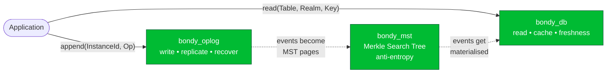
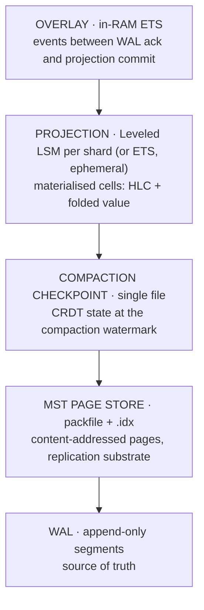
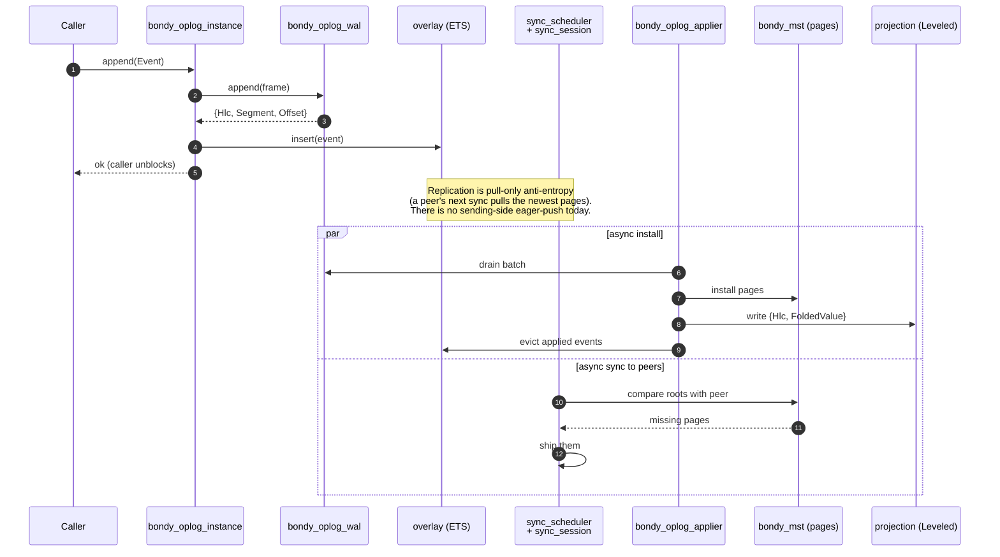
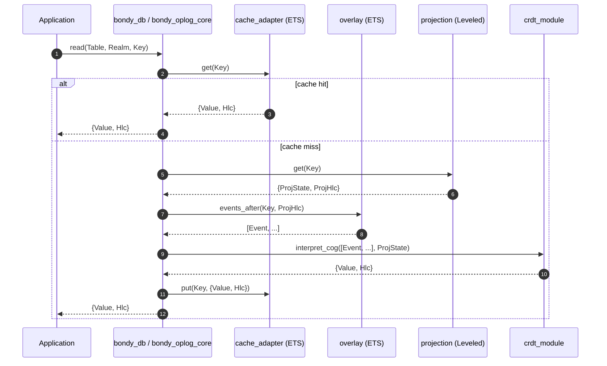
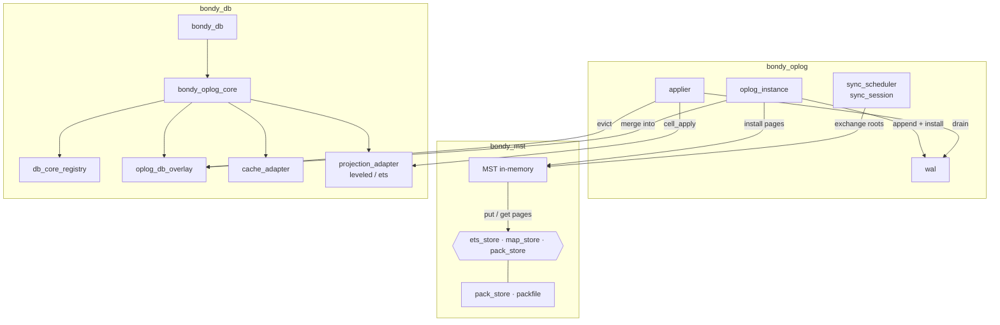

# The three packages

> Audience: anyone who wants the mental model before reading any code.
> Time to read: ~10 min.

You can think of `bondy_mst` as three cooperating libraries hiding
behind a tidy facade. They have crisp jobs and crisper interfaces:

- **`bondy_oplog`** is the **write side**. It appends events durably,
  ships them to peers, and recovers them after a crash.
- **`bondy_mst`** is the **replication structure** — a Merkle Search
  Tree (state-based CRDT) that lets two peers compare what they have
  without sending the whole world.
- **`bondy_db`** is the **read side**. It returns the most recent
  value for a key, fast, with bounded staleness if you ask for it.

Everything else (the applier, the projection, the cache, the CRDT
catalogue) is glue between those three.

The three are **layered**, with dependencies running one way:
`bondy_db` → `bondy_oplog` → `bondy_mst` (plus each layer's own leaf
dependencies — Leveled under `bondy_db`, the cluster transport under
`bondy_oplog`). Nothing lower ever calls up, so the graph is acyclic
and each package is a standalone OTP application usable on its own. A
layer configures the one below it through that layer's public API:
`bondy_db:open/2` passes per-instance options down to
`bondy_oplog:start_instance/2`, which in turn selects the `bondy_mst`
store backend. Layer-wide tuning that is not per-instance rides each
layer's own application environment — never one layer writing
another's.

## The 30-second picture

Three things to note before we go any further:

1. **Applications never read from the oplog.** Reads go to `bondy_db`.
   The oplog is replication / durability machinery beneath that.
2. **The MST is not a key/value store.** It is the *structure* peers
   use to agree on a set of events. The materialised key/value
   answers live in the projection (LSM-backed), behind `bondy_db`.
3. **There is no leader.** All three packages are local-first;
   convergence is achieved by exchanging MST pages over a sync
   transport.

## Layered storage

Each shard, per namespace, owns instances of five layers stacked like
this:

The arrows mean *"rebuilds from"*. If you delete every other layer, the
WAL alone can reconstruct the whole stack — that is why the WAL is the
"must survive" layer and everything above it is a performance choice.

## Following a write end-to-end

Imagine a client calls `bondy_oplog:append(InstanceId, Op)` (or, through
the facade, `bondy_db:apply(Table, Realm, Key, Op)`). Here is what
happens in the happy path:

A few things the diagram is hiding to keep it readable:

- The WAL only writes one frame; what the caller sees as one event
  becomes one `term_to_binary([Event], _)` payload on disk.
- The overlay (step 4) is what makes the event visible to **reads**
  before the projection catches up. It is the read-your-writes
  primitive.
- The sync session uses **MST root comparison** to find which *pages*
  a peer is missing, not a full event exchange — that is the whole
  point of `bondy_mst` (see chapter 02, in the bondy_mst library
  docs). Whether two nodes hold the *same data* is a separate
  question, answered by a per-instance **applied frontier** rather than
  the root: compaction empties the MST, so an empty-MST peer's root no
  longer witnesses its contents
  (see [chapter 06](06_compaction_and_bootstrap.md#the-applied-frontier-the-convergence-oracle)).
- **Ephemeral tables have a fused variant** of this picture: the
  applier collapses into the instance (one process runs
  drain→verify→apply→install inline) and the WAL can be an
  in-memory queue (`wal_backend => mem`) — no disk I/O on the write
  path at all, with durability provided by the cluster via
  anti-entropy. See [chapter 01](01_bondy_oplog.md).

## Following a read end-to-end

Now `bondy_db:read(Table, Realm, Key)` (the facade; `bondy_oplog_core:read(NS,
Index, Bucket, Key)` underneath):

Three storage tiers on the hot path: cache, overlay, projection. The
**CRDT module** is the per-table operation interpreter
([chapter 05](05_crdt_model.md)) — that's what gives the read its
CRDT semantics: the overlay's pending events are interpreted as a
group on top of the projection state, never folded one state at a
time.

## How the three packages talk to each other

Zooming in on the wires:

Most of the arrows here are obvious from chapters
[01](01_bondy_oplog.md) / 02 (in the bondy_mst library docs) /
[03](03_bondy_db.md) / [04](04_applier.md); the ones worth
flagging:

- The **applier is the only writer to the projection.** Reads share
  the same projection handle through `bondy_oplog_core_registry`.
- The **overlay is shared** between the writer (oplog_instance) and
  the reader (`bondy_oplog_core`) — that's how reads see events before
  the applier has folded them in.
- The **pack_store** is one of several `bondy_mst_store`
  implementations; tests use `ets_store` / `map_store`.

## Why this shape?

A handful of architectural commitments are worth naming up front, so
the chapters that follow make sense:

1. **WAL is the source of truth.** Every other layer (MST, snapshot,
   projection, overlay, cache) is reconstructible from it.
2. **Per-cell HLC.** Each projection cell carries its own
   `last_modified_hlc`. Reads return `{Value, Hlc}`; causality is
   *exposed*, not hidden.
3. **Per-table CRDT, pure operation-based.** The substrate is
   CRDT-agnostic: it ships *operations* (opaque terms) and causal
   metadata; what "merge" means for `users` vs `registry` lives in
   plain Erlang modules implementing the `bondy_oplog_crdt`
   behaviour. Commutative types ride the scalar HLC (`tier_0`);
   concurrency-detecting types (multi-value register, add-wins map)
   carry a per-cell causal context (`tier_2`). (The earlier
   state-based *fold* modules were retired; see
   [chapter 05](05_crdt_model.md).)
4. **Two-sided API.** `bondy_oplog` for writes, `bondy_db` for reads.
   Applications never read from the oplog.
5. **No consensus.** Convergence is by anti-entropy over the MST
   (carried, in a Bondy deployment, over Partisan), plus a wall-clock
   **freshness fence** for namespaces that need bounded staleness (e.g.
   auth). The fence is fed by a per-round heartbeat: every completed sync
   round stamps the shard as "in contact with its peers," so an idle
   security shard can still prove its liveness.
6. **The MST is bounded.** Once peers confirm they have an event,
   it is physically removed from the MST and folded into a single
   per-instance snapshot via `bondy_oplog_compaction`. A fully
   converged cluster's live MST is empty; new replicas bootstrap
   from a snapshot, not from the full history
   ([chapter 06](06_compaction_and_bootstrap.md)).
7. **Convergence is verified by the applied frontier, not the MST root.**
   Precisely because the MST empties (item 6), root equality cannot
   answer "do two nodes hold the same data?" — two converged peers in
   different compaction states show different roots, and two
   both-compacted peers both show `undefined`. Each instance instead
   maintains a compaction-invariant **applied frontier** — a per-origin
   version vector of applied events — and peers compare frontiers to
   judge agreement
   ([chapter 06](06_compaction_and_bootstrap.md#the-applied-frontier-the-convergence-oracle)).
8. **Changes are observable.** A table can opt into change
   notification: every write publishes a node-local event, and writes
   that arrive from a *peer* through anti-entropy publish a distinct
   *merge* event — the seam a node-local reactor uses to act on what
   another node did ([chapter 03](03_bondy_db.md#change-notification)).
9. **A node's day job is routing; storage work yields to it.** The
   heavy background tasks are bounded so they cannot starve the node.
   Anti-entropy runs under a node-wide concurrency cap, a fixed page
   budget that bounds its memory regardless of dataset size, a
   per-shard throttle that quiets converged shards, and (opt-in) a
   load-reactive yield that defers reconciliation while the node is
   busy — with the freshness-fence shards exempt so authentication
   never starves ([chapter 06](06_compaction_and_bootstrap.md#keeping-anti-entropy-subordinate-to-routing)).
   The durable MST seal runs off the apply path by default (chapter 02
   in the bondy_mst library docs), and a per-instance heap monitor
   reclaims transient apply garbage
   ([chapter 01](01_bondy_oplog.md#the-instance-heap-monitor)).

## Where next?

Read the chapters in order. Each one stands on its own but the order
is intentional — the write side teaches you what an event is, the
MST chapter teaches you how peers find their disagreements, then the
read side, then the glue.

If you only have time for one more chapter: read
02 — bondy_mst (in the bondy_mst library docs). It is the unique idea in the stack;
the rest is good engineering around it.

## Pointers

- These chapters are the architecture reference; module docs carry
  the implementation-level contracts (wire formats, options,
  invariants).
- Modules to skim before reading further:
  `bondy_oplog.erl`, `bondy_mst.erl`, `bondy_db.erl`.
