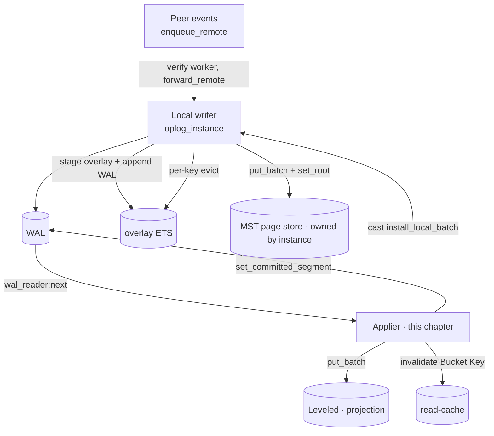
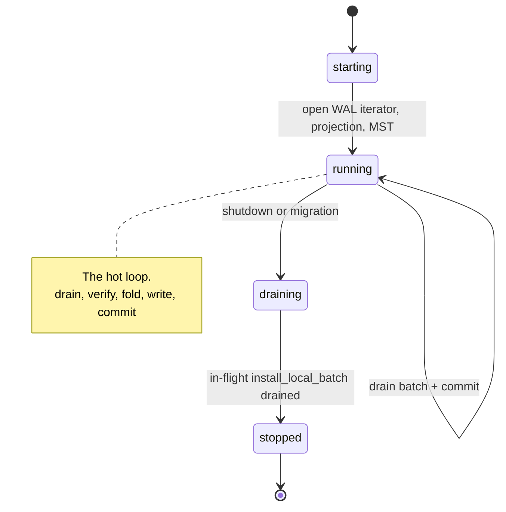
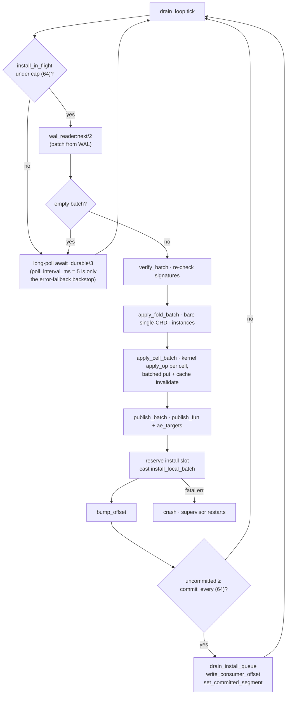
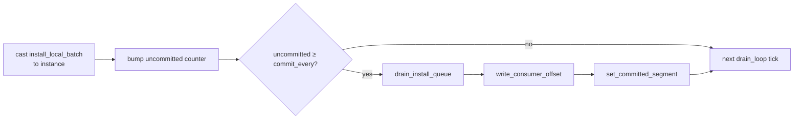
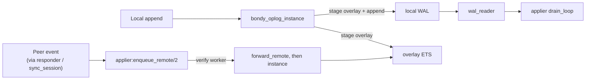
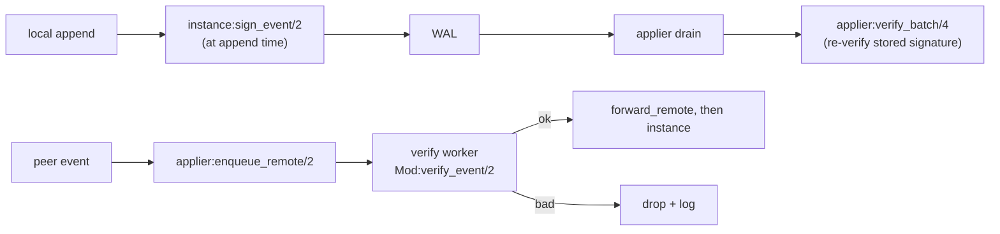
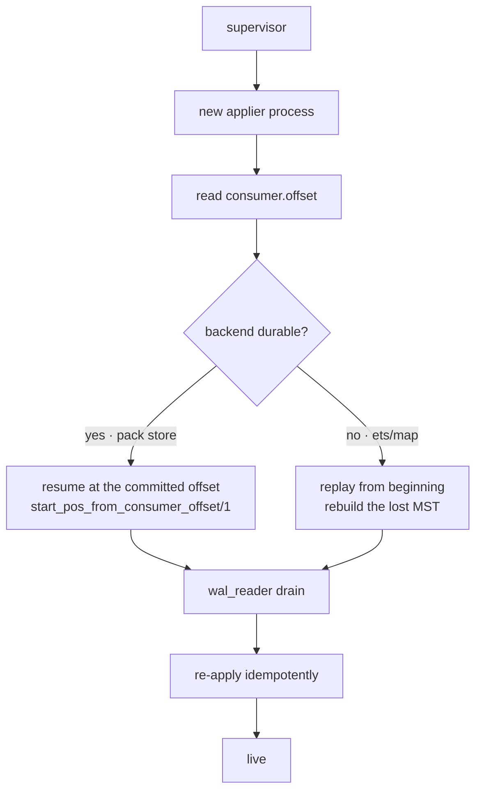
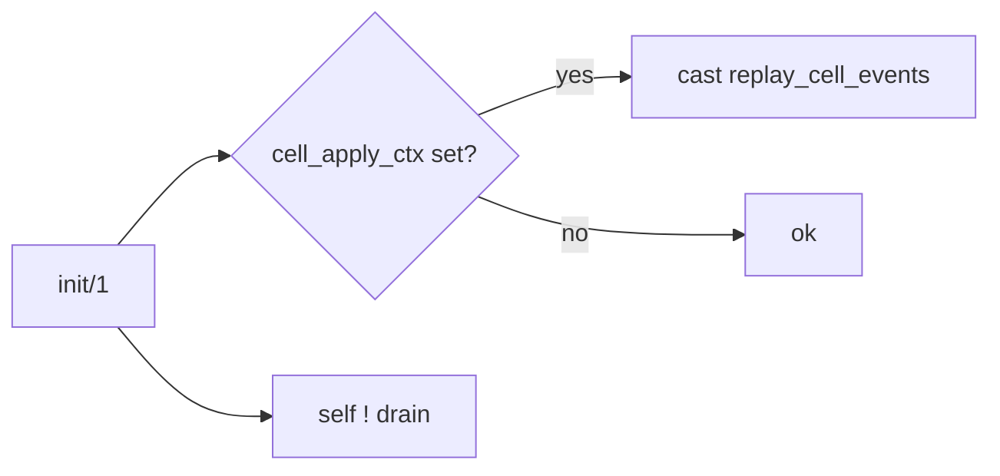

# The applier: the reconciler at the centre

> Audience: anyone debugging why a write isn't visible, or extending
> the substrate.
> Time to read: ~15 min.

If chapters [01](01_bondy_oplog.md) / 02 (in the bondy_mst library docs) /
[03](03_bondy_db.md) are the three packages, this chapter is the
**reconciler** that ties them together. The applier is one gen_server
per instance, supervised under `bondy_oplog_instance_sup` alongside
the instance, the WAL writer, and the WAL scrubber.

> **Fused mode has no applier.** An ephemeral instance opened with
> `fused => true` collapses this whole pipeline into the instance
> gen_server itself: the instance drains its WAL inline and runs the
> same verify → cell-apply → install → publish stages in-process
> (`fused_apply_batch/2`), yielding back to its mailbox every few
> batches so calls and casts are serviced under load. There is no
> applier or scrubber child. Everything in this chapter describes the
> **durable** (non-fused) path; the fused path reuses the same
> state-free stages and emits the same telemetry, so observability is
> uniform. See [chapter 01](01_bondy_oplog.md) for fused mode itself.

It owns four jobs:

1. Drain events from the WAL (via `bondy_oplog_wal_reader`).
2. Re-verify their signatures (defence-in-depth against WAL
   tampering — locals were signed at append time in the instance).
3. Apply each event to the projection through the per-cell kernel
   (`bondy_oplog_cell_apply:apply_cell_batch/3` →
   `bondy_oplog_cell_kernel:apply/6` → the CRDT's `apply_op`) and
   ask the instance to install the corresponding MST pages
   (`install_local_batch`).
4. Persist the consumer offset and advance the WAL committed
   segment, so retention can sweep older segments.

Peer-received events take a separate door: `enqueue_remote/2` →
verify in a worker process → `forward_remote/2` to the instance.
They never go through the WAL on the receiving side.

## Where it sits



The applier is **the only process that writes the projection** (via
the registered `projection_adapter`). The MST page store is written
by the **instance** gen_server, not the applier — the applier sends
batches via `cast(install_local_batch)` and the instance does the
page put + root set under its own serial lock.

## The state machine



## The hot loop

The applier loop (`drain_loop/1` in `bondy_oplog_applier.erl`) is:



Two things to note:

- **`install_in_flight` is a counter atomic** that bounds how many
  install batches the applier may have outstanding at the instance
  (`max_install_in_flight`, default 64). When the cap is full the
  loop defers reading — that is the actual back-pressure mechanism
  between applier and instance.
- **`maybe_commit` is event-count-driven**, not time-driven. After
  every `commit_every` events (default 64) the applier drains its
  install queue, persists the consumer offset, and advances the
  WAL's committed-segment marker so retention can sweep older
  segments.

When the WAL is empty the applier does **not** poll-sleep: it
long-polls the WAL's durable position via `await_durable/3` and is
woken by the writer. (`poll_interval_ms` survives only as the
backstop for the rare error fallback.)

## What "apply a batch" actually does

The batch is partitioned by op type. `{cell_apply, …}` events — the
catalogue common case — go to the shared cell-apply engine,
`bondy_oplog_cell_apply:apply_cell_batch/3` (the same engine the
fused instance calls inline):

```mermaid
sequenceDiagram
    autonumber
    participant Loop as applier loop
    participant CA as cell_apply engine
    participant K as cell kernel
    participant Adapter as projection_adapter
    participant Cache as cache_adapter
    participant Sec as secondary writer

    Loop->>CA: apply_cell_batch(Ctx, Id, Events)
    loop each event (in-batch shadow + old-state cache)
        CA->>Adapter: get prior frame (cache-miss only)
        CA->>K: apply/6 (OldState, Op, Key, Context)
        K-->>CA: {NewState, Hlc, StateBytes, ValueBytes, VES}
        CA->>Sec: index_entry ops (term-diff old vs new value)
    end
    CA->>Adapter: put_batch(all new frames, one batched write)
    CA->>Cache: invalidate touched (Bucket, Key)s
```

Four load-bearing details:

- **Writes are batched, not per-event.** All new frames in the batch
  go to the projection in one `put_batch` (for leveled, one
  `book_mput`); reads of prior cells are absorbed by a two-level
  old-state cache — an **in-batch shadow** (a later event in the same
  batch sees the frame an earlier one just produced) plus a
  write-through **frame cache** in front of the projection.
- **The kernel runs the CRDT's `apply_op`**, the eager op-based step
  ([chapter 05](05_crdt_model.md)) — there is no state-based
  `apply_event` fold anywhere on this path.
- **Secondary indexes are fed here.** The engine term-diffs the old
  and new cell values against the table's index specs and dispatches
  `index_entry` ops to the per-shard secondary writer
  ([chapter 03](03_bondy_db.md)).
- **A peer's change is announced here.** When the batch being applied
  is a *remote* merge (a peer's write arriving via anti-entropy) and the
  table opted in with `publish => true`, the engine emits a
  `bondy_oplog_core:publish_merge/4` event per touched cell — the remote
  half of the change-notification seam ([chapter 03](03_bondy_db.md#change-notification)).
  A node's *own* writes are announced separately by the applier's
  `publish_batch` (the local tag), because their side-effects already
  ran inline at the call site; the merge tag is what lets a node react
  to what a peer did.
- **The applied frontier is advanced here.** After the durable
  `put_batch` returns, the engine max-merges the batch's per-origin
  maxima into the per-instance **applied frontier** — the
  compaction-invariant convergence oracle ([chapter 06](06_compaction_and_bootstrap.md#the-applied-frontier-the-convergence-oracle)).
  The update is a small `O(#origins-in-batch)` max-merge applied on both
  the local and the remote-merge fold, right beside the high-water
  advance, and never leads the durable projection.

The applier also keeps an in-memory `fold_state`
(`apply_fold_batch/3`) for bare single-CRDT instances that have no
projection at all — it folds the batch through the same
`apply_op` step; the per-cell projection path is the common case.

### tier_2: the context stamp and the regression guard

For a tier_2 table ([chapter 05](05_crdt_model.md)) two extra things
happen at this seam, both gated on *locally-minted* events only:

- **Context stamp.** A local write's causal context — the cell's
  current version vector, read via `context_of/1` inside this
  single-applier-per-cell scope — is stamped into the event `meta`
  before the WAL append completes, making the event self-describing
  forever. Remote events replay their `meta` verbatim, never
  re-stamped.
- **`ctx_guard`.** A per-cell context-regression detector: if the
  context of a locally-stamped cell ever moves backwards (the
  signature of durable-state loss), the write is refused loudly
  instead of silently forking causality.

After the whole WAL batch has been folded:



The **commit point** is the consumer-offset write + the committed
segment advance. Crash before that → events are re-read from the WAL
on restart and re-applied; fold idempotency absorbs duplicates.

`drain_install_queue` is more than a mailbox barrier: it is also the
**MST root durability barrier**. Each `install_local_batch` merged its
events into the MST and staged a new root in memory
(`set_root/2` rewrites the manifest lazily); the synchronous drain call
flushes that root to disk (`bondy_mst:flush/1`, pages before the
pointer) in lockstep with the `consumer.offset` write about to follow.
That advances the on-disk root and the WAL retention cursor together,
bounding crash replay to one commit window — without it the on-disk
root lags, restart re-reads the whole WAL, and the compaction watermark
never advances so the WAL never truncates. With `pack_seal_mode =>
async` this same barrier is where the instance rolls the incoming pack
aside and spawns the seal worker (the rolled pages are now durable). It
is a no-op for ephemeral (ets/map) backends.

## Atomicity, in a paragraph

These steps are not transactional across stores. The ordering is
chosen so that:

- Crash **before `write_consumer_offset`** → on restart, the WAL
  reader resumes at the persisted offset; up to `commit_every`
  events (default 64) get re-read and re-applied. Idempotency
  absorbs them.
- Crash **after offset write, before `set_committed_segment`** →
  same effect on restart; the segment-advance only gates WAL
  retention, not correctness.
- Per-cell `put_batch` writes go to Leveled with
  `sync_strategy = none` — the projection is deliberately **not**
  fsynced per write. The WAL is the only locally-durable store;
  anything the projection loses in a crash is reconstructed by
  replay from the committed consumer offset.

Idempotency in the CRDT is the linchpin. Without it, no crash path
is safe.

## Two kinds of input: WAL and peer events

The applier receives events from two sources:



The crucial property: **peer-received events do not flow through the
local WAL**. The peer's WAL already has them durable. The applier
verifies their signature in a short-lived worker and then forwards
them to the instance, which stages them in the overlay just like a
local append.

Today's substrate has no eager-push fast-path; peer events arrive
through anti-entropy (`bondy_oplog_sync_session`) and through the
responder's request handlers. The staging hook (the `eager_pushed`
origin tag) exists in the overlay code as a forward-looking
mechanism but is not exercised.

## Overlay eviction

The overlay is evicted **per-event by the instance** as events are
installed (`evict_overlay_batch/2` in `bondy_oplog_instance.erl`),
using `ets:delete(Tab, Key)`. The applier's own eviction
(`evict_rejected_overlay/2`) only touches events the verifier
rejected — never the bulk apply path.

The overlay key shape `{{Bucket, Key}, EventHlc, EventKey}` makes
this safe under concurrent inserts: each row is identified by its
full event key, so deletes are point operations. There is no
watermark-based bulk eviction in the live code; the
`evict_to/3` helper in `bondy_oplog_db_overlay.erl` exists but has
no callers in `src/`.

## Validator gateway

Two paths, two checkpoints:



Local events are signed at the instance on the append path;
the applier re-verifies them when it reads them out of the WAL — a
defence-in-depth check against WAL-on-disk tampering. Peer events
are verified exactly once, in the `enqueue_remote` worker, before
being forwarded to the instance.

The validator snapshot is captured at applier init; an
operator-triggered `{refresh_validator, _}` cast swaps it.

## Crash recovery

If the applier crashes, the new process chooses its resume position
from the backend's **durability capability** — never from the MST's
live state:



A **durable** backend's MST and projection survive the restart, so the
applier resumes from the WAL's own committed consumer offset. This is
robust to a stale or absent on-disk root — and it is the fix for the
**resume livelock**: under the old MST-derived resume, an absent or
lagging root regressed the cursor to `beginning` and re-read the entire
WAL on *every* drain pass, pegging the node while it never made
forward progress. A **volatile** (ets/map) backend loses its MST on
restart, so the committed offset would skip past data the fresh tree
lacks; it replays from `beginning` to rebuild. Either way the WAL is
just a byte log positioned by a cursor — it never depends on MST state.

The consumer offset doubles as the **durability fence** for WAL
retention — it tells the writer how far the applier has committed, so
older segments are eligible for unlinking — but it is the *resume
cursor* only for a durable backend. On restart the worst case is
`commit_every` events (default 64) re-read from the committed offset;
the MST's HLC dedup and CRDT idempotency absorb them.

(The inline **fused** ephemeral instance, which runs its own drain
without a separate applier, positions its mem-reader from
`bondy_oplog_applier:resume_position/2` — the higher of the MST
last-key HLC and the watermark — because its mem-WAL and mem-MST live
and die together, with no durable consumer offset to fence on.)

If the **writer** crashes too, the WAL recovery ([chapter 01](01_bondy_oplog.md)) runs
first inside the WAL writer's `init/1`: tail-truncate to the last
valid frame. The applier then resumes against the truncated tail.

## Cold-replay catch-up

On a fresh start (after a clean shutdown), the MST may still hold
peer-authored events whose `replay_cell_events` never ran — the WAL
drain only handles events past its resume cursor, and these are
anchored on `last_replayed_root` instead. The applier's `init/1`
triggers a one-shot replay of those cell events guarded by the
presence of a `cell_apply_ctx`:



This fixes the otherwise-subtle case where a node restart leaves the
projection stale until the next sync tick.

## Things to keep in mind

- **The applier owns the per-cell projection write** (on the durable
  path; in fused mode the instance runs the same engine inline). The
  MST page store is written by the **instance**; the applier `cast`s
  install batches and the instance serialises them under its own
  lock.
- **Idempotency in the CRDT is non-negotiable.** Every crash path
  relies on it.
- **The consumer offset + committed segment are the commit point.**
  Everything before is recoverable; everything after is durable.
- **Peer events do not flow through the local WAL.** They are
  verified in `enqueue_remote` and forwarded to the instance for
  overlay staging + MST install.
- **Back-pressure is `install_in_flight`.** A bounded counter
  atomic gates the applier→instance hand-off; overlay-side limits
  (`max_overlay_events`, `max_overlay_bytes`) translate writer
  pressure into `{error, backpressure}` from the instance.

The tunables that matter today (see the `bondy_oplog_applier.erl`
moduledoc):

| Opt | Default | Purpose |
|---|---|---|
| `commit_every` | 64 | events between `write_consumer_offset` + `set_committed_segment` |
| `poll_interval_ms` | 5 | error-fallback backstop only (the hot path long-polls `await_durable/3`) |
| `max_install_in_flight` | 64 | cap on outstanding install batches at the instance |
| `cell_apply_target` | (registry-resolved) | which (projection, cache, kernel, overlay) handle to write |
| `oldstate_cache` | on for durable (leveled) tables; off for ets/ephemeral (bare applier default `false`) | write-through frame cache in front of the projection reads |
| `publish_fun`, `publish_ns` | undefined | per-cell local-write publish hook (`publish_ns` also gates the remote merge-event emission in the cell-apply engine) |
| `ae_targets` | [] | the `(NS, primary, Shard)` freshness refs stamped after a committed batch; `bondy_db` sets them at instance birth, and the sync session stamps the same refs every round (the heartbeat, [chapter 03](03_bondy_db.md#the-freshness-fence)) |

## Write→readable latency telemetry

`bondy_oplog_latency` reports, per instance, how long a user write takes
to become **readable in the projection** — the metric an operator
actually cares about, across whichever backend the instance uses
(leveled or the ETS memory topology).

It costs almost nothing because the write path is already synchronous:
`bondy_db:apply/4` appends to the WAL and then blocks in
`bondy_oplog:await_apply/1`, which returns only once the applier has
committed the cell to the projection (read-your-writes). So the elapsed
time across that one call **is** the write→readable latency. `bondy_db`
times it on the hot path (two `monotonic_time` reads) and feeds it to a
wait-free `bondy_metrics` histogram — one `counters` array per instance,
fixed log-linear buckets. A periodic tick subtracts the previous
snapshot and emits, per instance that wrote in the window:

| Event | Measurements | Metadata |
|---|---|---|
| `[bondy_oplog, instance, write_latency]` | `count`, `mean_us`, `p50_us`, `p95_us`, `p99_us`, `max_us` | `instance_id`, `interval_ms` |

`mean_us` is exact; the percentiles are nearest-rank estimates from the
bucket bounds (≈6% bucket error). The gate is a `persistent_term` read,
so when disabled the hot path pays one free read and captures nothing.

Scope is the **local origin node** (write→readable on the node that took
the write). Cross-node "readable on a replica" latency is out of scope —
monotonic clocks are not comparable across VMs.

```erlang
{bondy_mst, [
    {oplog_latency, #{
        enabled => true,             %% default: true (sampling is ~free)
        interval_ms => 10000,        %% default: 10s reporting window
        probe => #{enabled => false} %% default: idle probe off
    }}
]}.
```

**Idle probe (opt-in).** An instance with no traffic in a window reports
nothing. When the probe is on, the tick writes one benign, type-correct
op (`bondy_db:probe_write/1`) to a reserved cell of each idle instance so
it still reports a heartbeat next window. The reserved cell lives in a
bucket (`$probe`) no user query targets, so it is invisible to user
reads, and it is overwritten each time (bounded state). It is a real,
replicated write — appropriate for the occasional heartbeat of an idle
instance, which is why it is off by default.

## Pointers

Implementation:

- `bondy_oplog_latency.erl` — the per-instance sampler/emitter +
  `bondy_metrics` histogram type (`histogram/1`, `histogram_stats/1`).
- `bondy_oplog_applier.erl` — gen_server; `drain_loop/1`,
  `apply_batch/2`, `apply_fold_batch/3`, `maybe_commit/1`,
  `enqueue_remote/2`, `forward_remote/2`, `verify_batch/4`,
  `start_pos_from_consumer_offset/1` (the durable resume cursor),
  `resume_position/2` (the fused/ephemeral resume cursor).
- `bondy_oplog_cell_apply.erl` — the shared per-cell engine
  (`apply_cell_batch/3`, `compute_one_cell/12`,
  `invalidate_cache/4`, secondary-index dispatch, and the remote
  merge-event emission `maybe_collect_merge` / `publish_merges`);
  called by the applier here and by the fused instance inline.
- `bondy_oplog_cell_kernel.erl` — the CRDT seam the engine drives
  ([chapter 05](05_crdt_model.md)).
- `bondy_oplog_instance.erl` — `install_local_batch` handler,
  `evict_overlay_batch/2`, `sign_event/2`, `backpressure_admit/2`;
  `fused_apply_batch/2` (the fused inline twin of this chapter).
- `bondy_oplog_wal_reader.erl` — the WAL drain cursor.
- `bondy_oplog_wal.erl` — `write_consumer_offset/2`,
  `set_committed_segment/2`, `await_durable/3`.
- `bondy_oplog_db_overlay.erl` — overlay key shape and per-row
  delete.
- `bondy_oplog_validator.erl` (+ `_crypto` / `_trust` variants) —
  verifier callbacks.
- `bondy_oplog_instance_sup.erl` — the supervisor wiring (instance,
  WAL writer, applier, WAL scrubber as children — applier and
  scrubber omitted in fused mode).

Background: see [chapter 06](06_compaction_and_bootstrap.md) for how
the applier's writes feed compaction.
