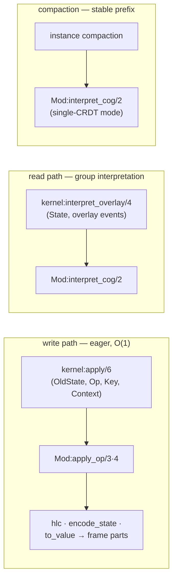
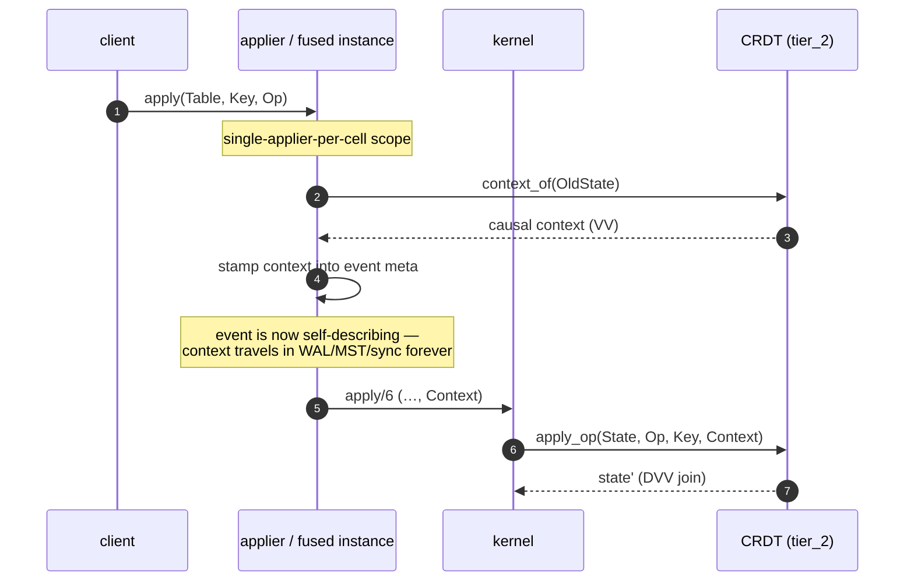
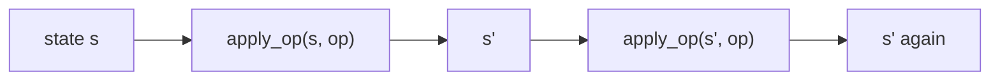
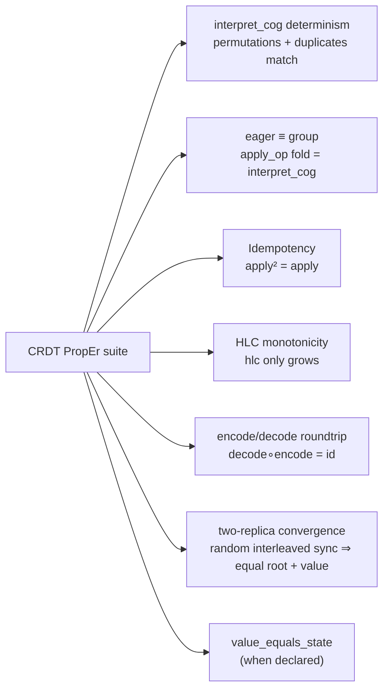

# The CRDT model

> Audience: anyone declaring a new table, implementing a custom CRDT,
> or curious why one substrate can serve LWW, counters, sets,
> multi-value registers and add-wins maps all at once.
> Time to read: ~15 min.

`bondy_mst` is **CRDT-agnostic**. The substrate appends operations,
replicates them, applies them — but it does not know what an operation
*means*. The meaning lives in a per-table **CRDT module** that
implements the `bondy_oplog_crdt` behaviour. This is a **pure
operation-based** architecture in the sense of Baquero, Almeida &
Shoker (*Pure Operation-Based Replicated Data Types*, 2017): the log
carries operations (not states), causal metadata is supplied by the
substrate, and the data type only *interprets*.

A CRDT module is — at its core — a single-operation step plus a group
interpreter plus a projection:

```
state' = apply_op(state, op, key)          %% one operation, eager write step
state' = interpret_cog(events, state)      %% a group, the SEC primitive
value  = to_value(state)
```

Operations travel as **opaque terms** in the WAL and the MST — there
is deliberately no `encode_event`/`decode_event`: the substrate never
asks a CRDT to serialise an op. Only the *state* has an encoding
(`encode_state/1` / `decode_state/1`), used by the projection HEAD
column and the compaction checkpoint.

`interpret_cog/2` — the Concurrent Operation Group interpreter, after
McCrary's *Canteen* (UC Berkeley, 2022) — is the single convergence
kernel. Everything else is an optimisation that must agree with it.

## The two design dials

Every CRDT declares two orthogonal properties:

- **`causal_tier()`** — the clock.
  - `tier_0` — scalar HLC only. Sufficient for commutative types
    (registers, counters, sets): HLC-monotonic delivery is a causal
    linearization and order cannot change the result.
  - `tier_1` — per-operation dot sets (reserved; no current type).
  - `tier_2` — a per-cell **causal context** (a version vector /
    Dotted Version Vector via `bondy_dvvset`) carried in the event
    `meta`, so `interpret_cog/2` can compute true *happens-before*
    and resolve concurrency-detecting types — the multi-value
    register and the add-wins map — which a scalar HLC cannot
    express (HLC(A) < HLC(B) does not imply A → B).
- **`order_independent()`** — the write path. `true` selects the
  O(1) eager step (`apply_op`) on the materialised cell — the common
  case, correct exactly because order cannot change the result.
  `false` means the type has no correct O(1) eager step; the kernel
  refuses it with `{non_commutative_crdt_eager_unsupported, Mod}`
  (a per-cell live-log re-interpretation path is a possible future
  step; `bounded_counter` is the only such type and has no
  production use).

The dials are independent. tier_2 types are still
`order_independent` — their `apply_op` is a DVV join, which is
commutative, associative and idempotent — so they ride the same
eager write path as tier_0, just with a causal context threaded in.

## The behaviour, at a glance

```mermaid
classDiagram
    class bondy_oplog_crdt {
      <<behaviour>>
      +causal_tier() tier_0 | tier_1 | tier_2
      +init() state
      +interpret_cog(events, state) state
      +query(query, state) result
      +to_value(state) value
      +hlc(state) hlc
      +encode_state(state) binary
      +decode_state(binary) state
      +removal_op() op °
      +stabilize(stable_hlc, state) keep | discard °
      +value_equals_state() bool °
      +order_independent() bool °
      +context_of(state) context °tier_2
      +reap_origins(state, retired) {state, reaped} °tier_2
    }
    class bondy_oplog_crdt_commutative {
      <<behaviour>>
      +apply_op(state, op, key) state °tier_0
      +apply_op(state, op, key, context) state °tier_2
    }
    bondy_oplog_crdt <|-- lww_register
    bondy_oplog_crdt <|-- g_counter
    bondy_oplog_crdt <|-- pn_counter
    bondy_oplog_crdt <|-- g_set
    bondy_oplog_crdt <|-- max_register
    bondy_oplog_crdt <|-- min_register
    bondy_oplog_crdt <|-- two_p_set
    bondy_oplog_crdt <|-- bounded_counter
    bondy_oplog_crdt <|-- mv_register
    bondy_oplog_crdt <|-- aw_map
    bondy_oplog_crdt <|-- aw_set
    bondy_oplog_crdt <|-- rw_set
    bondy_oplog_crdt <|-- ew_flag
    bondy_oplog_crdt <|-- dw_flag
    bondy_oplog_crdt <|-- index_entry
    bondy_oplog_crdt_commutative <|-- lww_register
    bondy_oplog_crdt_commutative <|-- mv_register
    %% (every catalogue type rides bondy_oplog_crdt_commutative; edges
    %%  elided for readability — see the table below for the full list)
```

(`°` marks optional callbacks.) The required set is `causal_tier/0`,
`init/0`, `interpret_cog/2`, `query/2`, `to_value/1`, `hlc/1`,
`encode_state/1`, `decode_state/1`.

The eager single-operation step lives in a companion behaviour,
`bondy_oplog_crdt_commutative`: `apply_op/3` (tier_0, context-free)
or `apply_op/4` (tier_2, with the write's causal context). Its
helper also provides a **generic `interpret_cog`** — sort the group
into canonical key order `{hlc, origin, seq}` and fold `apply_op` —
which is what most commutative types use as their `interpret_cog/2`
body, making the eager/group agreement true by construction.

## The kernel: one seam for every cell

Tables select their CRDT at `open_table` via `crdt_module`. A
`fold_module` *label* is accepted as a zero-migration alias from the
retired fold era and resolved to its byte-identical native twin by
`bondy_oplog_cell_kernel:default_crdt_for_fold/1` (e.g.
`fold_module => lww_register` resolves to
`bondy_oplog_crdt_lww_register`; durable cells decode unchanged).
A label with no twin raises `{unknown_cell_module, _}`.

All per-cell compute routes through `bondy_oplog_cell_kernel`:



- **Write** (the eager-materialised projection): the applier — or the
  fused instance — calls `kernel:apply/6`, which dispatches the
  CRDT's `apply_op`, then composes everything the V2 cell frame
  needs: `{NewState, Hlc, StateBytes, ValueBytes, ValueEqualsState}`.
- **Read**: `bondy_oplog_core` reads the projection frame and calls
  `kernel:interpret_overlay/4` to interpret the cell's *live group*
  of pending overlay events on top of the projection state — the
  CRDT's own `interpret_cog/2`, never a per-event state fold.
- **Compaction**: a catalogue (projection-backed) instance needs no
  re-fold at compaction — the projection *is* the per-cell
  `interpret_cog` checkpoint, maintained eagerly on write. A bare
  single-CRDT instance folds its stable prefix through
  `interpret_cog/2` into the compaction checkpoint
  ([chapter 06](06_compaction_and_bootstrap.md)).

### The agreement obligation

The eager path is an optimisation over the kernel primitive, so every
CRDT owes one equation:

> folding `apply_op` over a group, one op at a time, must produce the
> same state as `interpret_cog` over that group — for **any**
> permutation and **any** duplication of the inputs.

This is PropEr-pinned per type before a CRDT ships (permutation
invariance + eager-fold ≡ sorted-group-interpret). Types built on the
generic `bondy_oplog_crdt_commutative:interpret_cog` get it by
construction.

## tier_2: causal contexts

A tier_2 write needs to know *what the writer had observed*. The
substrate supplies this generically — the CRDT only consumes it:



The invariants that make this correct:

- The context is assigned **only at the origin**, inside the
  single-applier-per-cell scope, reading the freshest local state.
  It is never assigned upstream at append time.
- **Remote events are replayed verbatim** — a receiving replica never
  re-stamps `meta`. The stamp is gated strictly on locally-minted
  lineage.
- Each event carries its **own** observed context, so late or
  duplicated delivery cannot spuriously dominate; `interpret_cog/2`
  reconstructs each op with its context and joins.

The applier additionally maintains a per-cell **context-regression
guard** (`ctx_guard`): if a locally-stamped cell's causal context ever
regresses, the write is refused — this detects durable-state loss
before it can silently fork causality ([chapter 04](04_applier.md)).

A tier_2 cell carries one version-vector entry per origin that ever
wrote it. That cost is bounded by cluster size, not op count — but
entries of *retired* origins linger. `reap_origins/2` is the
membership-driven GC: given operator-supplied retired origins
(permanently gone, causally stable cluster-wide), it drops only the
entries that carry no live value. Only the add-wins family exports it
— `aw_set`, `aw_map`, `ew_flag`, `mv_register`. tier_0 types don't need
it (their per-origin entries *are* value), and the remove-wins pair
(`rw_set`, `dw_flag`) does not export it either.

## The non-negotiable properties

### 1. Determinism of `interpret_cog/2`

Same event set ⇒ same state, on every replica, regardless of arrival
order or duplication. This is the foundation of the Strong Eventual
Consistency guarantee; a non-deterministic implementation silently
diverges the cluster.

### 2. Idempotency under redelivery



The MST replicates by **set union** — the same operation can reach a
replica through the WAL, through anti-entropy, and again after a
crash-recovery replay. Applying it twice must produce the same state.
Per-origin `Seq` dedup (counters) or join semantics (registers, sets,
DVVs) are the standard mechanisms.

### 3. The HLC contract

Every CRDT answers one question consistently — *what is the maximum
HLC ever interpreted into this state?* `hlc/1` is non-decreasing as
operations are interpreted; the substrate stores it in the cell frame
and reads return it as the cell's logical timestamp. A separate
optional hook, `stabilize/2`, lets a type tell compaction — at a
cluster-stable HLC — whether a cell's state can be dropped or must be
kept.

## The catalogue

| module (`bondy_oplog_crdt_*`) | tier | eager | `value_equals_state` | semantics |
|---|---|---|---|---|
| `lww_register` | 0 | ✓ | no | last-writer-wins register; same-HLC ties broken deterministically on the payload |
| `g_counter` | 0 | ✓ | no | grow-only counter; per-Origin `{Count, MaxSeq}` with Seq dedup |
| `pn_counter` | 0 | ✓ | no | pos/neg counter; per-Origin accumulators, native per-Origin Seq dedup |
| `g_set` | 0 | ✓ | **yes** | grow-only set of opaque terms; `ordsets` join |
| `max_register` | 0 | ✓ | no | monotone max over an integer lattice (watermarks, quorum sizes) |
| `min_register` | 0 | ✓ | no | monotone min (deadlines, rate floors) |
| `two_p_set` | 0 | ✓ | no | two-phase set: a pair of grow-only sets (`add`/`rmv`); **removal is permanent** — a removed element can never be re-added |
| `mv_register` | **2** | ✓ | no | multi-value register on `bondy_dvvset`; concurrent writes surface as siblings, `to_value` returns all of them |
| `aw_map` | **2** | ✓ | no | add-wins map: dot-store + per-cell context VV; **pure remove** (drops the dots the remover's context observed — a concurrent add survives); a key resolves to the set of its concurrent sibling values (no per-key sub-CRDT) |
| `aw_set` | **2** | ✓ | no | add-wins (observed-remove) set; concurrent add\|remove ⇒ **add wins** |
| `rw_set` | **2** | ✓ | no | remove-wins set; concurrent add\|remove ⇒ **remove wins** (an add survives only if it observed every remove) |
| `ew_flag` | **2** | ✓ | no | enable-wins flag; concurrent enable\|disable ⇒ **enable wins** (add-wins over one token) |
| `dw_flag` | **2** | ✓ | no | disable-wins flag; concurrent enable\|disable ⇒ **disable wins** (remove-wins over one token) |
| `bounded_counter` | 0 | **✗** | no | zero-clamped counter; needs group evaluation — the kernel refuses the eager path; deferred, no production use |
| `index_entry` | 0 | ✓ | **yes** | internal — the secondary-index entry CRDT (apply ≡ merge LWW); see [chapter 03](03_bondy_db.md) |

This is the pure operation-based catalogue (the `pure_*` family of
Baquero/Almeida/Shoker) plus a few beyond-pure extras (`lww_register`,
`max`/`min_register`, `aw_map`, `bounded_counter`, `index_entry`).

Notes on the tier_2 types:

- **`mv_register`** — state is `{bondy_dvvset:clock(), hlc()}`: the DVVSet
  clock paired with the max HLC it has absorbed.
  `{set, V}` becomes `sync(State, update(new(Context, V), Origin))`;
  siblings are concurrent writes that neither dominated. The first
  tier_2 type, and the simplest exercise of every tier_2 seam.
- **`aw_map`** — an ORSet-style dot-store map plus one per-cell
  context VV (not a DVVSet per key — avoids per-key sibling
  explosion). `{put, K, V}` adds the value under a fresh dot (dropping
  the dots the writer's context already observed, so a sequential
  overwrite dominates); `{rmv, K}` drops exactly the dots of K the
  writer observed, read generically from the stamped context at apply
  time — there is no server round-trip and no client-supplied
  observed-dots argument. A key resolves to the *set* of its surviving
  concurrent sibling values; there is no per-key sub-CRDT (and so no
  `{apply, K, SubOp}` op). Add-wins emerges: a concurrent put's dot is
  not in the remover's context, so it survives.

### Add-wins vs remove-wins, and the shared cores

The add-wins and remove-wins families are causal duals, and each
family shares one implementation:

- **Add-wins** (`bondy_oplog_crdt_aw_core`): a dot-store of adds + a
  per-cell context. A `rmv` drops only the dots the remover *observed*;
  a concurrent add (un-observed dot) survives. Powers `aw_set`, `aw_map`,
  and `ew_flag` (an add-wins set over a single token).
- **Remove-wins** (`bondy_oplog_crdt_rw_core`): per element, the
  surviving adds + a *remove frontier* (the join of remove dots). An add
  survives only while its context **dominates** the frontier — i.e. it
  observed every remove; a concurrent remove beats it. Because the
  frontier only grows, a beaten add is pruned permanently. Powers
  `rw_set` and `dw_flag` (remove-wins over one token).

`two_p_set` is the tier_0 alternative for sets: no causal context, but
removal is permanent (no re-add). Choose it only when "removed means
gone for good" is the actual requirement.

### Retired types

The state-based fold family (`bondy_oplog_fold` +
`bondy_oplog_fold_*`) was retired with the pure op-based
re-grounding. Every commutative fold has a byte-identical native twin
(the alias table above). Five fold-era types were retired **without**
a twin — tables using them must move to a surviving type:

| retired | use instead |
|---|---|
| `presence_basic` | `lww_register` (presence is a register write) |
| `ttl_presence` | `lww_register` + application-level expiry |
| `orset` | `aw_set` (the dedicated add-wins / observed-remove set) |
| `strict_register` | `lww_register` — the substrate already crashes loudly on same-event-key collisions; surface concurrent-writer conflicts with `mv_register` if they must be visible |
| `map_of_fields` | `aw_map` (per-key sub-values) or one `lww_register` cell per field |

> **MST page-merge collisions.** When the MST sees two values for the
> same *event key*, the instance resolves them with a fixed internal
> rule (`bondy_oplog_instance:merge_page_value/3`): identical values
> pass through (idempotent peer re-receive), divergent values crash
> loudly — event keys are unique by construction, so a duplicate is a
> bug or an attack. This is unrelated to the CRDT catalogue: CRDT
> tables converge via their `fold_module`/`crdt_module`, not this
> hook.

## The projection-value seam

`kernel:apply/6` composes the parts of the **V2 cell frame** the
projection stores: the HLC, the encoded state bytes, and — unless
`value_equals_state() -> true` — a value column holding
`term_to_binary(to_value(State))`, so HEAD reads serve the projected
value byte-for-byte without decoding the full state. When
`value_equals_state` is `true` (g_set, index_entry) the column is
omitted and the state bytes double as the value; the read side's
`kernel:decode_value_bytes/2` knows the difference.

Those same encoded state bytes are the unit of cross-node agreement:
the state is the byte stream the MST stores and anti-entropy ships, and
two nodes that have converged on a cell hold byte-identical state for it
(see [chapter 06](06_compaction_and_bootstrap.md#the-applied-frontier-the-convergence-oracle)
for how convergence itself is judged — by the applied frontier, not by
re-hashing this state). Keeping the state encoding deterministic and
independent of how a projection backend lays the frame out is therefore
a correctness requirement, not just a convenience.

## Batched operations (packing many commands)

A single write to a Map (or set) cell can carry **many** commands at
once. `bondy_db:apply_batch/4` packs a list of the table CRDT's ops into
one `{batch, Ops}` event:

```erlang
ok = bondy_db:apply_batch(Users, Realm, <<"alice">>, [
    {put, <<"name">>, <<"Alice">>},
    {put, <<"age">>, 30},
    {rmv, <<"temp">>}
]),

%% declarative sugar over apply_batch/4:
ok = bondy_db:map_update(Users, Realm, <<"alice">>, #{
    put => #{<<"name">> => <<"Alice">>, <<"age">> => 30},
    rmv => [<<"temp">>]
}).
```

**One event, expanded lazily.** The packed op travels as a single opaque
event — one WAL entry, one MST entry, one projection read-modify-write —
and the substrate never unpacks it. Expansion happens only where state is
computed, at the one kernel funnel
`bondy_oplog_crdt_commutative:apply_op/5` (which both the eager write path
and `interpret_cog/2` route through): it folds each inner op onto the
state in list order. So there is no "expand at install" — the MST stays
compact; install, sync and compaction treat the batch as one entry.
Against N separate `apply/4` calls this collapses N WAL fsyncs, N
`await`s, N tier_2 context round-trips, and the N successive whole-cell
re-serialisations (super-linear as a map grows field-by-field) down to
one of each.

**Atomic, mutually-concurrent semantics.** Every inner op shares the one
event's dot `{Origin, Seq}` and one observed context, so the batch is a
single all-or-nothing causal unit:

- The commands do **not** observe each other. A `{put, K, V}` and a
  `{rmv, K}` in the *same* batch resolve add-wins — the put survives (the
  remove's context cannot see the put's dot). For a Map edit (set fields
  A, remove fields B, A ∩ B = ∅) this is exactly the intended atomic
  multi-field update.
- A concurrent **remote** operation either observed the whole batch or
  none of it.
- Repeated writes to the *same* field within a batch are resolved by list
  order (they share the dot, so the later one wins).

**Type scope.** Packing is safe only for CRDTs whose ops are identified
per sub-key/value — the dot-store and grow-set types: `aw_map`, `aw_set`,
`rw_set`, `two_p_set`, `g_set`, `ew_flag`, `dw_flag`. They declare the
optional `batchable/0` callback of `bondy_oplog_crdt_commutative`. Counters and
scalar registers (`pn_counter`, `g_counter`, `lww_register`,
`mv_register`, …) dedup or resolve by the event Seq / HLC, so several of
their ops packed under one identity would silently collapse;
`apply_batch/4` refuses such a table with `{error, {not_batchable, Mod}}`
— merge those client-side and use `apply/4` / `counter_inc/4`.

## Choosing a CRDT for a table

```mermaid
flowchart TB
    QC{counting events?}
    QB{must clamp at zero?}
    QM{monotone max/min<br/>over an integer?}
    QG{grow-only set?}
    QMAP{map with per-key<br/>add/remove semantics?}
    QCONC{must concurrent writes<br/>be *visible*?}
    QSTRICT{concurrent writes are<br/>an invariant violation?}

    QC -->|yes| QB
    QB -->|no, can go negative| PNC[pn_counter]
    QB -->|grow-only| GC[g_counter]
    QB -->|yes| BC["bounded_counter (deferred — no eager path)"]
    QC -->|no| QM
    QM -->|max| MAXR[max_register]
    QM -->|min| MINR[min_register]
    QM -->|no| QG
    QG -->|grow-only| GSET[g_set]
    QG -->|removable| QSET{set or flag, and how<br/>should concurrent<br/>add\|remove resolve?}
    QSET -->|add wins| AWS["aw_set (tier_2)"]
    QSET -->|remove wins| RWS["rw_set (tier_2)"]
    QSET -->|removal is permanent| TPS[two_p_set]
    QSET -->|single boolean, enable wins| EWF["ew_flag (tier_2)"]
    QSET -->|single boolean, disable wins| DWF["dw_flag (tier_2)"]
    QG -->|no| QMAP
    QMAP -->|yes| AWM["aw_map (tier_2)"]
    QMAP -->|no| QCONC
    QCONC -->|yes, surface siblings| MVR["mv_register (tier_2)"]
    QCONC -->|no| QSTRICT
    QSTRICT -->|yes| STRICT["mv_register (siblings = the conflict signal)"]
    QSTRICT -->|no| LWW[lww_register]
```

Prefer tier_0 when the semantics allow it: tier_2 pays for the
context stamp (a per-write read of `context_of`) and carries the
per-origin VV entries. See [chapter 07](07_app_developers_tour.md)
for worked, domain-shaped examples.

## Testing a custom CRDT

A CRDT should come with PropEr properties, in rough order of
importance:



P2 (eager-fold ≡ sorted-group-interpret) is the ship gate for any
`order_independent` type — it is exactly the agreement obligation
above. For tier_2 types add: convergence with concurrent writers
(siblings/add-wins resolved identically on every replica) and a
snapshot/bootstrap round-trip (the context survives `encode_state`).
See `bondy_oplog_crdt_aw_map_proper_test.erl`,
`bondy_oplog_crdt_commutative_test.erl`,
`bondy_db_mv_register_e2e_test.erl` and
`bondy_oplog_crdt_context_test.erl` for the shipped templates.

## Things to keep in mind

- **The substrate doesn't know what an op means.** Every table
  declares its CRDT module; ops are opaque terms end-to-end.
- **`interpret_cog/2` is the only convergence kernel.** The eager
  `apply_op` path is an optimisation that must provably agree with
  it.
- **Idempotency and determinism are the contract.** Without them,
  recovery, anti-entropy and the eager path all break.
- **HLC is the time the substrate speaks; tier_2 adds causality.**
  A scalar HLC orders, but cannot detect concurrency — that is
  precisely what the tier_2 context restores.
- **Concurrent writes are *visible*, not hidden.** LWW makes one
  win deterministically; `mv_register` surfaces siblings; `aw_map`
  lets adds win. Either way the decision is in the CRDT module, not
  magic.
- **Many commands can ride one event.** `apply_batch/4` packs a list
  of Map/set ops into one `{batch, Ops}` event (one WAL/MST entry),
  expanded at the kernel funnel; the inner ops are atomic and
  mutually-concurrent. Only the dot-store / grow-set types are
  `batchable` — counters and registers are refused.

## Pointers

Implementation:

- `bondy_oplog_crdt.erl` — the behaviour (required + optional
  callbacks, tier semantics, determinism invariant).
- `bondy_oplog_crdt_commutative.erl` — the eager-step companion
  behaviour (`apply_op/3·4`) + the generic sort-and-fold
  `interpret_cog` helper; the `{batch, Ops}` expansion in `apply_op/5`
  and the `batchable/0` capability (`is_batchable/1`).
- `bondy_oplog_cell_kernel.erl` — the per-cell seam:
  `from_modules/2` + `default_crdt_for_fold/1` (selection and the
  fold-label alias), `apply/5·6` (eager write step),
  `interpret_overlay/4` + `decode_value_bytes/2` (read seam),
  `reap_origins/3` (tier_2 GC dispatch).
- The native catalogue — `bondy_oplog_crdt_lww_register.erl`,
  `bondy_oplog_crdt_g_counter.erl`, `bondy_oplog_crdt_pn_counter.erl`,
  `bondy_oplog_crdt_g_set.erl`, `bondy_oplog_crdt_two_p_set.erl`,
  `bondy_oplog_crdt_max_register.erl`,
  `bondy_oplog_crdt_min_register.erl`,
  `bondy_oplog_crdt_mv_register.erl`, `bondy_oplog_crdt_aw_map.erl`,
  `bondy_oplog_crdt_aw_set.erl`, `bondy_oplog_crdt_rw_set.erl`,
  `bondy_oplog_crdt_ew_flag.erl`, `bondy_oplog_crdt_dw_flag.erl`,
  `bondy_oplog_crdt_bounded_counter.erl`,
  `bondy_oplog_crdt_index_entry.erl`.
- Shared cores — `bondy_oplog_crdt_aw_core.erl` (add-wins/observed-
  remove dot-store machinery, used by aw_set/aw_map/ew_flag) and
  `bondy_oplog_crdt_rw_core.erl` (remove-wins frontier machinery, used
  by rw_set/dw_flag).
- `bondy_dvvset.erl` — the Dotted Version Vector set the tier_2
  types build on (compact causal contexts; `sync` is the join).
- `bondy_oplog_cell_frame.erl` — the V2 cell frame the kernel's
  outputs are wrapped in.

Related but separate:

- **`bondy_oplog_instance:merge_page_value/3`** — the fixed internal
  rule for MST same-key duplicate resolution (identical passes,
  divergent crashes). Unrelated to operation interpretation.
- [Chapter 04](04_applier.md) — how the applier (and the fused
  instance) drive `kernel:apply/6` per batch.
- [Chapter 06](06_compaction_and_bootstrap.md) — `interpret_cog` at
  compaction; checkpoints and bootstrap.
