# Causal stability, compaction & bootstrap

> Audience: anyone who wants to know **why the log is bounded**, why a
> long-running cluster eventually carries no live events at all, and
> how a brand-new replica gets up to speed.
> Time to read: ~20 min.

This chapter covers the property that distinguishes `bondy_oplog` from
a plain replicated log: **the oplog is self-truncating**. Once peers
have caught up, the events that they all hold can be removed from the
MST — not marked deleted, *physically* removed — and replaced with a
single compacted state snapshot. At full convergence the live MST is
**empty**; the cluster's persistent state is the snapshot alone.

The mechanism in this codebase is the COG (Concurrent Operation
Group) idea — `bondy_oplog_compaction` orchestrates;
`bondy_oplog_instance` runs the cycle; `bondy_oplog_gc_scheduler`
fires it on a timer; the physical deletion is a TWO-step handoff —
`bondy_mst:truncate/2` unlinks the stable prefix (rewriting only the
O(log N) left spine) and `bondy_mst:gc/1` then sweeps the unlinked
subtrees' pages out of the store (`truncate_below_or_equal/3`; ETS
backend); `bondy_oplog_sync_session` (`bootstrap/3` /
`bootstrap_catalogue/3`) carries the snapshot to new replicas.

## The intuition: the MST is not a log, it's a *window*

Everywhere else in the architecture documentation we talk about
"events in the MST". That is true, but it understates the lifecycle.
Pictured over time, an instance looks like this:

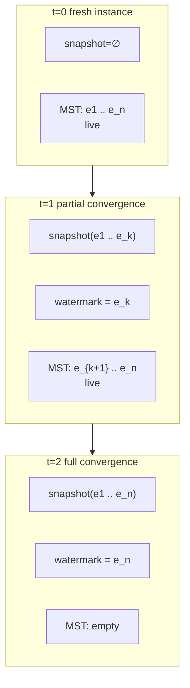

The MST is the **live window** of unstable events. The snapshot is the
**closed past**. The watermark separates the two. As peers exchange
events and confirm they have them, the boundary advances.

A handful of consequences fall out of this:

1. **The oplog is bounded by network propagation, not by app
   lifetime.** A long-quiet cluster's MST shrinks to nothing.
2. **A new replica syncs the snapshot once, then catches up the
   small live tail.** Not the whole history.
3. **The MST root changes when truncation happens.** Two replicas
   that have truncated to the same watermark hold the same live tail
   and so compute the same root. But two replicas in *different*
   compaction states do not — even when they hold identical data —
   and a fully compacted instance has an empty MST whose root is
   `undefined`. The root tracks the *live window*, not the
   *materialised state*.
4. **Convergence is therefore judged by what was applied, not by the
   MST root.** Because truncation moves the root without changing the
   data, root equality is not a faithful "do two nodes hold the same
   data?" oracle. The oracle is a separate **applied frontier** — a
   per-origin version vector of applied events; it is the subject of [its
   own section](#the-applied-frontier-the-convergence-oracle) below.

## What does "stable" mean here?

An event is **stable** when every (fresh, non-stale) peer is known to
hold it. The library tracks this through per-peer root hashes,
recorded by sync sessions:

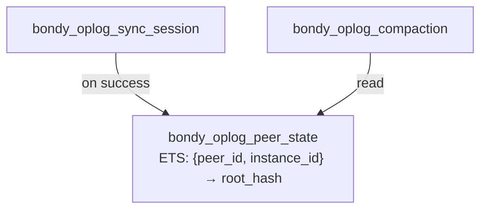

`bondy_oplog_peer_state` records, per `(peer, instance)`, the most
recent root hash observed on a successful sync, plus a `last_seen`
timestamp. Peers we haven't heard from in `peer_timeout_ms` (default
30s) are filtered out — silent peers must not pin the watermark
forever.

## Computing the stability frontier

The frontier is the highest event key K such that **every fresh peer
has every key ≤ K**. The algorithm — `compute_frontier_for/2` in
`bondy_oplog_instance.erl` — is:

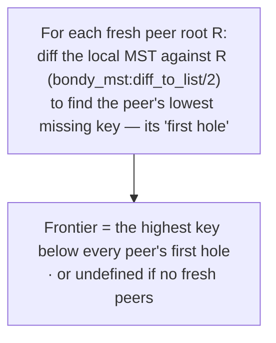

A few subtle things:

- **Each peer's "first hole"** is found by a structural diff of the
  local MST against the peer's advertised root. Page content-addressing
  makes the diff cheap — shared subtrees are compared by hash, not
  walked — so the historical root's pages need not be materialised as a
  key set.
- **The frontier is the longest common *prefix*** because keys are
  HLC-ordered. Stability is monotonic in HLC: if a peer has key K,
  it transitively has every key < K.
- **No coordination is required.** Two replicas that have observed
  the same set of peers compute the same frontier independently.

### Retention-bounded truncation for ephemeral catalogue instances

**An opt-in overload backstop, OFF by default.** Peer-confirmed
compaction is the primary history bound for ephemeral catalogue
instances exactly as for durable ones — it trails the write rate by
roughly one sync round plus one GC tick, so a loaded shard's live
history is bounded by propagation, not by app lifetime.

The incident that motivated this section deserves its honest history: a
fleet-scale subscribe-heavy load test drove every node of a 5-node
cluster to 90-98% RAM in minutes, and an A/B experiment appeared to
prove the growth was a capacity fact of stability-driven compaction
itself. That conclusion was CONFOUNDED: `bondy_oplog_gc_scheduler` had a
head-of-line starvation defect (each tick walked `list_instances()` from
the head and the first `max_concurrency` fast-completing instances —
the idle `main/*` shards — monopolised every round), so compaction had
never run at all for `registry/*` shards on any clustered node in any of
those experiments. With the scheduler firing fairly
(least-recently-fired first), the peer-confirmed frontier advances
normally under load and drains history fully once writes stop.

What retention exists for is the residual risk the confirmed frontier
cannot cover: a live-but-lagging peer (or one partitioned longer than
`peer_timeout_ms` filters for) pins the frontier, and on the memory
topology pinned history is RAM. Enabling the policy trades the
soundness invariant peer confirmation provides — *never truncate what a
live peer still lacks* — for a hard local bound; the recovery paths
below exist to pay that trade's cost. Instance opt `mst_retention =>
#{max_age_ms, max_events}` (registry knobs `db.registry.retention.*`,
both default `0` = disabled):

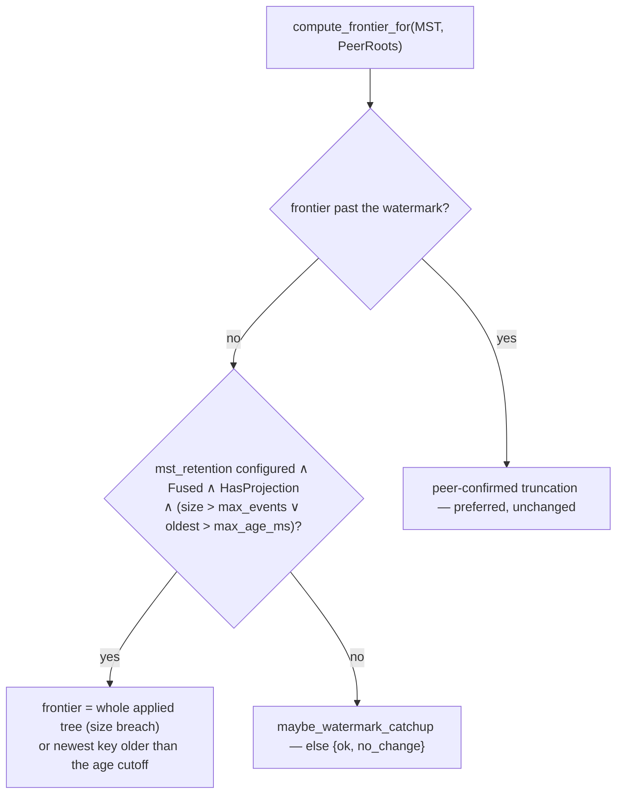

Key properties:

- **Peer-confirmed first.** A confirmed frontier is strictly better —
  every peer already holds that prefix, so truncating it costs nobody a
  bootstrap. Retention fires only when the confirmed path yields
  nothing (`retention_or_catchup/5` → `retention_frontier/3` in
  `bondy_oplog_instance.erl`).
- **Sound because ephemeral + projection-backed.** A restart wipes the
  instance anyway (no durability to protect) and the projection
  materializes all applied state, so truncation loses nothing locally.
  Enforced twice: `mst_retention` requires `fused`
  (`validate_retention/2`; `fused ⇒ ephemeral` per
  `bondy_db:assert_fused_requires_ephemeral/2`) and never fires without
  a projection (`retention_ctx/2`). Durable instances are untouched.
- **Uniform policy, not per-node heroics.** Every node bounds these
  instances by the same policy, so no peer's frontier computation is
  held hostage by another node's retained history. Solo nodes need no
  special case — retention truncates regardless of membership (the
  earlier interim solo-membership carve-out was subsumed and removed).

What a peer that missed truncated history does:

- **Failed page pull** — the pages are gone. The session's FIRST move
  is not to give up: a miss usually just means the peer truncated (and
  page-GC'd) mid-round, so the session re-requests the peer's current
  root and continues against that — its live pages are always servable
  (`chase_refreshed_root/7`, budget-bounded). Only when the peer has
  not moved AND the peer's applied-frontier VV is strictly ahead of
  ours does the session die with `{peer_pages_unavailable, _}` and the
  scheduler flag a catalogue re-bootstrap (dedup + backoff,
  `?REBOOTSTRAP_TAB`); a miss with NO frontier deficit ends the round
  benign — the unpullable pages covered only events this replica
  already applied. Treating every miss as terminal caused a
  re-bootstrap storm on every truncation round, each one a needless
  clobber-and-rederive cycle.
- **Silent deficit** — the peer truncated events this node NEVER
  received, so no page pull fails; instead, after every complete round
  a retention instance compares the peer's pre-round applied-frontier
  VV against its own post-replay VV. Strictly behind on any origin ⇒
  the session fails with `{frontier_gap, Origins}` and the scheduler
  flags the same re-bootstrap. Crucially this check also **gates
  frontier adoption**: the "adopt the peer's frontier after a
  successful round" oracle-repair is only sound when peer compaction
  implies all-peer confirmation — retention breaks that implication,
  and adopting across a gap would report CONVERGED over silently
  missing data. This is ALSO the organic join-time trigger: a fresh
  replica's first sync against a truncating cluster lands here and
  bootstraps; a fresh cluster with nothing yet truncated syncs clean
  with no wasted bootstrap.
- **Catalogue bootstrap works on fused instances** (it must — it is the
  only complete recovery source once history truncates): the snapshot
  producer resolves the projection target through the fused instance
  itself when there is no applier (`bondy_oplog_catalogue_snapshot:
  resolve_cell_apply_target/1`), and the installer runs in the fused
  gen_server over its own mux cell-apply source
  (`bondy_oplog_applier:install_catalogue_cells/3`, shared body).
- **Live re-bootstraps re-derive the projection afterwards** — on fused
  instances via `bondy_oplog_instance:rederive_projection/1` (the
  fused counterpart of the applier's `rederive_projection_sync/1`,
  routed by `bondy_oplog_sync_session`). The `replace`-mode install is
  skip-if-older by HLC, which can clobber a per-Origin-accumulating
  cell: the peer's higher-HLC copy may omit ops the peer had not
  applied when its snapshot was cut, and the loss is invisible to the
  convergence oracle (the local applied-frontier VV still covers the
  clobbered ops). The rederive re-applies every retained MST event —
  already-held ops are rejected by the kernel's causal metadata,
  missing ops integrate. **This remedy is complete only for ops still
  inside the retained window**: under peer-confirmed compaction that is
  guaranteed (anything truncated is in everyone's cells already), which
  is exactly why retention — which truncates past confirmation — is an
  opt-in trade rather than a default.

## The compaction cycle

`bondy_oplog_gc_scheduler` ticks every `gc_interval_ms` (default 1s)
and spawns one short-lived worker per instance, firing the
**least-recently-fired instances first** — the `gc_max_concurrency` cap
(default 4) admits only that many workers per round, and a stable
head-of-list order would permanently starve every instance beyond the
cap whenever the head's triggers complete within one interval (the
defect that kept `registry/*` shards uncompacted behind 16 idle
`main/*` shards and caused the fleet-scale OOM). The worker just
**issues the compaction call**; the instance gen_server runs the whole
five-step cycle **synchronously**:

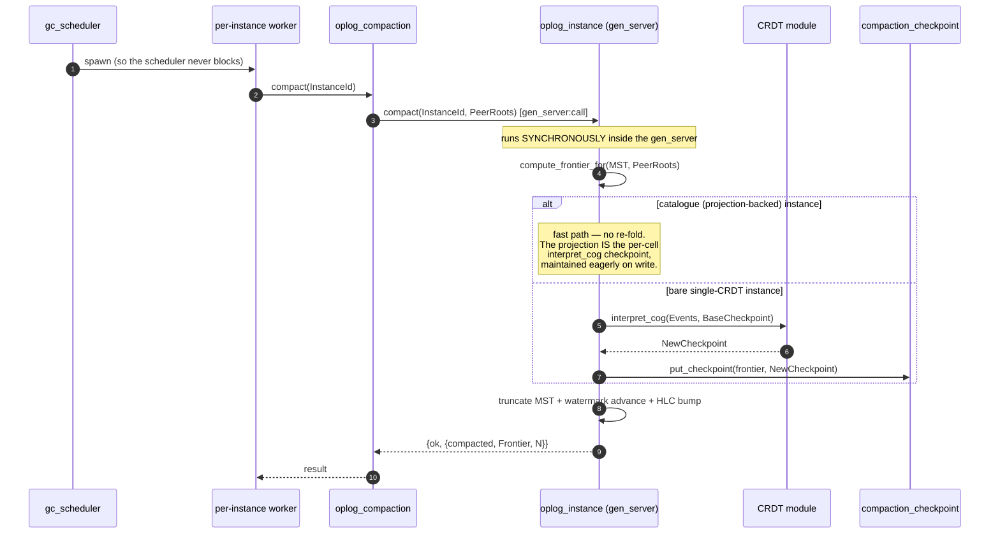

Three design choices worth noting:

- **Compaction runs synchronously inside the instance gen_server.**
  Frontier computation, `interpret_cog`, checkpoint persistence, and the
  truncate/watermark/HLC commit all run in the gen_server's `compact`
  handler. The only off-process actor is the gc_scheduler's per-instance
  worker, which merely issues the call — so the *scheduler* never blocks.
  While a compaction runs the instance is busy, but lock-free reads and
  stateless appends are unaffected (they bypass the gen_server); only the
  applier's install casts queue behind it.
- **The cycle is concurrency-guarded.** Only one compaction per
  instance is in flight at a time; overlapping requests reply
  `{ok, no_change}` and the next tick retries. Compaction is
  idempotent, so a missed tick is not a problem.
- **No overlay-drain barrier.** The frontier derives from peer-synced
  roots, which only ever reflect installed, published events — it is
  always at or below the installed watermark, strictly below anything
  still pending in the overlay. `compact/1` therefore runs safely
  under sustained write load; in fused mode the yielding drain
  guarantees the compact request is actually serviced between drain
  slices. (`truncate_prefix/2`, whose watermark is caller-supplied
  and arbitrary, keeps its barrier.)

The cycle yields `{ok, no_change}` (no fresh peers, empty
intersection, or frontier ≤ current watermark) far more often than
`{ok, {compacted, _, _}}`. That is expected — most ticks are no-ops
that just confirm there is nothing new to compact.

## "Truncate" means **delete pages**, not tombstone events

The MST truncation step is the one that actually bounds the tree. It is
not a soft-delete: the instance calls `bondy_mst:truncate/2` with the
watermark, a **structural prefix-truncate** that removes every key
`≤ Watermark` in one pass.

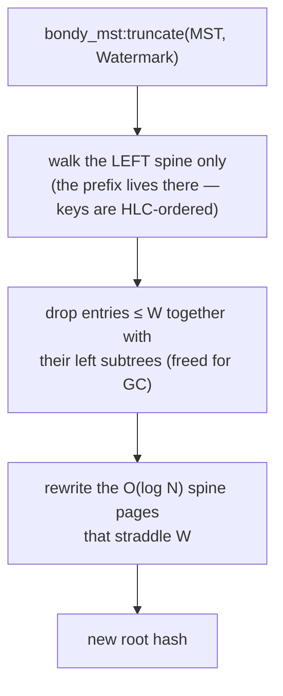

Unlike calling `bondy_mst:delete/2` once per stale key — `O(P·log N)`
in the prefix size, one spine rebuild per key — `truncate/2` walks the
left spine **once**, rewrites only the `O(log N)` pages that straddle
the watermark, and leaves the dropped subtrees unreferenced for the
store's GC. Because the MST is history-independent, the result is
**byte-identical** (same root hash) to the equivalent sequence of
deletes and to a fresh tree built from the surviving keys — a
property pinned by equivalence tests.

This matters because:

- **No tombstones to ship over AE.** Sync sessions exchange only
  pages that exist; truncated keys are simply gone.
- **GC reclaims the space.** The pack-store rewrite GC reads only
  pages reachable from the live root; freed pages are not written
  to the new pack and the old packs are unlinked. (The ETS store
  prunes freed pages by epoch.)
- **Truncation is deterministic.** Every replica that truncates the
  same prefix arrives at the same tree (same pages, same root hash).

`bondy_mst:truncate/2` is implemented in `bondy_mst.erl`
(`truncate_at` / `truncate_scan` / `rebuild_truncated`);
`bondy_mst:delete/2` remains for single-key structural deletion.

## The compaction checkpoint

For a **bare single-CRDT instance**, the checkpoint is the output of
`CrdtMod:interpret_cog(Events, BaseState)` folded over every event in
the stable prefix since the last compaction. For a **catalogue
(projection-backed) instance** no separate fold is needed — the
projection, maintained eagerly on write through the cell kernel, *is*
the per-cell `interpret_cog` checkpoint; compaction only truncates
the MST.

The substrate stores the single-CRDT checkpoint via the
`bondy_oplog_compaction_checkpoint` behaviour (named to disambiguate
it from the *catalogue snapshot* used by bootstrap, below):

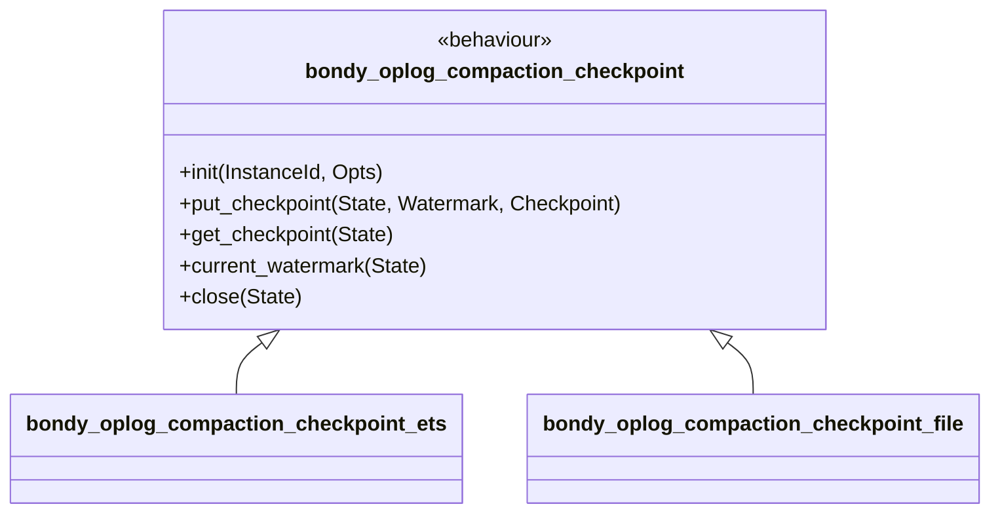

Two storage implementations ship; the default is **context-sensitive**
— file-backed when `storage_path` is set, ETS otherwise:

| Backend | Durability | Use |
|---|---|---|
| `bondy_oplog_compaction_checkpoint_ets` | in-memory | tests, ephemeral instances |
| `bondy_oplog_compaction_checkpoint_file` | tmp + datasync + rename + fsync-dir, at `<storage_path>/<InstanceId>/checkpoint.etf` | production |

The file backend treats a decode failure as `{error, {corrupted, _}}`
and the instance **refuses to start** on a corrupted checkpoint —
loud, not silent.

The library policy is **one checkpoint per instance** — the most
recent one. Older checkpoints are not retained. The live MST plus the
latest checkpoint fully reconstruct the application state.

The checkpoint slot additionally carries the instance's applied
frontier — the convergence-oracle version vector for the compacted
prefix — written at every compaction commit and at clean shutdown, so it
is restored on the next start rather than rebuilt from a projection scan
(see [The applied frontier](#the-applied-frontier-the-convergence-oracle)).

## The CRDT module (the COG interpreter)

The substrate is meaning-agnostic. Each instance is bound at start
time to a CRDT module implementing the `bondy_oplog_crdt` behaviour:

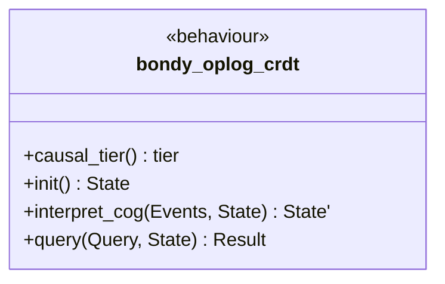

Three things to know about `interpret_cog/2`:

1. **It must be deterministic.** Same `(Events, State)` ⇒ same
   `State'`, on every replica. Non-determinism breaks Strong
   Eventual Consistency.
2. **It receives events in key (HLC) order.** Concurrent operations
   are co-batched; the interpreter resolves conflicts however its
   CRDT semantics require.
3. **It is called both for compaction and for live queries.** During
   compaction it folds the stable prefix into the snapshot; during
   reads `bondy_db` may also fold live events on top of the latest
   snapshot.

`interpret_cog` is the **COG interpreter** of the original Canteen
design — same role, same contract, same determinism invariant.

## The empty-MST steady state

Imagine three peers, a moderate write rate, and steady AE. Over time:

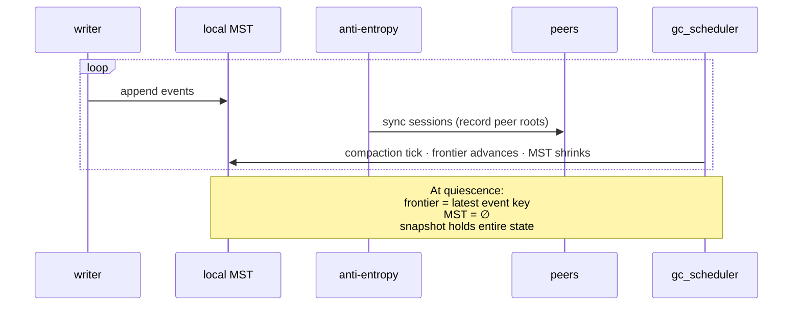

In a quiescent, fully-converged cluster the live MST is empty. New
appends populate it briefly; the next compaction tick (~1s) drains it
again. The cluster's *durable* persistent state is the snapshot —
the MST is a transient buffer for "events the cluster has not yet
all agreed on".

This is the precise opposite of the conventional log-replication
mental model. Practically, it means:

- **Old replicas don't carry old log.** Their disk footprint is
  bounded by snapshot size, not write history.
- **AE bandwidth is bounded.** Catching up is at worst the size of
  the live tail, never the size of history.
- **New replicas don't replay the world.** They get the snapshot
  and a small live tail (next section).

## The applied frontier: the convergence oracle

The empty-MST steady state forces a question the rest of the
architecture has quietly assumed away: once two converged peers both
hold an empty MST, *how does anything verify they actually hold the
same data?* The MST root cannot answer it. Truncation moves the root
without changing the data, so two peers in different compaction states
compute different roots for identical data, and a fully compacted
instance's root is `undefined`. Comparing roots in this regime yields
two failure modes — a false **diverged** verdict for identical data
(one peer compacted, one not), and, once both peers compact to empty,
a false **in-sync** verdict in which both advertise `undefined` and
nothing has been compared at all.

The convergence oracle is therefore taken over **what each instance has
applied**, not over the MST. Each instance maintains an **applied
frontier**: a version vector mapping every event origin to the highest
sequence number it has applied from that origin,

```
frontier = #{ Origin => max Seq applied from Origin }
```

over every `{HLC, Origin, Seq}` `cell_apply` event the instance has
materialised. One property of the op-log makes a per-origin maximum a
complete summary of the applied set: **delivery is causal — no per-origin
gaps.** Because an origin's events apply in sequence order with nothing
skipped (see [chapter 02](02_event_log_and_keys.md)), knowing the
maximum sequence applied from an origin is equivalent to knowing
*exactly which* of that origin's events have been applied. Two instances
with equal frontiers have therefore applied the same op-set, and the
op-based CRDT guarantees the same op-set yields the same state (see
[chapter 05](05_crdt_model.md)). Two further properties make this the
right oracle:

- **It is compaction-invariant.** The frontier is a cumulative *applied
  position*, not a snapshot of live state. Compaction truncates the MST
  and advances the checkpoint; it removes none of the positions already
  reached. An empty MST and a full MST over the same applied history
  carry the same frontier.
- **It is cheap.** The frontier is `O(#origins)` — one integer per node
  that has ever authored an event — not `O(#cells)`. There is no fold
  over the projection at any point, on any path.

It is maintained on the apply path: at each commit barrier the applier
**max-merges** the batch's per-origin maxima into the frontier (see
[chapter 04](04_applier.md)). Max-merge is idempotent and monotone, which
is what makes recovery trivial — re-applying an event that is already
counted leaves the frontier unchanged.

### Recovery: three durable sources, no recompute

Because max-merge is idempotent, an instance reconstructs its frontier at
`init/1` by merging three durable sources, in any order, with no
projection rescan and no transient "not yet authoritative" state:

1. **The compaction checkpoint** carries the frontier of the *compacted
   prefix* — the events truncated from both the WAL and the MST, whose
   maxima are recoverable nowhere else. `terminate/2` and every
   compaction commit persist it.
2. **The live MST** carries the uncompacted, already-applied events
   (compaction watermark → durable root). A clean restart resumes at the
   tail, so these never replay; their maxima are folded directly out of
   the MST's `cell_apply` keys — `O(live MST)`, bounded by compaction.
3. **The WAL tail** carries events past the durable root, which the
   applier replays on the normal apply path after `init/1`, topping up
   the frontier as it goes.

This is deliberately *not* a fold over the materialised projection. An
`O(#cells)` rescan on every restart was the cold-boot cost the frontier
exists to avoid; reconstruction here is bounded by the live op-log, which
compaction keeps small.

### Comparing across peers

A peer fetches another's frontier with a `get_frontier` request over the
anti-entropy channel; the reply carries the frontier map and the node's
keying-topology fingerprint (see
[chapter 03](03_bondy_db.md#the-topology-manifest)). Two instances are
judged converged when their fingerprints agree (the projections are keyed
the same way, so the frontiers are comparable) and the frontiers are
equal — including the case where both are empty, which the MST root could
not distinguish from "untested". The operator sync view reads convergence
this way; the MST root survives only as a fallback for a peer too old to
answer the frontier request.

The frontier holder and its max-merge live in `bondy_oplog_registry`; it
is maintained on the apply path in `bondy_oplog_cell_apply` and
reconstructed at startup in `bondy_oplog_instance` (`restore_frontier`
from the checkpoint, `frontier_from_mst` from the live tree).

## Bootstrap: how a new peer joins

The complement to truncation is **snapshot transfer**. A replica
joining a cluster — or recovering from a long outage — has a stale
or empty MST. Plain anti-entropy would have to ship the entire
history; instead, the replica bootstraps from a peer:

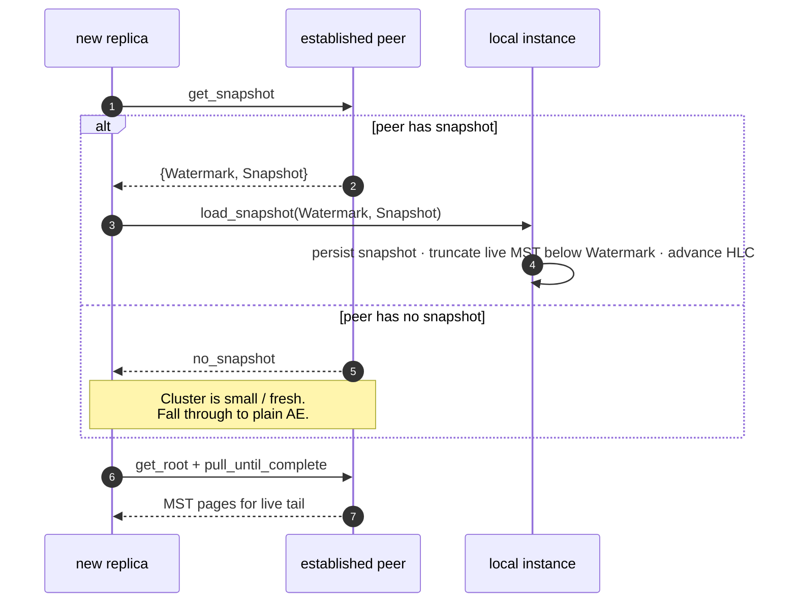

The entrypoint is `bondy_oplog_sync_session:bootstrap/3`. After the
snapshot is installed, normal AE picks up at the watermark and
catches the live tail (typically a few seconds of events) — not the
whole history.

`bondy_oplog_instance:load_snapshot/3` enforces watermark monotonicity:

- If the local watermark is `undefined`, install the snapshot.
- If the peer's watermark is strictly greater, install and advance.
- Otherwise refuse with `{error, watermark_not_advancing}` and fall
  through to plain AE.

> **Terminology.** The sequence above is the **single-CRDT** (bare
> instance) bootstrap: what travels is the instance's *compaction
> checkpoint* (the wire request is still named `get_snapshot`).
> Catalogue instances — the `bondy_db` common case, where state is a
> per-cell projection rather than one CRDT state — use the
> **catalogue snapshot** protocol below. Same lifecycle gate, a
> different payload.

### Catalogue-mode bootstrap (multi-cell snapshot)

A catalogue's state is millions of cells, not one term, so the
transfer is a **cursor-paginated cell stream**
(`bondy_oplog_sync_session:bootstrap_catalogue/3`):

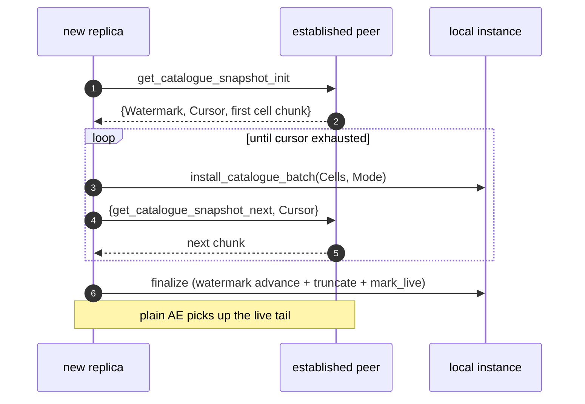

`install_catalogue_batch` writes cells in **replace** mode: each cell is
written as-is, using the projection adapter's `head/3` fast path when
exported. Bootstrap always streams into a fresh replica, so there is no
surviving local state to merge against. The finalize step performs the
same monotonic watermark advance and `mark_live/1` ordering as the
single-CRDT path.

**The frontier travels separately.** The streamed cells are
`{Bucket, Key, Frame}` triples — HLC and folded value only. They do
**not** carry the `{Origin, Seq}` pairs the [applied
frontier](#the-applied-frontier-the-convergence-oracle) is built from
(the frontier is advanced only on the WAL-drain apply path, never on a
direct projection write). So installing every cell seeds the replica's
*data* but leaves its frontier empty — and a replica that holds all the
data yet reports an empty frontier is judged **diverged forever**. The
finalize entry point therefore takes the peer's frontier and adopts it:
`finalize_catalogue_bootstrap/4` captures the peer's `get_frontier`
response *before* the stream starts (a lower bound on what the live scan
ships, so it never over-claims) and max-merges it into the local
frontier alongside the watermark advance. `finalize_catalogue_bootstrap/3`
is the degenerate no-merge form. Without this, the snapshot would
converge by data but never by the oracle.

## Bootstrap lifecycle: gating the applier

There is a subtle hazard in the bootstrap story above: between "instance
process starts" and "snapshot installed", what stops the applier from
draining live events onto an empty projection? Nothing, historically —
the applier would happily apply `+100` onto bottom state and converge
to wrong values. The failure is silent and affects **every** fold
strategy, not just counters.

The fix is an explicit, substrate-enforced two-state lifecycle per
instance:

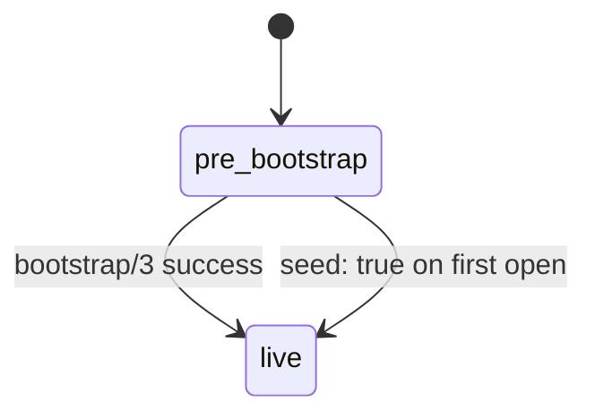

- **`pre_bootstrap`** — default state for a freshly-opened
  *persistent* instance. The WAL accepts writes from local appenders
  and sync sessions (the WAL is the durable buffer); the applier does
  not drain.
- **`live`** — applier drains normally.

The lifecycle bit lives in `<instance_dir>/lifecycle.live`, an empty
flag file. Presence ⇒ `live`. Absence ⇒ `pre_bootstrap`. The
transition is atomic via `file:rename/2` — no parsing, no checksum,
no version handshake. A boolean mirror in `atomics` keeps the
applier's hot-loop check syscall-free.

### Bootstrap completion ordering

`bondy_oplog_sync_session:bootstrap/3` performs three durable effects.
Order matters:

1. `load_snapshot` installs the snapshot and advances the watermark
   to `H_boot` (idempotent under crash-replay).
2. `mark_live/1` writes the durable flag file — **the marker that
   "everything before me succeeded."**
3. Plain AE picks up events past the new watermark.

`mark_live/1` MUST run last. A crash between (1) and (2) leaves no
flag file; on restart the lifecycle goes back to `pre_bootstrap` and
the operator re-runs `bootstrap/3`, which idempotently re-installs
the snapshot.

### Genesis: `seed: true`

The first peer in a fresh cluster has nothing to bootstrap from. To
declare a genesis peer, pass `seed => true` in the instance opts.
On first open this flips the lifecycle directly to `live` and (when
`storage_path` is configured) writes the flag file so subsequent
restarts also see `live` without needing the opt again.

### Ephemeral instances

Instances without `storage_path` cannot persist a flag file. For
those the lifecycle is in-memory only and defaults to `live` —
there is no persistent state to bootstrap from, and tests that
don't think about lifecycle work unchanged. `seed: false` is still
honoured for tests that want to exercise the gate.

### Summary

| Configuration | Initial state |
|---|---|
| `lifecycle.live` exists on disk | `live` |
| `seed: true` in opts | `live` (writes flag file if persistent) |
| No `storage_path` (ephemeral) | `live` |
| Persistent, no flag file, `seed: false` | `pre_bootstrap` |

Modules: `bondy_oplog_bootstrap_lifecycle.erl` (the durable bit +
atomic mirror), `bondy_oplog_instance.erl` (`mark_live/1`,
`lifecycle_state/1`), `bondy_oplog_applier.erl` (gate in
`drain_loop/1`).

## Auto-bootstrap and dispatch policy

The lifecycle gate above guarantees correctness — the applier does
not drain until the snapshot is in place. But the gate alone is
inert: someone has to call `bondy_oplog_sync_session:bootstrap/3`
to flip a fresh persistent replica from `pre_bootstrap` to `live`.
Before this layer, that someone was application code; consumers
who forgot to call `bootstrap/3` ended up with replicas that
silently never drained.

`bondy_oplog_sync_scheduler` closes the loop. The default tick
inspects each running instance's lifecycle and routes
accordingly:

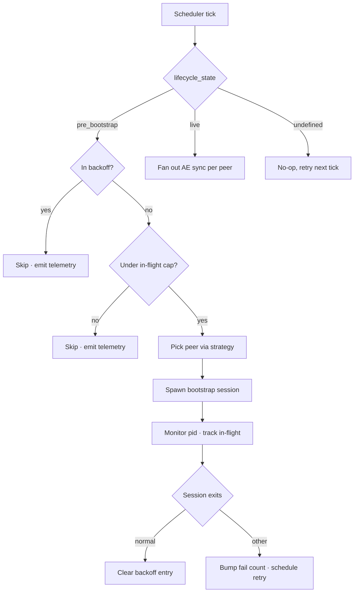

A `pre_bootstrap` instance is dispatched to **exactly one** peer
per tick. Bootstrap ships a full projection (catalogue mode) or a
full MST snapshot (single-CRDT mode), so multi-peer dispatch would
duplicate I/O without improving correctness. A `live` instance
fans out one pull-direction sync session per peer — but that fan-out
is no longer unconditional: it is bounded by the node-wide AAE
concurrency cap, deduplicated per peer, throttled once the shard
converges, and (optionally) yielded under routing load. Those four
regulators are the subject of [Keeping anti-entropy subordinate to
routing](#keeping-anti-entropy-subordinate-to-routing) below.

### Four knobs in front of one decision

| Knob | Default | Purpose |
|---|---|---|
| `bootstrap_peer_strategy` | `first` | Which peer is selected when dispatching: `first` (deterministic head of the peer list), `random` (uniform), or `round_robin` (per-instance index). |
| `max_inflight_bootstraps` | `4` | Global cap on parallel bootstrap sessions. Over-cap dispatches are skipped; the instance stays `pre_bootstrap` and retries on the next tick as in-flight sessions drain. `0` disables dispatch — operator escape hatch. |
| `bootstrap_retry_base_ms` | `500` | Initial backoff after a non-`normal` session exit. Doubles on each consecutive failure. |
| `bootstrap_retry_max_ms` | `30000` | Upper bound on the exponential backoff. |
| `bootstrap_retry_jitter` | `true` | Multiplies the wait by uniform `[0.5, 1.5]` to spread retries when many instances fail in the same window. |

Each knob has a runtime setter on `bondy_oplog_config` (no restart, no
recompile). The current configuration is visible via
`bondy_oplog_sync_scheduler:info/0`.

### Gate ordering

The two skip gates run in this order on every `pre_bootstrap`
dispatch:

1. **Backoff** — if `now < NextRetryMs` for this instance, skip.
   An instance in backoff does NOT consume an in-flight cap slot
   (so other instances still dispatch).
2. **Cap** — if `inflight_count >= max_inflight_bootstraps`,
   skip. Within a single tick, the in-flight count is monotonic
   (DOWN messages queue but are not processed until the tick
   completes), so the cap is deterministic per-tick.

### Lifecycle state machine extended

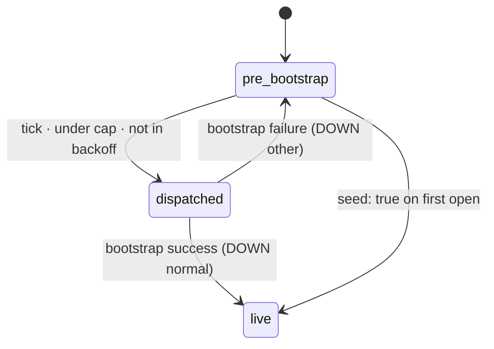

A failed bootstrap session keeps the instance in `pre_bootstrap`;
the next tick re-evaluates the lifecycle and (assuming backoff has
elapsed) re-dispatches. This is the structural self-healing
property — there is no separate retry machinery, just the standard
tick + lifecycle re-evaluation.

### Telemetry surface

Each gate emits a dedicated event so operators can monitor
retry pressure without sampling logs:

| Event | When | Meta |
|---|---|---|
| `[bondy_oplog, sync_scheduler, dispatch_bootstrap]` | A session was spawned. | `instance_id`, `peer`, `mode` (`catalogue \| single_crdt`), `strategy` |
| `[bondy_oplog, sync_scheduler, bootstrap, started]` | Session pid was added to the in-flight set. | `instance_id`, `pid` |
| `[bondy_oplog, sync_scheduler, bootstrap, ended]` | Session pid exited (any reason). | `instance_id`, `pid`, `reason` |
| `[bondy_oplog, sync_scheduler, bootstrap_capped]` | Dispatch skipped because in-flight cap was hit. | `instance_id` |
| `[bondy_oplog, sync_scheduler, bootstrap_backoff_deferred]` | Dispatch skipped because `now < NextRetryMs`. | `instance_id` |
| `[bondy_oplog, sync_scheduler, bootstrap_retry_scheduled]` | A failure bumped the fail count + wrote a new retry time. | `instance_id`, `wait_ms`, `fail_count` |

### Operator playbook

| Symptom | Action |
|---|---|
| New cluster cold-start storms peer network/disk. | Lower `max_inflight_bootstraps`. Default `4` is conservative; very large clusters may want lower. |
| One specific peer is hot under bootstrap load. | Switch `bootstrap_peer_strategy` to `round_robin` or `random`. |
| A specific replica keeps failing to bootstrap. | Watch `bootstrap_retry_scheduled` telemetry for that `instance_id` — `fail_count` rising past 5+ means the peer-pool is genuinely unreachable for this replica, not a flake. |
| Need to quiesce bootstrap traffic without disabling AE. | `bondy_oplog_config:set_max_inflight_bootstraps(0)` — sessions in flight drain naturally; no new ones are spawned. |
| Tests need deterministic retry timing. | `bondy_oplog_config:set_bootstrap_retry_base_ms(0)` + `bondy_oplog_config:set_bootstrap_retry_jitter(false)`. |

## Keeping anti-entropy subordinate to routing

A Bondy node's real job is routing messages; anti-entropy is background
work that must never render the node useless. Bootstrap dispatch (above)
is gated; the steady-state `live` fan-out is regulated by four
independent mechanisms that compose. Together they bound how much of the
node AAE may consume — in concurrency, in memory, and in scheduler time —
without ever starving a shard or the authentication path.

### The node-wide concurrency cap

`aae_max_concurrency` (default `3`) caps how many sync sessions —
bootstrap **or** live — run at once, across the whole node. Every spawned
session is tracked and monitored in a named ETS table keyed by its pid
and tagged by kind and peer (`{Pid, InstanceId, bootstrap | live, Peer}`);
the row count is the in-flight number the cap reads, fresh before every
dispatch, so the cap holds across instances within a tick. The
bootstrap-only `max_inflight_bootstraps` (`4`) is a *narrower sub-cap*
inside this one — a bootstrap dispatch needs headroom under both. A live
fan-out additionally skips any peer it already has a session running
against, so a slow (bulk-syncing) shard never stacks duplicate sessions
on the same peer.

### Bounded-memory sync

The cap governs *speed and fairness*, not the memory ceiling — that is a
separate budget. `aae_max_pages_in_flight` (default `2048`) is the
node-wide ceiling on MST pages any reconciliation may materialise at
once. A session pulls a peer's missing pages in **rounds**, each bounded
to `aae_pages_per_round = aae_max_pages_in_flight ÷ aae_max_concurrency`.
Dividing the budget by the concurrency is what makes the memory ceiling
independent of how many sessions run: one session pulls big batches,
three each pull a third — same node-wide page peak, three-way fairness.
The historical failure this fixed: a session pulled the *entire* missing
set in one round, so a bulk initial sync loaded a whole shard tree at
once — times every shard syncing concurrently, the 16× blow-up that drove
a fresh replica to multiple GB. (The page budget bounds the sync buffers;
the transient apply garbage the instance *process* accumulates is
reclaimed separately by the per-instance heap monitor — see
[chapter 01](01_bondy_oplog.md#the-instance-heap-monitor).)

### Fairness: per-tick rotation

A low cap must not let the head shards monopolise the scarce slots. Each
tick sorts the running instances into a deterministic order and then
**rotates** that list by a monotonic tick counter before dispatching, so
the instances that win the free slots rotate across ticks. This is what
makes a low cap safe: with `aae_max_concurrency = 1`, a fixed order would
let the first shard hold the only slot forever and starve the rest; the
rotation offers every shard the slot in turn, so all of them eventually
make progress.

### The live-sync adaptive throttle

A converged `live` shard re-syncs only to *discover* divergence; once its
data has settled it has nothing to pull, yet polling every peer every tick
is constant, pointless load — the dominant steady-state cost of AAE across
many shards. The throttle (`live_sync_adaptive`, default on) uses the
shard's in-memory MST root as a free change detector. While the root is
moving — a local write, data arriving by replication, or a prior sync
catching up — the shard syncs every tick. Once the root goes quiescent the
poll window doubles each round up to `live_sync_max_ms` (default `5s`); the
first poll that pulls anything moves the root and resets the window to the
fast cadence, so recovery is quick. Because `bondy_db` apply is pull-only,
this window is also the steady-state cross-node convergence latency for an
idle shard — keep it below the convergence SLA you need.

### Load-reactive yield (opt-in)

The cap bounds AAE in aggregate; the load-reactive yield adds the
*temporal* dimension. Even three concurrent syncs add scheduler pressure,
and during a routing burst that pressure competes with the node's real
job. When on (`aae_load_adaptive`, default **off**), the scheduler samples
a node-load signal once per tick and, while the node is backlogged,
*yields* — skipping its throttleable dispatches (bootstrap ships and
non-fence live syncs) for that tick.

The signal is a pure BEAM primitive read directly, so the storage layer
takes no dependency on the router above it: `erlang:statistics(run_queue)
÷ schedulers_online`, the average count of ready processes queued per
scheduler, EWMA-smoothed across ticks and compared against
`aae_load_run_queue_threshold` (default `2.0`). The yield is **soft** —
in-flight sessions are never aborted, only new dispatches deferred, and
deferred shards retry on the next quiet tick — and **correctness-invariant**:
deferring AAE while overloaded, then catching up once load drops, changes
only convergence latency. It ships off by default because the cap and
throttle already keep AAE subordinate and the run-queue signal is
environment-sensitive; enable it where a node's routing latency is
sensitive to AAE scheduler pressure under load.

### The fence exemption

One class of instance bypasses the cap, the throttle, **and** the yield:
an instance that backs the authentication freshness fence — one carrying
AE freshness targets (`bondy_oplog_registry:set_ae_targets/2`). Its
successful sync round re-bumps those targets, and the read-side auth fence
refuses authentication once a target goes unconfirmed past `auth_max_lag`.
Throttling, capping, or yielding such an instance would starve the bump
and trip the fence on inactivity — refusing logins on an idle but healthy
node. So a fence-backer syncs every tick regardless of load. Its memory
stays bounded by the per-round page batch, and fence-backers are few, so
the bounded over-budget is an acceptable trade for auth availability.

### The knobs

| Knob | Default | Purpose |
|---|---|---|
| `aae_max_concurrency` | `3` | Node-wide cap on concurrent sync sessions (bootstrap + live). Also the divisor for the per-round page batch, so it tunes speed/fairness, never the memory ceiling. |
| `aae_max_pages_in_flight` | `2048` | Node-wide budget, in MST pages, for reconciliation in flight at any instant. The lever that bounds AAE peak memory. |
| `aae_pages_per_round` | derived | `aae_max_pages_in_flight ÷ aae_max_concurrency`; the batch a single session pulls per round. |
| `live_sync_adaptive` | `on` | Back a converged shard's sync cadence off geometrically until its root moves. |
| `live_sync_max_ms` | `5000` | Upper bound on the backed-off live-sync window — the idle-shard convergence latency. |
| `aae_load_adaptive` | `off` | Yield throttleable dispatches while the node is backlogged. |
| `aae_load_run_queue_threshold` | `2.0` | Run-queue-per-scheduler (EWMA) at or above which the yield fires. |

Each *settable* knob has a runtime setter on `bondy_oplog_config`
(`aae_max_pages_in_flight` is env-only and `aae_pages_per_round` is
derived, so neither has one). The live configuration is visible
via `bondy_oplog_sync_scheduler:info/0` (which also reports the live
in-flight total, the smoothed `current_load`, and whether the node is
`load_yielding` this tick). Telemetry mirrors every decision:
`[bondy_oplog, sync_scheduler, live_capped | live_load_deferred | load_yield]`
and the bootstrap events tabled above.

## The independent-watermark reconciliation rule

Two replicas may compact at different rates. Say Replica X has
truncated up to `e6` while Replica Y has only truncated up to `e4`.
When AE pulls Y's pages into X, X must not "un-truncate" by accepting
events it already folded into its snapshot. The mechanism is in
`bondy_oplog_instance.erl:do_handle_call({integrate_peer_root, _})`:

```erlang
%% bondy_oplog_instance.erl — do_handle_call({integrate_peer_root, _})
MST1 = bondy_mst:merge(MST0, MST0, PeerRoot),
MST2 = case State#state.watermark of
           undefined -> MST1;
           W         -> truncate_below_or_equal(MST1, W, State#state.backend)
       end,
```

The peer's pages are merged in, then `truncate_below_or_equal/3`
re-runs against the local watermark, dropping any keys X has already
compacted away. The local-append side uses the same idea via
`below_or_equal_watermark/2` — appended or peer-supplied events whose
key is ≤ the local watermark are rejected at the door.

`truncate_below_or_equal/3` is also where dropped pages are PHYSICALLY
reclaimed: `bondy_mst:truncate/2` frees only the O(log N) spine pages
it rewrites and leaves the dropped subtrees merely unreachable in the
page store, so on the ephemeral (ETS) backend the helper follows every
truncation with the mark-and-sweep `bondy_mst:gc/1` (current root
protected). Nothing else ever ran that collector — shards whose event
count read 0 still pinned their entire history as orphaned pages
(~5 GB/node at fleet scale), the residual RAM plateau after the
scheduler-starvation fix. Two consequences are deliberate: the pack
(durable) backend is excluded (its list-mode GC is a sealed-pack
rewrite with its own lifecycle — a disk-space follow-up, not a RAM
problem), and a compaction-cycle diff against a peer root whose pages
were just swept defers conservatively instead of raising
(`peer_first_hole/2` certifies nothing for that peer until its root
refreshes on the next sync round).

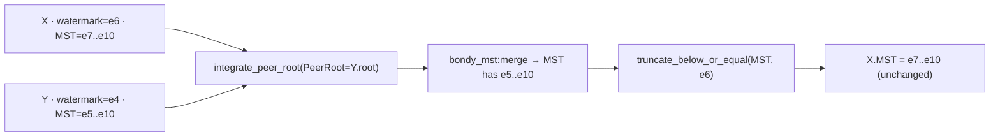

Two replicas with different watermarks are **not divergent** — they
agree on application state. One is just slightly more compact. On Y's
next GC tick, Y reads X's advanced root via `bondy_oplog_peer_state`
and computes a new frontier that absorbs `e5..e6` into its own
snapshot.

## What can go wrong (and what catches it)

| Hazard | Catch |
|---|---|
| Two peers both compact to an empty MST and both advertise an `undefined` root, so a root comparison reports "in sync" without comparing anything. | Convergence is judged by the [applied frontier](#the-applied-frontier-the-convergence-oracle), a per-origin version vector that is compaction-invariant and equal even when both MSTs are empty; the MST root is not the oracle. |
| Silent peer pins the watermark forever. | `peer_timeout_ms` filters stale peer entries (default 30s); the frontier ignores them. |
| Replica truncates a prefix the application still cares about. | `interpret_cog` must consume the prefix into the snapshot first. The compaction cycle is `frontier → events → interpret_cog → snapshot → truncate` — the snapshot is durable *before* the MST mutation. |
| Two compactions race. | One-at-a-time guard in `bondy_oplog_instance`: a second `compact` request while one is in flight replies `{ok, no_change}`. |
| Peer ships events the local replica has already truncated. | Integrate path drops events with `key ≤ watermark`. |
| Bootstrap snapshot is older than local. | `load_snapshot/3` refuses with `watermark_not_advancing` and falls through to plain AE. |
| `interpret_cog/2` is non-deterministic. | Convergence breaks silently. The behaviour documentation flags this as the invariant; PropEr suites for each CRDT verify it (`bondy_mst_crdt_SUITE.erl`). |
| Fresh persistent replica never flips to `live` because nobody calls `bootstrap/3`. | The default scheduler dispatch is lifecycle-aware: `pre_bootstrap` instances are auto-bootstrapped from the first available peer on the next tick. |
| Cluster cold-start fires N parallel snapshot transfers and saturates the peer pool. | `max_inflight_bootstraps` cap (default `4`) gates concurrent sessions. Over-cap dispatches are deferred to the next tick as in-flight sessions drain. |
| A replica with an unreachable peer-pool retries every 500 ms forever. | Per-instance exponential backoff (`500 ms → 30 s` ceiling, optional ±50 % jitter) drops the steady-state retry rate to ~1/30 Hz after a few failures. |
| Multiple replicas hammer the same first peer. | `bootstrap_peer_strategy` (`first` \| `random` \| `round_robin`) — switch to `round_robin` or `random` to spread load. |
| `registry/*` shards' MSTs retained every event — pure RAM, unbounded; the fleet-scale OOM. Root cause was NOT a stalling frontier: the gc scheduler's head-of-list tick order let the first `gc_max_concurrency` fast-completing instances (idle `main/*` shards) monopolise every round, so compaction never ran for `registry/*` at all on clustered nodes. | Least-recently-fired tick ordering in `bondy_oplog_gc_scheduler` (see [the compaction cycle](#the-compaction-cycle)); peer-confirmed compaction then bounds ephemeral history by propagation, same as durable. For genuine overload where a lagging live peer pins the frontier, [retention](#retention-bounded-truncation-for-ephemeral-catalogue-instances) (`mst_retention`, opt-in, off by default) is the backstop; laggards then recover via the `peer_pages_unavailable` / `frontier_gap` → catalogue re-bootstrap + rederive path. |
| Shards whose event count read 0 still pinned their entire history as orphaned ETS pages (~5 GB/node): `bondy_mst:truncate/2` frees only the O(log N) spine pages it rewrites and nothing ever ran the store's collector over the unlinked subtrees. | `truncate_below_or_equal/3` follows every truncation with the mark-and-sweep `bondy_mst:gc/1` on the ETS backend; `peer_first_hole/2` defers (never raises) when a compaction diff meets a peer root whose pages were swept. Pack (durable) reclamation is a tracked follow-up. |

## Tests that pin this down

The COG truncation pipeline is the most-tested part of the substrate
because everything else relies on it. The relevant suites:

- `test/bondy_oplog_compaction_test.erl` — frontier computation,
  watermark advance, idempotency, no-change cases, MST shrinkage.
- `test/bondy_oplog_compaction_fused_test.erl` — [retention-bounded
  truncation](#retention-bounded-truncation-for-ephemeral-catalogue-instances):
  size- and age-breach truncation, no-policy defers forever, retention
  requires `fused`, never fires without a projection, the
  truncate-vs-drain race loses no data, idempotence, the peer-confirmed
  and mux paths unchanged, the fused-to-fused catalogue-bootstrap
  roundtrip, the frontier-gap detect → non-adopt → bootstrap-remedy
  sequence end to end, the install-clobber → rederive-heal →
  idempotent-rederive sequence, and PHYSICAL page reclamation on
  truncation (asserted at the ETS level — the blind spot every
  event-count assertion missed).
- `apps/bondy_router/test/bondy_oplog_compaction_cluster_SUITE.erl` —
  the cluster regression-lock AT DEFAULTS: 3 real nodes, sustained
  writes, every `registry/*` shard under the propagation ceiling
  throughout, drained to quiescent post-settle (catches any future
  scheduler-starvation shape), instance-owned ETS bytes back to a
  live-tree footprint (catches any future page leak), zero RIB
  divergence on every node.
- `test/bondy_oplog_gc_scheduler_test.erl` — tick cadence, semaphore
  cap, set_interval/set_trigger races, per-instance isolation.
- `test/bondy_oplog_bootstrap_test.erl` — snapshot transfer,
  watermark monotonicity, no-snapshot fallback, post-bootstrap AE.
- `test/bondy_mst_crdt_SUITE.erl` — end-to-end determinism + Strong
  Eventual Consistency for the test CRDT (`bondy_mst_test_crdt_server`).
- `test/bondy_oplog_sync_scheduler_bootstrap_test.erl` — lifecycle-
  aware dispatch (pre_bootstrap routes to bootstrap; live fans out).
- `test/bondy_oplog_sync_scheduler_peer_strategy_test.erl` —
  `first` / `random` / `round_robin` selection.
- `test/bondy_oplog_sync_scheduler_cap_test.erl` — bootstrap in-flight
  cap honoured within a tick; DOWN cleanup; `0` escape hatch.
- `test/bondy_oplog_sync_scheduler_aae_concurrency_test.erl` — the
  node-wide cap bounds live sessions; the fair `rotate/2` round-robin;
  a fence-backer bypasses the cap.
- `test/bondy_oplog_sync_scheduler_live_backoff_test.erl` — the
  adaptive live-sync throttle (`live_decide/5`): activity resets, the
  quiescent window grows, fence-backers are never throttled.
- `test/bondy_oplog_sync_scheduler_load_gate_test.erl` — the
  load-reactive yield (`load_decide/4`): EWMA hysteresis, the yield
  defers a non-fence live shard, a fence-backer dispatches anyway.
- `test/bondy_oplog_sync_bounded_batch_test.erl` — a session pulls at
  most `aae_pages_per_round` pages per round and still converges.
- `test/bondy_oplog_sync_scheduler_backoff_test.erl` —
  exponential progression, normal-exit clear, deferred telemetry.

## Things to keep in mind

- **The MST is a *window*, not a log.** Bounded by network
  propagation, not by app lifetime.
- **Truncation is real deletion.** Pages are freed; the next
  pack-store GC reclaims the disk.
- **Convergence implies emptiness.** At full quiescence, the live
  MST is `∅`; the snapshot holds the entire state.
- **The CRDT module is the only meaning.** The substrate truncates;
  `interpret_cog/2` decides what the truncated prefix folds into.
- **New replicas don't replay the world.** Snapshot bootstrap +
  small live tail catch-up.

## Pointers

Implementation:

- `bondy_oplog_compaction.erl` — orchestrator (reads peer roots,
  delegates to instance).
- `bondy_oplog_gc_scheduler.erl` — periodic tick, semaphore cap,
  per-instance worker.
- `bondy_oplog_instance.erl`:
    - `compute_frontier_for/2` — frontier as longest common prefix.
    - `retention_or_catchup/5` + `retention_frontier/3` +
      `retention_ctx/2` + `validate_retention/2` — [retention-bounded
      truncation](#retention-bounded-truncation-for-ephemeral-catalogue-instances)
      for `mst_retention` instances.
    - `membership_class/1` — classifies `reclamation_members/0` into
      `solo | {clustered, Members} | error` for causal-stability
      reclamation's solo shortcut.
    - `do_compact_sync/2` + `run_compaction/10` — the cycle, run
      synchronously in the instance gen_server.
    - `commit_compaction/3` — atomic truncate + watermark + HLC bump.
    - `truncate_below_or_equal/3` — drops keys ≤ watermark, then
      (ETS backend) sweeps the dropped subtrees' pages via
      `bondy_mst:gc/1` — truncate only unlinks them.
    - `do_load_snapshot/3` + `apply_loaded_snapshot/3` — bootstrap
      install with monotonicity guard.
    - `do_handle_call({integrate_peer_root, _}, _, _)` — merge +
      re-truncate on AE integration.
    - `below_or_equal_watermark/2` — append-side filter.
- `bondy_oplog_peer_state.erl` — per-(peer, instance) root cache;
  `get_instance_peer_states/1` filters by `peer_timeout_ms` (default
  30 000 ms).
- `bondy_oplog_compaction_checkpoint.erl` + `_ets.erl` + `_file.erl` —
  one-checkpoint-per-instance behaviour and implementations
  (context-sensitive default: file when `storage_path` is set).
- `bondy_oplog_sync_session.erl:bootstrap/3` — fetch peer snapshot
  then pull live tail; falls back to plain AE on `no_snapshot`.
  Calls `mark_live/1` *after* the snapshot install succeeds — the
  durable barrier that flips the lifecycle.
- `bondy_oplog_sync_session.erl:bootstrap_catalogue/3` — the
  catalogue (multi-cell) bootstrap: cursor-paginated cell stream
  (`get_catalogue_snapshot_init` / `..._next`),
  `install_catalogue_batch` (replace mode), finalize +
  `mark_live/1` last.
- `bondy_oplog_bootstrap_lifecycle.erl` — the `<instance_dir>/lifecycle.live`
  flag file + atomics mirror; `open/2`, `is_live/1`, `mark_live/1`.
- `bondy_oplog_sync_scheduler.erl`:
    - `default_dispatch/2` — lifecycle-aware routing
      (`pre_bootstrap` → bootstrap; `live` → fan-out AE).
    - `maybe_dispatch_bootstrap/2` — backoff gate, then cap gate.
    - `pick_bootstrap_peer/3` — `first` / `random` /
      `round_robin` strategies. RR counter lives in the
      `bondy_oplog_sync_scheduler_rr` named ETS table.
    - `track_inflight/2` — monitors the spawned session pid and
      records `{Pid, InstanceId, bootstrap | live, Peer | undefined}`
      in the `bondy_oplog_sync_scheduler_inflight` named ETS table.
    - `update_backoff/2` — DOWN-reason classifier; clears the
      entry on `normal`, bumps fail-count + writes a new
      `NextRetryMs` otherwise. State lives in the
      `bondy_oplog_sync_scheduler_backoff` named ETS table.
    - The runtime value tunables (peer strategy, in-flight cap,
      retry backoff) are set via the `set_*/1` write-throughs
      co-located with their accessors in `bondy_oplog_config`
      (e.g. `bondy_oplog_config:set_bootstrap_peer_strategy/1`);
      each writes the `bondy_oplog` app env, so the choice
      survives a scheduler restart within the same VM lifetime,
      and the scheduler reads it per tick.
    - `info/0` — current configuration including
      `current_inflight_bootstraps`.
- `bondy_oplog_sync_session.erl`:
    - `start_bootstrap/3` — async single-CRDT bootstrap spawner.
    - `start_bootstrap_catalogue/3` — async catalogue bootstrap
      spawner. Both return `{ok, Pid}`; the scheduler monitors
      the pid and translates its exit reason into the backoff
      decision.
- `bondy_oplog_crdt.erl` — `interpret_cog/2` callback.
- `bondy_mst.erl:truncate/2` (`truncate_at` / `truncate_scan` /
  `rebuild_truncated`) — the structural prefix-truncate; `delete/2`
  + `merge_subtrees/4` for single-key structural deletion.

The dispatch-policy chain (auto-bootstrap routing, peer strategy,
in-flight cap, retry backoff) is documented in the auto-bootstrap
section above; the scheduler module docs carry the option tables.

Tests:

- `test/bondy_oplog_compaction_test.erl`
- `test/bondy_oplog_gc_scheduler_test.erl`
- `test/bondy_oplog_bootstrap_test.erl`
- `test/bondy_oplog_bootstrap_lifecycle_test.erl` — the durable flag
  file + `mark_live` ordering, in isolation.
- `test/bondy_oplog_bootstrap_lifecycle_e2e_test.erl` — applier-gate
  integration: appends sit in the overlay until `mark_live` flips the
  lifecycle.
- `test/bondy_mst_crdt_SUITE.erl` (+ `bondy_mst_test_crdt_server.erl`)

Background / origin:

- Preston McCrary, *Canteen* — UC Berkeley EECS-2022-160 (source of
  the COG / interpret_cog vocabulary). The local code does not depend
  on the paper.
