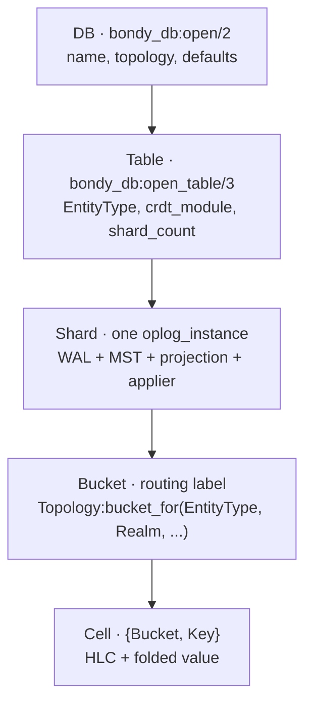
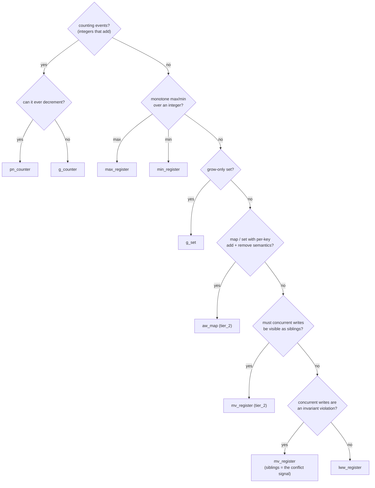
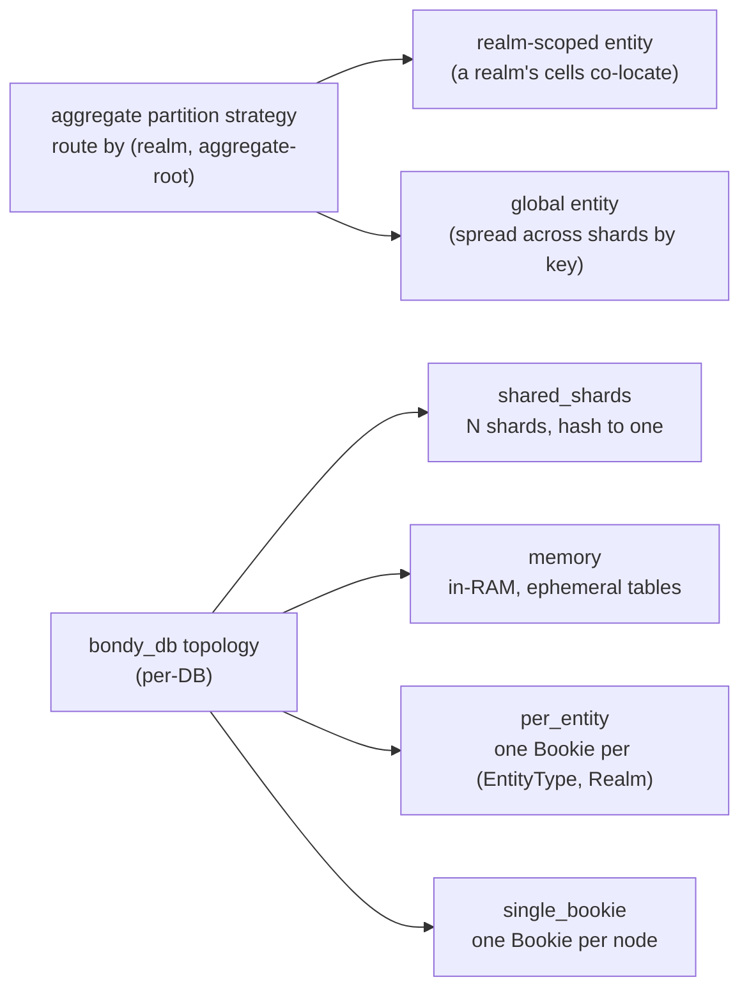
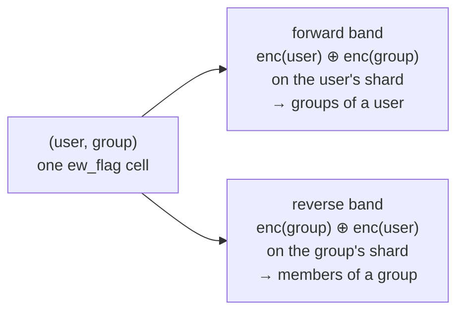

# An app developer's tour

> Audience: anyone designing a schema on top of `bondy_db`.
> Time to read: ~25 min.
> Premise: by the end you'll have mapped your domain onto a small
> set of tables, with a CRDT per table and a topology per cluster.

The previous chapters walked through the substrate from the inside.
This one walks through it from your end of the API. The question we
answer: **given a piece of state you want to replicate, how do you
turn it into a `bondy_db` table?**

We use the tables Bondy Router maintains as the worked example. By the
end, every table will have a one-paragraph justification for its CRDT and
the DB it lives in.

## 1. The model, in one picture



Two API surfaces sit above this:

- **`bondy_db`** — the consumer-facing facade. You call
  `open_table/3`, `read/3`, and `apply/4` (plus `counter_inc/4`,
  `apply_batch/4`, `map_update/4`) with table-handle maps. Each
  table is a [namespace](05_crdt_model.md).
- **`bondy_oplog_core`** — the substrate primitive
  ([chapter 03](03_bondy_db.md)). It takes `(NS, Index, Key)` and
  exposes the freshness fence (`ensure_fresh/2`), batch reads
  (`read_batch/2`), and the registry.

App code mostly uses `bondy_db`. `bondy_oplog_core` shows up when you
need `ensure_fresh/2` (auth paths) or `read_batch/2` (multi-cell
atomic-as-of-fence reads).

The single most important rule of this tutorial is one sentence:

> **The CRDT attaches to Table.** Two pieces of data that need
> different merge semantics are two tables.

Everything else in this chapter is a consequence of that rule.

## 2. Picking a CRDT

`bondy_db` ships a small catalogue of native operation-based CRDTs
(see [chapter 05](05_crdt_model.md)). Reframed by "what does the data
look like":



Older material refers to a set of state-based "fold" types that no longer
exist as separate modules. If you meet one of those names, it maps onto a
current CRDT like this (the common labels — `lww_register`, `g_set`,
`pn_counter`, `g_counter` — are still accepted as `fold_module`
shorthands and resolve to the byte-identical native CRDT):

| older name | use instead |
|---|---|
| `presence_basic` | `lww_register` (presence is a register write) |
| `ttl_presence` | `lww_register` + application-level expiry |
| `orset` | `aw_map` (observed-remove, done causally right) |
| `strict_register` | `mv_register` (concurrent writes surface as siblings the app resolves); same-event-key duplicates already crash loudly via the substrate's fixed strict-uniqueness collision rule |
| `map_of_fields` | `aw_map` (per-key sub-values) or one `lww_register` cell per field |

A few practical notes:

- **`lww_register` covers the common case.** If your code already
  reads-modifies-writes the whole record, `lww_register` matches
  that shape exactly. Don't reach for `aw_map` until concurrent
  per-key edits are an actual problem.
- **Conflict-surfacing is for invariants, not for performance.**
  Where two concurrent writes mean someone broke a rule
  (authorisation grants, single-policy registrations), use
  `mv_register` — the siblings *are* the conflict signal, and your
  handler decides what to do. (Same-*event-key* duplicates — which
  indicate a bug or tampering, not concurrency — already crash
  loudly via the substrate's default strict-uniqueness merge
  strategy.)
- **Sets and maps with removal belong in `aw_map`, in their own
  table.** A set living inside an `lww_register` record is the
  "members-in-record" anti-pattern — members get clobbered by
  whole-record LWW.
- **`mv_register` is for when losing a concurrent write is worse
  than seeing two.** Reads return *all* siblings; the application
  resolves. It is tier_2 — it pays for a causal context per cell.
- **Quantity CRDTs are for *quantities*, not records.**
  `pn_counter`, `g_counter`, `max_register`, `min_register`, and
  `g_set` each model one value per cell with a single algebraic
  merge rule. Don't encode a record inside one — use a separate
  cell key per quantity.
- **Counters use `bondy_db:counter_inc/4`.** It's a thin wrapper
  over `apply/4` that issues `{inc, Delta}` events. Negative deltas
  decrement. Duplicate delivery is absorbed by the event key's
  per-Origin Seq dedup; the CRDT sees each event exactly once.

## 3. Picking `shard_count` and topology

A table's shards are independent oplog instances. They have their
own WAL, MST, applier, projection. The topology decides how cells
route to shards and how shards map to Bookies.



For app developers, the recommendation is short:

- **Default to `bondy_db_topology_shared_shards` for durable state.** One
  shard pool, predictable footprint, every table multiplexes onto the
  same physical storage. This is what Bondy uses for its `main` DB.
  Because the realm is folded into the cell key here
  ([chapter 03](03_bondy_db.md#realm-folding)), tenants share shards
  without colliding.
- **Use `bondy_db_topology_memory` for ephemeral, session-bound
  state.** It is what the `registry` DB runs on: in-RAM projection, no
  disk, the data re-converges from peers on restart.
- **`per_entity` is available when you need operational isolation** — it
  gives one Bookie per `(EntityType, Realm)`, so ops can quiesce or
  migrate a single realm's storage without touching the rest. Bondy does
  not use it today; everything durable shares the `main` DB.
- **`single_bookie` is for tests and single-node deployments.**

In Bondy, **`shard_count` is a per-DB choice**, not per-table: the `main`
DB sizes every table the same via `db.main.shard_count` (default 16).
The substrate itself accepts a per-table `shard_count` if a deployment
wants to size a hot table independently. The sizing trade-off is real
either way: each shard runs its own AE sessions, so cluster-wide AE
bandwidth is roughly `shard_count × write_rate × peer_count` — start near
your peer count and raise it only on measurement. High-churn,
low-contention tables (tickets, tokens) are the ones that reward more
shards, which is why they shard by key.

What a higher `shard_count` does **not** do is multiply AE's instantaneous
cost: the per-node anti-entropy *concurrency* and *memory* are bounded
node-wide (`aae_max_concurrency`, `aae_max_pages_in_flight`), so more
shards means more sessions taking turns under the cap, not more running at
once — and the fair per-tick rotation keeps any one shard from starving
([chapter 06](06_compaction_and_bootstrap.md#keeping-anti-entropy-subordinate-to-routing)).
The knobs themselves live on `bondy_oplog_config` and the `db.aae.*`
schema keys.

## 4. The Bondy Router tour

Bondy Router declares its state to the substrate through a single
catalogue (`bondy_namespace_catalog`), which provisions every table at
boot. Below, each table gets a sample `open_table/3` call, the CRDT it
runs, the DB it lives in, and the one-line "why". The tables divide
between **two DBs**: a durable `main` DB (leveled, `shared_shards`) for
everything that must survive a restart, and an ephemeral `registry` DB
(in-RAM, `memory` topology) for session-bound routing state.

> **One CRDT vocabulary.** The substrate has a single catalogue of native
> operation-based CRDTs ([chapter 05](05_crdt_model.md)); there are no
> separate state-based "fold" modules. A table names its CRDT with a
> `crdt_module`, or a short `fold_module` label for the common ones
> (`lww_register`, `g_set`, `pn_counter`, `g_counter`). The catalogue
> maps each table's declared *fold class* to a CRDT: `lww` →
> `lww_register`, `mv` → `mv_register`, `aw` → `aw_map`, `ew` →
> `ew_flag` (the enable-wins flag behind group membership, §4.4).

The durable tables live in one DB, opened once with a **default
`fold_module`** — the required type label every table inherits and each
table's `crdt_module` overrides:

```erlang
{ok, Main} = bondy_db:open(main, #{
    topology    => bondy_db_topology_shared_shards,
    fold_module => lww_register   %% required default; per-table crdt_module wins
}).
```

(`open_table/3` requires a `fold_module`; supplying it once at the DB level
means the per-table calls below need only their `crdt_module`.)

> **As-built vs. design target.** Several tables below name `lww_register`
> where their data model would ideally surface concurrent writes as
> siblings (`mv_register`) or as an observed-remove relation (`aw_map`).
> That is deliberate: those richer CRDTs only differ from `lww` when two
> nodes write the *same* cell concurrently, which requires anti-entropy
> to be exchanging those writes. Bondy runs them as `lww` until that
> concurrency is enabled, then graduates the declared class. Where a
> table does this, the tour names both the shipped CRDT and the design
> target, and why the gap is safe.

### 4.1 Registration and subscription RIB summaries

A WAMP registration or subscription entry (`#entry{}`) never enters
`bondy_db` at all — it lives in `bondy_registry_store`'s partition-local
ETS (one table per node) and backs the in-memory match tries
(`bondy_registry_ptrie`). What `bondy_db` holds is the **RIB** (Routing
Information Base): one summary cell per `(Realm, MatchPolicy, Uri,
Node)`, replicated so a node can route to a peer's callee/subscriber
without that peer re-announcing on every call. The cells live in the
**ephemeral `registry` DB**, opened on the in-RAM `memory` topology with
the fused, mem-WAL stack:

```erlang
{ok, Registry} = bondy_db:open(registry, #{
    topology    => bondy_db_topology_memory,
    fold_module => lww_register
}).
{ok, RegsRib} = bondy_db:open_table(Registry, bondy_registration_rib, #{
    crdt_module => bondy_oplog_crdt_struct,
    crdt_opts   => ?RIB_REGISTRATION_SCHEMA
}).
{ok, SubsRib} = bondy_db:open_table(Registry, bondy_subscription_rib, #{
    crdt_module => bondy_oplog_crdt_pn_counter
}).
```

Only the node named in a cell's key ever writes it — single-writer by
construction — so `count`/`invoke`/`earliest`/`latest` (registrations) or
a bare `count` (subscriptions) are backed by per-field CRDTs rather than
one opaque LWW blob: `bondy_registry_rib`'s add/remove hooks write small,
lock-free, targeted deltas directly, with no per-realm
recompute-from-scratch write. Both tables are **ephemeral** — RAM
projection, in-memory WAL, no disk anywhere
([chapter 03](03_bondy_db.md#projection-backend-durable-vs-ephemeral))
— and both are `publish => true`: a cell merged in from a peer via
anti-entropy drives `bondy_aae_reactor` to hand it to
`bondy_registry_rib`, which maintains the local stub view routing reads
from ([chapter 03](03_bondy_db.md#change-notification)). Neither table
declares a secondary index — a cell is looked up directly by its
`(Realm, MatchPolicy, Uri, Node)` key.

Routing itself never touches `bondy_db`: the hot path walks the local
`bondy_registry_ptrie`/`bondy_registry_store` tries, maintained
independently on every node from its own local entries. The RIB is a
permanent, write-only cross-node directory — it tells a node a peer
*can* route a URI, never carries the entry's own routing detail; a
node's own registrations/subscriptions are always served from its own
local store, never read back through `bondy_db`.

### 4.2 Realm

```erlang
{ok, Realms} = bondy_db:open_table(Main, bondy_realm, #{
    crdt_module => bondy_oplog_crdt_lww_register,
    shard_count => 4
}).
```

A realm is a single record with security settings, allowed
authentication methods, default groups, etc. Bondy reads, modifies, and
writes the whole record, so `lww_register` matches that read-modify-write
contract exactly. Same-HLC ties break deterministically by lex order on
the encoded payload, so two concurrent realm edits converge to the same
winner on every node.

Unlike the per-realm security tables, this one is a **global registry**:
every realm shares a single constant band, keyed by its URI, so a
`bondy_db:list/2` over that band enumerates every realm cluster-wide. It
is also a `publish => true` table — a peer deleting a realm publishes a
*merge* event, which this node's reactor turns into closing every local
session on that realm (§5).

If field-level concurrent edits become a real problem (rare), splitting
into an `aw_map` (one sub-key per field) is a one-table refactor.

### 4.3 Users

```erlang
{ok, Users} = bondy_db:open_table(Main, security_users, #{
    crdt_module => bondy_oplog_crdt_lww_register,
    shard_count => 8
}).
```

Same pattern as realms. A user record holds display_name,
authorized_keys, groups, meta, etc. The whole record is replaced on every
write, so `lww_register` is the right shape. Like realms it is `publish
=> true`: a peer deleting a user publishes a merge event, and this node's
reactor closes that user's local sessions (§5).

A user's group membership is **not** stored on the user record — it
lives in its own relation, `security_group_members` (§4.4). The user
cell stays a plain `lww_register` value, and `security_users` declares
no secondary indexes.

### 4.4 Groups and group memberships

```erlang
{ok, Groups} = bondy_db:open_table(Main, security_groups, #{
    crdt_module => bondy_oplog_crdt_lww_register,
    shard_count => 4
}).
{ok, Members} = bondy_db:open_table(Main, security_group_members, #{
    crdt_module    => bondy_oplog_crdt_ew_flag,
    aggregate_root => second_col,
    shard_count    => 8
}).
```

The group record — name, meta, default policies — is `lww_register` on
`security_groups`. **Membership** is the interesting part, and it is a
first-class relation in its own right.

Each `(user, group)` membership is one cell, and its CRDT is an
**enable-wins flag** (`ew_flag`): a concurrent *add* survives a *remove*
that did not observe it. Modelling membership as a cell per fact —
rather than a `groups` list inside the user's `lww_register` record — is
what makes concurrent edits safe: two nodes that independently add the
*same* user to *different* groups both survive, where a whole-record
`lww` write would let one clobber the other.

The relation answers both directions **without a secondary index**,
using the *permutation-index* pattern: every fact is written in two key
orderings — a forward band keyed `enc(user) ⊕ enc(group)` and a reverse
band keyed `enc(group) ⊕ enc(user)`. "Which groups is this user in?" is
a bounded, realm-local scan of the forward band; "who is in this group?"
the same scan of the reverse band. `aggregate_root => second_col`
co-locates each fact with its leading entity — a forward fact on the
user's shard, a reverse fact on the group's — so each direction is a
single-shard scan, not a cross-shard scatter. The read/write primitives
live in `bondy_rbac_user`.

Like grants, the relation is `publish => true`: when anti-entropy merges
a peer's membership change, this node's reactor invalidates the realm's
cached authorization contexts in place
([chapter 03](03_bondy_db.md#change-notification)). A membership change
still advances the user's `token_version`, because the write path also
touches the user cell.



The lesson generalises: **a relation that must answer in two directions
is cheaper as a cell-per-fact relation with a permutation index than as
a list inside a record** — the record form forces a read-modify-write
and a lossy `lww` merge, while cell-per-fact gives concurrent edits and
direction-free reads.

### 4.5 Grants (user and group)

```erlang
{ok, UserGrants} = bondy_db:open_table(Main, security_user_grants, #{
    crdt_module    => bondy_oplog_crdt_lww_register,
    aggregate_root => leading_col,
    indexes        => grant_indexes()
}).
{ok, GroupGrants} = bondy_db:open_table(Main, security_group_grants, #{
    crdt_module    => bondy_oplog_crdt_lww_register,
    aggregate_root => leading_col,
    indexes        => grant_indexes()
}).
```

Grants ship as `lww_register`, but their data model is the canonical
**conflict-surfacing** case, so they are the clearest illustration of the
as-built-vs-design-target gap. Two concurrent grants to the same
`(Realm, Principal, Resource)` mean someone violated single-writer
discipline at the management plane. The design target is `mv_register`,
where that conflict is *visible*: the read returns both siblings and the
auth layer refuses/queues/alerts instead of silently accepting an LWW
winner. Until anti-entropy is exchanging concurrent grant writes, two
nodes cannot actually produce that conflict, so `lww` is observably
identical and is what runs.

Two as-built details matter regardless of the CRDT:

- **The key is an order-preserving composite** `{Rolename, Resource}`,
  with `aggregate_root => leading_col` so a role's grants co-locate on
  one shard. "Grants for role R" is then a bounded band range scan rather
  than a full-table scan.
- A **`by_resource` secondary index** answers the reverse "grants on
  resource R", and `publish => true` lets a peer's grant change reach
  this node: the merge event drives a realm-wide re-evaluation of cached
  authorization (§5) — an authorization change re-evaluates in place, it
  does not tear the session down.

`per_entity` topology is available if a deployment needs to quiesce or
migrate one realm's grants Bookie in isolation, but as-built every
durable table — grants included — lives on the shared `main` DB.

### 4.6 Sources

```erlang
{ok, Sources} = bondy_db:open_table(Main, security_sources, #{
    crdt_module    => bondy_oplog_crdt_lww_register,
    aggregate_root => leading_col
}).
```

Auth sources pin a `{Username, CIDR-mask, Method}` to an authentication
method. Same shape as grants: the design target is `mv_register` (a
concurrent edit to the same source should surface as siblings), shipped
as `lww` until that concurrency exists. The key is the order-preserving
composite `{Username, AddressMask, Authmethod}` with `aggregate_root =>
leading_col`, so "sources for user U" — the lookup the auth path makes on
every login — is a bounded username-band range scan. There is no reverse
index: matching a client address against a stored CIDR is containment,
not equality, so it cannot ride the equality index.

### 4.7 API Gateway

```erlang
{ok, Gateway} = bondy_db:open_table(Main, api_gateway, #{
    crdt_module => bondy_oplog_crdt_lww_register,
    shard_count => 4
}).
```

Static-ish API config. Writes are rare and almost always come from one
operator at a time, so `lww_register` is plenty. It is `publish => true`
for a different reason than the security tables: the cowboy dispatch
table is derived from this spec, so the reactor rebuilds it whenever the
spec changes — including when a *peer's* edit arrives via anti-entropy
(the merge event), which is what keeps every node's HTTP routing
identical.

### 4.8 Tickets

```erlang
{ok, Tickets} = bondy_db:open_table(Main, bondy_ticket, #{
    crdt_module => bondy_oplog_crdt_lww_register,
    shard_count => 32
}).
```

Tickets are short-lived auth artefacts with a hard expiry. Two
properties matter:

1. **TTL eviction is app-level.** The substrate has no expiring CRDT; a
   `lww_register` cell holds the ticket, and the auth handler enforces
   expiry on read and clears expired cells (or a periodic sweep does).
   The expiry HLC can live in the value.
2. **High cardinality, key-independent.** Sharding by key
   (hash) spreads load evenly. 32 shards is a fine starting point;
   tune up if write rates climb.

### 4.9 OAuth tokens

```erlang
{ok, Tokens} = bondy_db:open_table(Main, bondy_oauth_token, #{
    crdt_module => bondy_oplog_crdt_lww_register,
    shard_count => 32
}).
```

Same shape as tickets. Two things worth calling out:

- **Refresh-token rotation needs `revoked → issued` reanimation.**
  `lww_register` gives this for free: a `clear` (revoke) is not
  terminal, so a later-HLC `set` (re-issue) reanimates the cell —
  exactly what you want when re-issuing a rotated refresh token to the
  same `{user, realm, device}`. (Expiry handling is app-level, as for
  tickets above.)
- **The "bounded N tokens per `{user, realm, device}`" rule is
  app-level.** No CRDT can express "keep the N latest" without
  coordination. Your auth handler reads the current token set,
  deletes the oldest if you're at the limit, and then writes the
  new one. Expiry is also app-level (deadline in the value, treated
  as absent on read); the count cap stays in your code.

### 4.10 Bridge relays

```erlang
{ok, Bridges} = bondy_db:open_table(Main, bondy_bridge_relay, #{
    crdt_module => bondy_oplog_crdt_lww_register,
    shard_count => 4
}).
```

Edge bridge config. Whole-record updates, rare writes, `lww` is
fine. Could be an `aw_map` if independent per-field updates
become a thing.

### 4.11 When to use a counter (illustrative)

Bondy itself does not ship a counter table yet, but the commutative
(tier_0) quantity CRDTs are domain-neutral and the `pn_counter` CRDT +
`counter_inc/4` helper exist so consumers can opt in without writing a
custom one. The shape:

```erlang
{ok, Counters} = bondy_db:open_table(Main, app_counters, #{
    crdt_module => bondy_oplog_crdt_pn_counter,
    shard_count => 8
}).

%% Increment a counter — positive or negative deltas allowed.
ok = bondy_db:counter_inc(Counters, <<"my_realm">>, <<"page:home">>, +1),
ok = bondy_db:counter_inc(Counters, <<"my_realm">>, <<"page:home">>, +1),
ok = bondy_db:counter_inc(Counters, <<"my_realm">>, <<"page:home">>, -1).

%% Read the converged value.
{ok, {1, _Hlc}} = bondy_db:read(Counters, <<"my_realm">>, <<"page:home">>).
```

When the shape fits:

- **Quantities that monotonically add up across replicas.** Page
  views, click counts, retry counts, queue depths, gauge
  increments. Anything where every observer's contribution should
  be summed and the order of summation doesn't matter.
- **Per-Origin Seq dedup is free.** Duplicate
  `counter_inc(Table, Realm, Key, +1)` deliveries from the same
  origin (WAL replay, AE re-shipping a page) are absorbed by the
  WAL's per-Origin Seq counter. Your code doesn't need any extra
  idempotency token.
- **Negative deltas decrement.** A "delete" of a previously-added
  +1 is just `counter_inc(_, _, _, -1)`. The state tracks `Pos`
  and `Neg` accumulators per origin so the converged value can go
  up and down without loss.

When *not* to reach for it:

- **You need at-most-N semantics.** `pn_counter` is unbounded —
  it cannot express "stop at 100." Bounded counters need
  coordination (escrow, leases) that lives above the catalogue.
- **You need *which client* contributed what.** PN-Counter is a
  sum; individual increments are not preserved past compaction.
  If you need provenance, use `g_set` of audit records keyed by
  the contributor identity.
- **You're counting unique members.** That's set cardinality, not
  a sum. Use `g_set` (or `aw_map` if removes are needed) and read
  the set size.

#### Adjacent shapes

- **Max-Register / Min-Register** model "the largest (or smallest)
  value any replica has reported." Use `max_register` for quorum
  sizes, observed watermarks, peak throughput; `min_register` for
  deadlines (`min(expiry)` across competing writers) and rate
  floors. Once the lattice rises (or falls), it cannot reverse.
- **G-Set** is the grow-only set of binaries. Suitable for
  append-only catalogues, audit trails, "members ever seen". If
  membership ever has to *retract*, use the add-wins map
  (`aw_map`) instead — G-Set has no remove event by design.

### 4.12 Summary table

Topology and shard count are **per-DB** choices, set once at
`bondy_db:open/2`. As-built there are two DBs: the durable `main` DB
(`shared_shards`, `db.main.shard_count` shards, default 16) and the
ephemeral `registry` DB (`memory`). The column below is which DB each
table belongs to; where the shipped CRDT differs from the table's data
model, the **design target** column names what it graduates to once
concurrent multi-writer is enabled.

| Table | CRDT (ships) | Design target | DB | Notes |
|---|---|---|---|---|
| `bondy_registration_rib` | `bondy_oplog_crdt_struct` | — | registry (ephemeral) | RIB summary cell; single-writer by key; no secondary index |
| `bondy_subscription_rib` | `bondy_oplog_crdt_pn_counter` | — | registry (ephemeral) | RIB summary cell; single-writer by key; no secondary index |
| `bondy_realm` | `lww_register` | — | main | global registry; `publish` |
| `bondy_realm_keys` | `aw_map` | — | main | realm signing/encryption key material, split out of the realm cell so key bytes never enter the realm's convergence identity; global registry, `kid => key bundle` |
| `security_users` | `lww_register` | — | main | `publish`; no secondary index (membership is its own relation) |
| `security_groups` | `lww_register` | — | main | group record |
| `security_group_members` | `ew_flag` | — | main | authoritative membership relation; forward/reverse permutation index; `aggregate_root => second_col`; `publish` |
| `security_user_grants` | `lww_register` | `mv_register` | main | composite key; `by_resource` index; `publish` |
| `security_group_grants` | `lww_register` | `mv_register` | main | composite key; `by_resource` index; `publish` |
| `security_sources` | `lww_register` | `mv_register` | main | composite key |
| `api_gateway` | `lww_register` | — | main | `publish` (dispatch rebuild) |
| `bondy_ticket` | `lww_register` + app-level expiry | — | main | global, keyed by `{realm, authid, scope}` |
| `bondy_oauth_token` | `lww_register` + app-level expiry | — | main | global, keyed by opaque token |
| `bondy_bridge_relay` | `lww_register` | — | main | node-scoped, read once at boot |
| `retained_messages` | `lww_register` | — | main | keyed by topic |

Everything durable is one `shared_shards` DB; only the session-bound
routing tables are split out, into the ephemeral `registry` DB. None of
Bondy's tables today use the quantity CRDTs — `pn_counter`, `g_counter`,
`max_register`, `min_register`, and `g_set` are available for consumers
that need them; the §4.11 example shows the typical setup. Among the causal
types, `ew_flag` ships in the membership table and `aw_map` in
`bondy_realm_keys`; `mv_register` is the declared target for the grant and
source tables, which run as `lww` today (see §4.5 for why that is safe).

## 5. Reacting to a peer's change

The security tables are where two substrate facilities — the freshness
fence ([chapter 03](03_bondy_db.md#the-freshness-fence)) and change
notification ([chapter 03](03_bondy_db.md#change-notification)) — earn
their keep, because a security decision must stay correct across nodes
*without* waiting for global consensus. Bondy composes them into a
single discipline: **fence the read, version the token, react to the
merge.**

**Fence the read.** Before any authentication, the auth path calls
`bondy_oplog_core:ensure_fresh([users, grants], 1s)`. If this node's
security shards have not heard from their peers within the bound, it
refuses with `temporarily_unavailable` rather than authenticate against
possibly-stale data. The check is one wait-free atomic read.

**Version the token.** A user cell's HLC is a monotonic revocation
counter — it advances on every write to that user. Bondy carries the HLC
the user had at issue time inside the token. A credential or membership
change bumps the cell's HLC; once that bump has converged, a peer
re-reads it and rejects the now-stale token. The fence guarantees the
version it compares against is itself fresh, so the two mechanisms are a
pair: bounded staleness plus a per-subject epoch.

**React to the merge.** Some changes cannot wait for the next
authentication — an active session must be acted on now. That is what the
merge events from the `publish => true` security tables drive, through a
single node-local reactor. The reaction splits on the authn-vs-authz
distinction:

| A peer… | Merge event on… | This node… |
|---|---|---|
| deletes a user | `security_users` (`clear`) | **closes** that user's local sessions |
| deletes a realm | `bondy_realm` (`clear`) | **closes** every local session on that realm |
| grants or revokes a permission | `security_*_grants` (`set`/`clear`) | **re-evaluates** the realm's cached authorization in place |

The split is the key idea: an **authentication**-level change (a
delete) tears the session down, whereas an **authorization** change (a
grant edit) re-evaluates the session's cached RBAC context in place — the
session survives, and its next authorize reads the new grants. A node's
*own* writes already did this inline at the write site; the merge tag is
strictly for reacting to what a peer did.

## 6. Patterns you'll keep using

- **New table when the CRDT differs.** Don't try to unify two
  tables that need different merge semantics. The cost of a table
  is small; the cost of a wrong CRDT is silent divergence.

- **Memberships as their own add-wins table.** Whenever the data
  shape is "X has many Y", and X is not flat config, lift the
  membership into a dedicated `aw_map` table. Group members,
  subscriptions-per-topic, capabilities-per-role.

- **Expiry lives in the value, eviction in the app.** Store the
  deadline inside the cell value (`lww_register`) and treat an
  expired value as absent on read; sweep lazily. Count caps also
  stay in app code (no CRDT solves that).

- **Read-your-writes is free.** `bondy_db:apply/4` blocks in
  `await_apply` until the write is committed to the projection
  ([chapter 03](03_bondy_db.md)), so the next `bondy_db:read/3` on the
  same node sees it.

- **Cross-node freshness needs `ensure_fresh/2`.** Auth paths
  should call `bondy_oplog_core:ensure_fresh([users, grants], 1s)`
  before reading. The wall-clock predicate is wait-free; it costs
  one atomic read.

- **`read_batch/2` when multiple cells must be consistent.**
  `bondy_oplog_core:read_batch/2` gives you "all of these as-of HLC
  F", with skew detection. Use it when (e.g.) authorisation
  combines a user row and a grants row.

## 7. Anti-patterns

- **`aw_map` for whole-record-update workloads.** Every write goes
  through one key at a time, and each cell pays for a tier_2 causal
  context. If your app already does read-modify-write, you're
  paying the cost without using the benefit. Default to
  `lww_register`; revisit if per-key contention shows up in
  telemetry.

- **Over-sharding.** Each shard runs its own AE. Doubling
  `shard_count` doubles AE bandwidth at low write rates. Start
  small.

- **Eager TTL sweepers.** If you're writing background jobs that
  race to delete expired entries cluster-wide, you're generating
  delete traffic for cells every replica can already judge as
  expired locally. Put the deadline in the value, treat expired as
  absent on read, and sweep lazily/locally.

- **Splitting tables that share fold and lifecycle.** Two tables
  that always get written together, with the same fold, are
  signalling that they should be one table with a richer key. Use
  the cell key `{Bucket, Key}` to model the relationship.

- **Conflating realms with shards.** Realms are an application
  concept; they appear in cell keys (`{RealmUri, ...}`) or in the
  topology's `bucket_for/3`. They are not shards. Two tenants
  share the same shards by default; if you need physical
  isolation, that's a per_entity topology question, not a
  schema question.

- **Records inside a counter (or any quantity CRDT).** PN-Counter,
  Max-Register, Min-Register, and G-Set each model **one value
  per cell.** A `{counter, metadata}` tuple stuffed into a
  pn_counter table will neither be merged nor projected correctly.
  If the data has shape, it belongs in `lww_register`, an
  `aw_map`, or its own table. One cell, one quantity.

- **Counters used for set cardinality.** Counting distinct member
  inserts via `counter_inc(_, _, _, +1)` will be off after AE
  reships an event from a peer that had already inserted the
  member: the WAL's per-Origin Seq dedup absorbs the duplicate
  *from that origin*, but two separate origins each contributing
  +1 for the *same logical member* still sum to 2. Use `g_set` (or
  `aw_map`) and read its size.

## Pointers

- [Chapter 03](03_bondy_db.md) — the read side: `bondy_oplog_core`,
  cache, overlay, projection, `ensure_fresh/2`, `read_batch/2`.
- [Chapter 05](05_crdt_model.md) — the CRDT contract and the full
  native catalogue (registers, counters, sets, `mv_register`,
  `aw_map`), with the tier model and the same decision tree.
- [Chapter 06](06_compaction_and_bootstrap.md) — what happens to
  your events once peers agree they have them.
- `bondy_db.erl` — the consumer facade
  (`open/2`, `open_table/3`, `read/3`, `apply/4`,
  `counter_inc/4`).
- `bondy_oplog_core.erl` — substrate primitives
  (`read/3`, `read_batch/2`, `ensure_fresh/2`, `range/4`,
  `subscribe/2`).
- `bondy_oplog_config.erl` (in `bondy_oplog`) — the layer-wide tuning
  surface (sync and GC cadence, the live-sync throttle, the AAE
  freshness-fence policy), separate from the per-table options you pass
  to `open_table/3`.
- `bondy_namespace_catalog.erl` (in `bondy_router`) — the catalogue
  that declares the two DBs and every table above, with each table's
  database, fold class, indexes, and `publish` flag.
- `bondy_aae_reactor.erl` (in `bondy_router`) — the node-local reactor
  that turns the security tables' merge events into session closes and
  RBAC re-evaluation (§5).
- `bondy_db_topology_shared_shards.erl`,
  `bondy_db_topology_per_entity.erl`,
  `bondy_db_topology_single_bookie.erl` (durable, sharing
  `bondy_db_topology_leveled_common.erl`) and
  `bondy_db_topology_memory.erl` (ephemeral) — the topologies.
