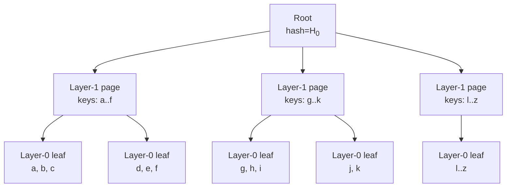
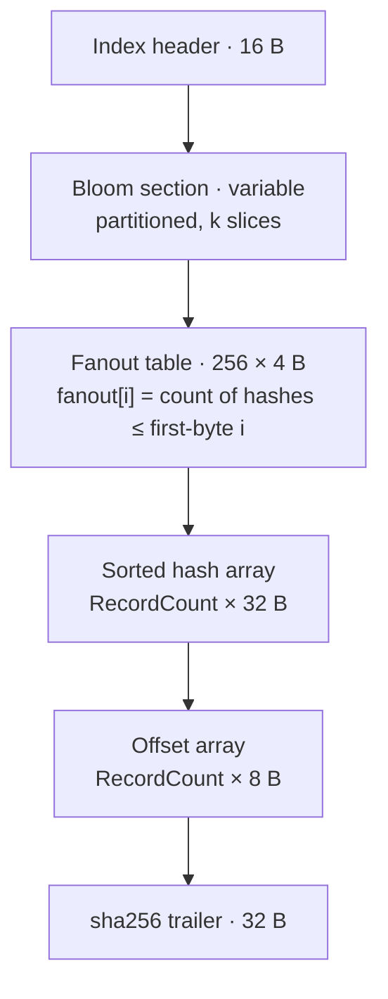
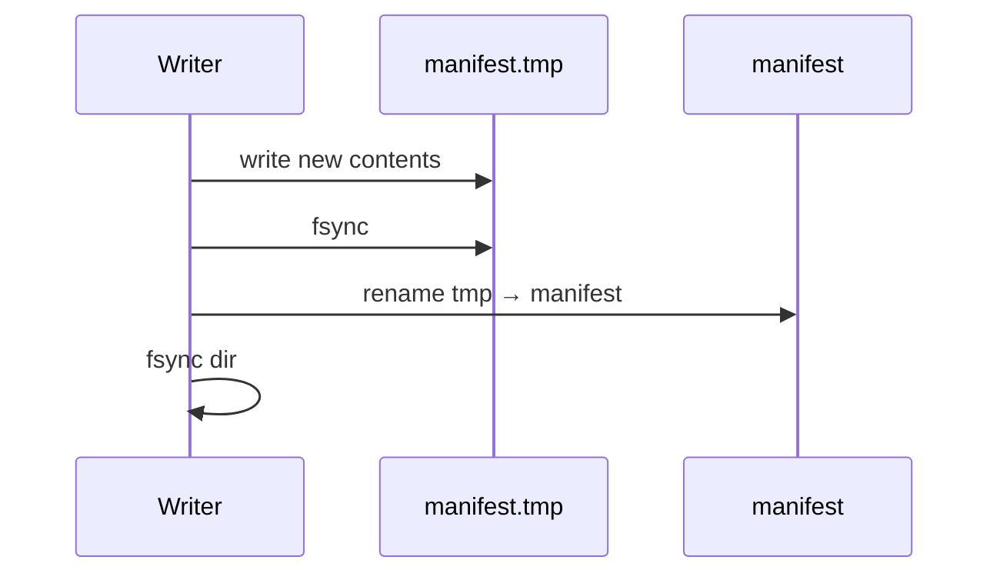
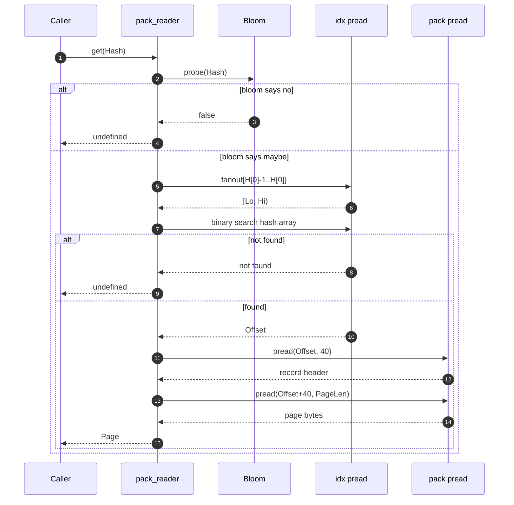
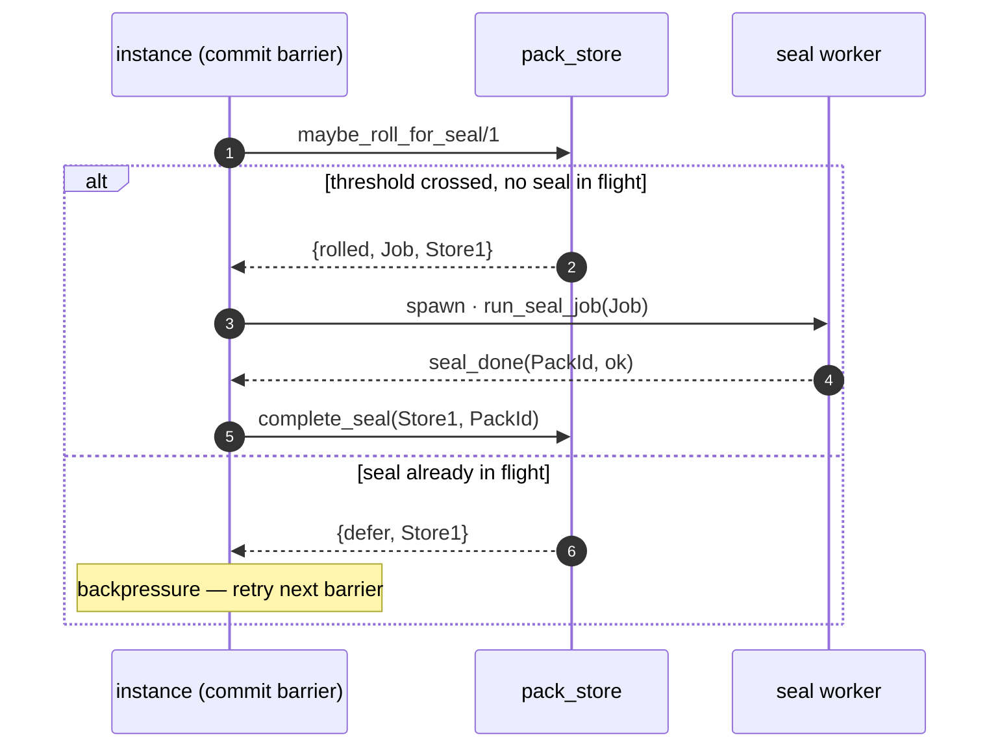
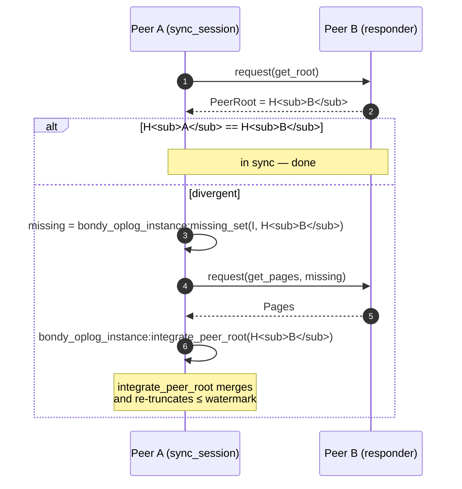
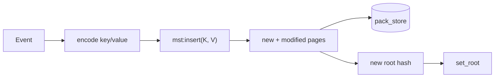
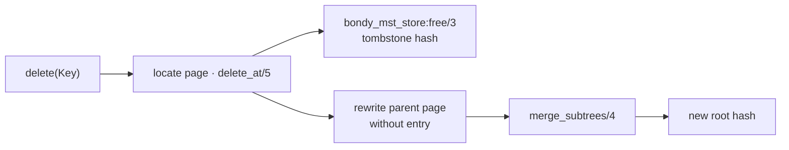
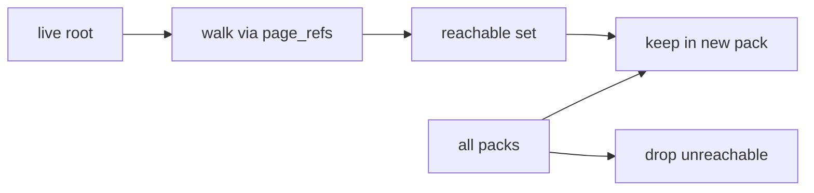

# bondy_mst: the Merkle Search Tree

> Audience: anyone who wants to know what a Merkle Search Tree is, why
> it's at the heart of this library, and how peers converge without
> consensus.
> Time to read: ~20 min.

`bondy_mst` is the package name *and* the name of the data structure
at its centre. The name is overloaded on purpose — the MST is the
single idea that makes everything else worth building. This chapter
introduces the structure, the page-store backend, and the anti-entropy
protocol peers use to converge.

## What problem does the MST solve?

Suppose two peers each have ~10⁶ events. They want to know which
events the other one is missing, without shipping all 10⁶ over the
network. With a flat data structure you'd ship a Bloom filter at best;
with a key-value store you'd run a diff per key.

A **Merkle Search Tree** turns this into log-N comparisons:

- The tree is **balanced by hash**, not by insertion order — two
  peers that hold the same set of items build the **same tree**
  deterministically.
- Each internal node holds a hash of its subtree (Merkle).
- To compare two trees, peers exchange root hashes. Equal? Done.
  Different? Recurse only into the children that disagree.

The result: peers find their disagreement in **O(diff)**, not
O(set size).

A caveat on "equal roots? done": root equality means the two *trees*
are identical, which lets a peer skip page exchange. It is not, on its
own, a test for "the two peers hold the same application data" once a
consumer **truncates** the tree. A consumer that compacts stable items
out of its MST leaves a converged tree empty, with an `undefined`
root, so two peers in different compaction states carry different
roots over identical data. A consumer that needs a data-convergence
oracle maintains it over its materialised state, not over the MST
root.

> The construction is from Auvolat & Taïani, *Merkle Search Trees:
> Efficient State-Based CRDTs in Open Networks*, SRDS 2019. The
> Erlang implementation in `bondy_mst.erl` is ported from the
> authors' reference Elixir prototype and extended with multiple
> backends and GC.

## Anatomy of an MST



A few things to note:

- **Pages are the unit of content.** A page holds keys, hashes of
  child pages, and an optional value list.
- **A key's layer is decided by hashing the key.** This is the
  trick. Two peers inserting the same key end up with the key in the
  same layer — so the trees they build agree by construction.
- **Pages are content-addressed.** A page's address *is* its hash.
  Two equal pages are the same page; there is no concept of "this
  page on node A vs this page on node B".

## The store interface

`bondy_mst_store` is the behaviour every backend implements. Three
backends ship:

| Backend | Persistent? | Use it for |
|---|---|---|
| `bondy_mst_ets_store` | No (RAM) | Tests, ephemeral instances |
| `bondy_mst_map_store` | No (process state) | Tiny embedded use |
| `bondy_mst_pack_store` | **Yes** | Production |

The behaviour is intentionally small:

```mermaid
classDiagram
    class bondy_mst_store {
      <<behaviour>>
      +open(HashAlgorithm, Opts) Store
      +close(Store) ok
      +get_root(Store) Hash
      +set_root(Store, Hash) Store
      +get(Store, Hash) Page
      +has(Store, Hash) bool
      +put(Store, Page) {Hash, Store}
      +delete(Store, Hash) Store
      +copy(Store, Store2, Hash) Store
      +free(Store, Hash, Page) Store
      +gc(Store, KeepRoots) Store
      +list(Store) [Hash]
      +missing_set(Store, Root) [Hash]
      +page_refs(Page) [Hash]
      +destroy(Store) ok
      +transaction(Store, Fun) Result
      +capabilities(Store) Caps
    }
    bondy_mst_store <|-- bondy_mst_ets_store
    bondy_mst_store <|-- bondy_mst_map_store
    bondy_mst_store <|-- bondy_mst_pack_store
```

`list`, `missing_set`, and `gc` all walk the tree from a root via
`page_refs/1`. **GC is mark-from-root**: keep only pages reachable
from the live root set, drop everything else. `free/3` is the
soft-delete used during truncation — the backend records the hash as
tombstoned and the next `gc/2` (pack-rewrite for `pack_store`)
reclaims the disk.

## The pack store on disk

The production backend is a **content-addressed packfile** — git's
object database, adapted for MST pages.

```
{mst_dir}/{instance_id}/
    manifest           # current packs, root pointer (atomic swap)
    tombstones         # logically deleted hashes
    incoming.pack      # mutable, in-progress (index kept in memory, not on disk)
    pack-NNNN.pack     # sealed, immutable (NNNN = zero-padded id, e.g. 0001)
    pack-NNNN.idx      # companion sorted-hash index with fanout + bloom
    ...
```

The pack store has four pieces; each one earns its keep.

### 1. The pack file — sorted by hash, write-once


Each record is:

```
Hash (32 B) | PageLen (4) | PageCrc32 (4) | Page bytes
```

Sorted by hash so binary search is possible. Sealed packs are
**immutable** — that is what makes mmap'd reads and concurrent GC
safe.

### 2. The index — fanout + bloom + sorted hashes

A companion `.idx` per pack:



The fanout table is the same trick git uses: take the hash's first
byte, look up `fanout[H[0]-1]` and `fanout[H[0]]`, and you've narrowed
binary search to ~`N/256` candidates. The bloom filter is a recent
addition that closes the multi-pack negative-lookup gap (28–42×
hit-path speedup, 2–4× miss-path).

### 3. The manifest — the atomic swap point

The manifest names the current packs and the current MST root. It is
written tmp + rename + fsync — the standard atomic-file trick.



If the process crashes mid-rename, either the old manifest is intact
or the new manifest is intact — never a half-written one.

The manifest also carries the **MST root pointer**, and a root is only
ever as durable as the pages it reaches. The store therefore never
advances the on-disk root until the pages under it are on disk —
**pages before the pointer**. Persisting the root first would let a
crash truncate the unsynced pages while the root survives, leaving a
*dangling root* that points at bytes that were never written (and that,
once replicated, would corrupt a peer). The flush that enforces this
ordering is [The root-flush commit
barrier](#the-root-flush-commit-barrier) below.

### 4. Tombstones — for the "I deleted this page" case

The map/ETS backends have an in-memory free set. The pack store
persists it to a `tombstones` file (same atomic-write shape as the
manifest) so reopening doesn't re-expose deleted pages.

## A read inside the pack store



For a hot read, the bloom and fanout are in OS page cache; cost is
~2–3 `pread` calls.

## Sealing the incoming pack

`incoming.pack` is the mutable write buffer — new pages append to it and
a read merges it with the sealed packs. It cannot grow without bound, so
once it passes `auto_seal_bytes` (the store's own default is `16_000_000`,
16 MiB) the store **seals** it: rewrites it into an immutable `pack-NNNN`
with its companion `.idx`, then starts a fresh empty `incoming.pack`.

The seal is one datasync'd rewrite of the whole buffer, and its duration
is a freeze of *write visibility* — read-after-write freshness lag — not
of throughput (reads serve from the projection and caches, never the MST;
see chapter 03 in the bondy umbrella docs). The threshold sizes that
freeze: the 16 MiB default produced 600 ms-plus freezes, large enough to
push freshness lag toward the authentication fence's 1 s bound and cause
spurious `temporarily_unavailable` refusals — which is why the `bondy_oplog`
consumer lowers its own `auto_seal_bytes` to 2 MiB (through
`bondy_oplog_config:pack_auto_seal_bytes`), keeping each freeze to tens of ms.

**Two seal modes** (the store's `seal_mode` option — default `sync`; the
`bondy_oplog` consumer selects `async`):

- **`sync`** — the historical inline seal. The rewrite runs on the `put`
  that crosses the threshold, on the instance's apply pipeline, so the
  freeze sits on the critical path.
- **`async`** — the seal runs off the apply pipeline. At a commit barrier
  the store *rolls* the full `incoming.pack` aside and hands back a
  self-contained job: `maybe_roll_for_seal/1` returns `{rolled, Job, Store}`.
  A monitored worker runs `run_seal_job/1` (the rewrite); the instance then
  finalises with `complete_seal/2`, which mounts the new sealed pack. An
  **in-flight = 1 cap** bounds this: while a seal is in flight, a crossed
  threshold returns `{defer, Store}` and the caller applies backpressure
  rather than starting a second concurrent rewrite. This removes the inline
  freeze entirely (measured ≈44 % lower `mst_install` p99; the 84–188 ms —
  up to ~750 ms under disk contention — freezes gone) with no throughput
  change: the per-writer ceiling is disk fsync bandwidth, independent of
  *where* the seal runs.



**Recovery is built in.** The roll-aside file (`incoming-sealing-*`) is on
disk before the worker starts, so a crash mid-seal loses nothing: reopening
the store re-seals any leftover rolled file before serving reads. No
manifest change is involved, so async sealing adds no new failure mode to
the atomic swap.

## The root-flush commit barrier

`bondy_mst_store:set_root/2` only *stages* the new root in memory and
rewrites the manifest lazily (debounced). That is the right default for
throughput, but it means the on-disk root can lag the writes behind it. A
durable instance needs the on-disk root to be current at its commit
boundaries, for two reasons: a stale on-disk root read on restart sends
the applier back to re-read the whole WAL (the resume livelock — see
chapter 04 in the bondy umbrella docs), and the compaction watermark
cannot advance past an unflushed root, so the WAL never truncates.

`bondy_mst:flush/1` is the barrier that closes this. It persists the staged
root to the store, **pages before the pointer** (the ordering the manifest
section above relies on), and returns `{ok, Tree}`. `bondy_oplog` calls it
at the applier's commit barrier — in lockstep with the WAL `consumer.offset`
commit — so the on-disk root and the WAL retention cursor advance together
and crash replay is bounded to one commit window. In `async` seal mode this
same barrier is where the roll-and-spawn happens, so the rolled pages are
already durable before the seal commits. `flush/1` is a no-op for the
ets/map backends, whose only root is the in-memory one.

## Anti-entropy: the protocol that earns its keep

Now the payoff. Two peers want to converge. They each have an MST
root hash. The session goes like this:



The crucial property: **`missing_set` walks the trees in parallel and
prunes whole subtrees whose hashes match**. If A and B disagree on a
small region of the keyspace, only the pages in that region get
shipped. The transport carries opaque request/response frames; the
verb names above are illustrative (`bondy_oplog_transport:request/4`
in code).

The session is implemented in `bondy_oplog_sync_session.erl` and the
peer side is `bondy_oplog_responder.erl`. The transport is pluggable.

## Where do MST pages come from?

The MST is **derived from events**. The applier (chapter 04 (in the bondy umbrella docs)) is the
process that:

1. Takes events from the WAL drain (or from peer integration).
2. Calls the bondy_mst library to compute the page-level deltas.
3. Calls `bondy_mst_store:put(Page)` for each new page.
4. Calls `bondy_mst_store:set_root(NewRoot)` at the end.



Compaction snapshots the **stable prefix** of events into a single
file, then truncates the MST. The frontier between "snapshotted" and
"live" is the **compaction watermark**, advanced by
`bondy_oplog_compaction` (not by the applier) — see chapter 06 (in the bondy umbrella docs).

## Truncation is physical page deletion

`bondy_mst:delete/2` is not a tombstone. The implementation in
`bondy_mst.erl` (`delete_at/5` → `delete_below_level/5` →
`delete_from_level/4` → `merge_subtrees/4`) locates the page that
holds the key, calls `bondy_mst_store:free/3` on it (tombstone the
hash + drop in-memory entry), rewrites the parent without the entry,
and merges the orphaned sibling subtree back into the previous
entry's subtree:



The freed pages enter the store's tombstone set; the **pack-rewrite
GC** (next section) reclaims their disk space.

This matters because:

- Truncated keys don't appear in `missing_set/2` results, so AE
  never offers them back to a peer that has already truncated them.
- Compaction is deterministic — every replica that truncates the
  same prefix arrives at bit-identical pages and the same root hash.
- The disk footprint of a fully-converged instance is bounded by
  snapshot size, not by write history.

## Garbage collection



The pack-rewrite GC reads every reachable page, writes a new pack,
swaps the manifest, and unlinks the old packs. It is the same code
path as compaction — "rewrite packs omitting hashes unreachable from
current MST root".

## Things to keep in mind

- **The MST is deterministic.** Two peers with the same set of events
  build bit-identical trees.
- **Pages are content-addressed and immutable.** This is what makes
  AE, GC, and replication safe.
- **The pack store is git's object database, scoped down.** If you
  know git internals, you already know most of `bondy_mst_pack_*`.
- **AE finds disagreement in O(diff), not O(N).** This is the
  unique property — without it, the whole stack doesn't work at
  cluster scale.

## Pointers

- Paper: Auvolat & Taïani, *Merkle Search Trees*, SRDS 2019,
  Inria HAL-02303490.
- Core: `bondy_mst.erl` (put/put_batch with bulk canonical
  construction, merge, truncate/2, read-only diff_to_list, `flush/1`
  for the root commit barrier, and the async-seal surface
  `maybe_roll_for_seal/1` · `run_seal_job/1` · `complete_seal/2`),
  `bondy_mst_store.erl` (the behaviour), `bondy_mst_page.erl`.
- Backends: `bondy_mst_ets_store.erl`, `bondy_mst_map_store.erl`,
  `bondy_mst_pack_store.erl`.
- Pack-store internals (each module's doc carries the on-disk
  format detail): `bondy_mst_pack_writer.erl` (live pack + seal
  trigger), `bondy_mst_pack_seal.erl` (the seal pipeline),
  `bondy_mst_pack_reader.erl` + `bondy_mst_pack_sealed_view.erl`
  (sealed reads), `bondy_mst_pack_index.erl` +
  `bondy_mst_pack_bloom.erl` (lookups), `bondy_mst_pack_codec.erl`
  (record format), `bondy_mst_pack_manifest.erl`,
  `bondy_mst_pack_tombstones.erl`, `bondy_mst_pack_recovery.erl`
  (crash recovery), `bondy_mst_pack_idx_rebuild.erl` (self-healing
  `.idx` rebuild).
- Consumers: `bondy_oplog_sync_session.erl`,
  `bondy_oplog_responder.erl`.
