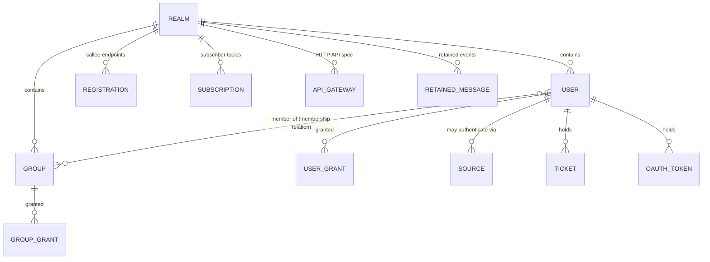

# The Bondy data model and its storage topology

> Audience: anyone who needs to know what state Bondy keeps, how its entities
> relate, and how those entities are laid out on the `bondy_db` substrate.
> Time to read: ~20 min.

Bondy keeps a small, well-defined set of domain state: the **realms** it serves,
the **principals** (users and groups) in each realm and what they may do
(**grants** and **sources**), the **auth artifacts** it issues (tickets and
OAuth tokens), the **routing** state of live sessions (registrations and
subscriptions), and a few operational stores (the **API gateway** specs,
**bridge-relay** config, **retained messages**).

All of it lives in `bondy_db`. A single module — `bondy_namespace_catalog` —
declares every database and table and is the source of record for the mapping
this document describes; treat its `tables/0` declarations as authoritative
where this prose and the code ever disagree.

This document is the **consumer's** view: the domain model, and the storage
decisions made for it. The substrate mechanics those decisions rest on — how a
shard materialises a value, what a CRDT fold is, how anti-entropy converges two
peers — are the subject of the `bondy_db` architecture series (in
`apps/bondy_db/doc_extras/architecture`), which this document links to at the
point of need rather than restating.

## The data model

Every piece of domain state is scoped, directly or transitively, to a **realm**
— Bondy's administrative and security boundary, the unit of multi-tenancy. A
realm owns its principals and their authorization; a session belongs to exactly
one realm; tokens and tickets are minted against a realm.

**Realm.** The tenant. A realm has a URI, configuration (security settings,
authentication methods, prototype inheritance), and is the band every other
per-realm entity is filed under. Realms form a single global registry — there is
no enclosing realm above them — so a realm is addressed by its URI directly.

**User.** A principal that authenticates and acts within one realm. Addressed by
username within the realm. The user record carries credentials and metadata; its
group membership is **not** stored on the record (see *Membership*).

**Group.** A named bundle of authorization, within one realm, addressed by name.
A user inherits the grants of every group it belongs to. Groups may nest (a
group can be a member of another group).

**Membership.** The user↔group relation, modelled as a relation in its own
right rather than as a list on either record. Each `(user, group)` pair is one
fact. This is the one place Bondy's data model is genuinely relational, and it
is deliberate: membership is read in both directions ("which groups is this
user in?" on the hot authorization path, "who is in this group?" for
administration), and concurrent edits from different nodes must not clobber each
other. Both needs fall out of cell-per-fact storage; neither survives a
`groups` list inside an LWW record.

**Grant.** An authorization fact attaching a set of permissions on a resource to
a **role** — a role being a username or a group name. Grants are split into two
tables by the kind of role (`security_user_grants`, `security_group_grants`),
each keyed by the composite `{role, resource}` within the realm.

**Source.** A rule permitting a user to authenticate by a given method from a
given network range — the `{username, auth-method, CIDR-anchor}` an
authentication attempt is matched against. Keyed by the composite
`{username, address-mask, auth-method}` within the realm.

**Ticket** and **OAuth token.** The auth artifacts Bondy issues. A ticket is
addressed by its `{realm, authid, scope}` identity; a token by its (already
opaque, hashed) value. Both are looked up by key on the authentication path;
neither is enumerated in normal operation.

**Registration** and **Subscription.** The routing state of live sessions: which
callee can serve a procedure, which subscriber wants a topic. Each is bound to a
session and addressed by a per-realm-unique entry id. These are **ephemeral** —
when a session's transport closes, its entries are gone — so they are the only
state Bondy never persists.

**API gateway, bridge relay, retained messages.** Operational stores, each
per-realm: the gateway holds the HTTP-API specifications a node compiles into
its Cowboy dispatch; bridge relay holds the inter-cluster bridge configuration
(read once at boot, filtered to the local node); retained messages hold the
last event published with the `retain` option on each topic.

## Two databases: `core` and `registry`

The catalogue declares exactly two `bondy_db` databases, split by a single
question — *must this survive a restart?*

- **`core`** — **durable**. The system of record: realms, users, groups,
  membership, grants, sources, tickets, tokens, the gateway specs, bridge
  config, retained messages. Twelve tables, all on the durable substrate
  (Leveled-backed).
- **`registry`** — **ephemeral**. The two routing tables. It is in-memory
  end to end (ETS projection, in-memory write-ahead log), because persisting a
  registration would only resurrect a dead, unroutable session on restart. A
  rebooted node starts with an empty registry and re-learns live entries from
  its peers.

The split is not cosmetic: it selects the entire storage stack. `core` pays for
durability (a disk write-ahead log, an LSM projection, crash recovery);
`registry` pays for none of it and routes on RAM alone.

## The storage topology

A table's placement on the substrate is decided by four declarations in its
catalogue spec — which database, how it shards, how it folds, and whether it
publishes change events — plus the secondary access paths it declares. The rest
of this section takes them one at a time.

### The per-shard stack and the partition strategy

Each database is a fixed set of **shards**, and every shard owns its own full
storage stack (write-ahead log, MST, projection). `core` runs on the
**shared-shards** topology over Leveled with a deployment-configurable shard
count (`oplog.core.shard_count`, default 16); `registry` runs on the **memory**
topology (ETS, in-memory WAL, the fused single-process writer) with its own
shard count.

Which shard a write lands on is the database's **partition strategy**. `core`
uses the **aggregate** strategy: a cell's shard is chosen by hashing
`(realm, aggregate-root-of-key)`. The realm component keeps a realm's data
together with itself; the aggregate-root component (below) decides *which*
related cells share a shard. (The mechanics of the hash, and the alternative
strategies, are in the bondy_db series'
[topology chapter](../../bondy_db/doc_extras/architecture/03_bondy_db.md#topology-and-the-registry).)

The partition strategy is **frozen** the first time a durable database is
opened: it determines where on disk every cell lives, so changing it after data
exists would silently misplace reads. The topology manifest records the frozen
configuration and reconciles it against the running config on every boot (see
*The topology manifest*).

### Realm scoping: `shard_by`

`shard_by` declares whether a table is filed *under a realm* or in a *single
global keyspace*.

- **`shard_by => realm`** — the cell lives in a per-realm band. A realm's data
  is isolated, and a realm-scoped query — "list this realm's users", "this
  user's grants" — is a bounded, realm-local key range, not a scatter across the
  whole table. This is the default, used by every per-realm table: users,
  groups, membership, grants, sources, the gateway, bridges, retained messages,
  and the (realm-scoped) routing tables.
- **`shard_by => key`** — no realm band; the table is one global keyspace
  addressed by key. Used by `bondy_realm` (the realm registry itself has no
  enclosing realm — realms are spread across shards by their URI) and by
  `bondy_ticket` / `bondy_oauth_token` (addressed by their opaque key, where
  creation and point lookup are the only access patterns and enumeration is a
  non-goal).

### Co-location: `aggregate_root`

Under the aggregate strategy, `aggregate_root` picks *which part of a cell's key
decides its shard*, so that related cells co-locate. This is what makes the hot
authorization read cheap.

- **`identity`** (the default) — the whole key decides the shard; each record is
  placed independently.
- **`leading_col`** — the first column of a composite key. A user's grants
  (`{username, resource}`) and sources (`{username, …}`) hash by `username`, so
  they land on the **same shard as that user's record**. A group's grants
  co-locate with the group.
- **`second_col`** — the second column of a band-tagged key. A forward
  membership fact co-locates with its user, a reverse fact with its group.

The payoff is locality on the authorization path: a user's record, its grants,
its sources, and its group memberships sit on one shard, so building an
authorization context is a near-single-shard read rather than a cluster-wide
scatter. This is *locality, not atomicity* — the records still live in separate
per-table logs, and cross-entity consistency is provided by other means (the
freshness fence on the read path, not a cross-table atomic write).

### The fold class: a table's CRDT

Every table converges by a CRDT fold, declared as its **fold class**. The fold
is what "merge" means for that table when two nodes have both written.

- **`lww`** — last-writer-wins by HLC. A `set` or `clear`, highest timestamp
  wins. This is the fold for almost everything: realms, users, groups, the
  gateway, tickets, tokens, bridges, retained messages, grants, sources, and
  the routing tables.
- **`ew`** — an **enable-wins flag**, the fold for `security_group_members`.
  Each membership fact is a flag cell: a concurrent *add* survives a *remove*
  that did not observe it. This is why two nodes that independently add the same
  user to different groups both succeed — the lost update an LWW `groups` list
  would suffer is structurally impossible when each membership is its own cell.
- **`mv`** (a multi-value register, sibling-preserving) and **`aw`** (an
  add-wins map) are defined fold classes available to the substrate but not
  currently bound to a table. Grants and sources are *modelled* as
  sibling-preserving — so a genuinely concurrent multi-node grant edit could be
  surfaced rather than silently resolved — but run as `lww` today; the
  distinction only matters under concurrent cross-node edits.

### Change notification: `publish`

A table marked `publish => true` emits a change event on every write. There are
two distinct events, and the distinction is the whole point:

- a **local event** for a write made on this node, and
- a **merge event** for a write that arrived from a *peer* through anti-entropy.

The merge event is the seam a node-local **reactor** (`bondy_aae_reactor`) uses
to act on what another node did — invalidate cached authorization contexts when
a peer changes a grant or a membership, close a user's sessions when a peer
deletes the user, rebuild the gateway dispatch when a peer changes a spec,
maintain the routing trie when a peer's registration replicates. A node's *own*
writes run their side-effects inline at the call site, so reactors ignore the
local tag and act only on the merge tag.

Tables that publish: realms, users, membership, both grant tables, the gateway,
and the two routing tables. Tables that do not (no consumer reacts to a remote
change): groups, sources, tickets, tokens, bridges, retained messages.

### Secondary access paths

Most tables answer every query from their primary key order. Three patterns
provide the reverse or cross-cutting lookups Bondy needs:

- **The permutation index** (membership). Rather than a secondary index, each
  membership fact is written in *both* key orderings — a forward band and a
  reverse band — so "groups of a user" and "members of a group" are each a
  bounded realm-local range scan. (See the bondy_db series'
  [app-developer's tour](../../bondy_db/doc_extras/architecture/07_app_developers_tour.md).)
- **Declared secondary indexes.** The grant tables declare a `by_resource`
  index (the equality reverse lookup "who has a grant on resource R"); the
  routing tables declare a `by_session` index (so closing a session is a bounded
  reverse lookup, not a realm scan). `security_users` declares none.
- **Key-ordered range scans.** Retained messages are keyed by topic and matched
  by prefix / wildcard range scans over the key order — no secondary index.

### The topology manifest

A durable database's keying configuration — partition strategy, shard count,
each table's `shard_by` and `aggregate_root` — decides where every cell lives on
disk. Change it after data exists and reads silently miss. The manifest defends
against this: the first durable open **freezes** the configuration, and every
later boot reconciles the running config against it, reporting a mismatch per
the `oplog.core.on_topology_mismatch` policy (`warn` by default, `stop` to
refuse the boot). The frozen configuration also yields a **topology
fingerprint** two peers exchange during anti-entropy, so a node that keys its
data differently is never mistaken for a divergent replica of the same data.

## The catalogue

The full inventory, grouped by domain. `DB` is `core` (durable) unless noted;
`shard` is `shard_by`; `co-loc` is `aggregate_root` (blank = `identity`);
`fold` is the CRDT; `pub` marks change-publishing tables.

| Domain | Table | DB | shard | co-loc | fold | pub | Notes |
|---|---|---|---|---|---|---|---|
| Realm | `bondy_realm` | core | key | — | lww | ✓ | global realm registry, keyed by URI |
| Principals | `security_users` | core | realm | — | lww | ✓ | user record; membership is separate |
| Principals | `security_groups` | core | realm | — | lww | | group record |
| Principals | `security_group_members` | core | realm | second_col | **ew** | ✓ | membership relation; forward/reverse permutation index |
| Authorization | `security_user_grants` | core | realm | leading_col | lww | ✓ | `{username, resource}`; `by_resource` index |
| Authorization | `security_group_grants` | core | realm | leading_col | lww | ✓ | `{group, resource}`; `by_resource` index |
| Authorization | `security_sources` | core | realm | leading_col | lww | | `{username, mask, method}` |
| Auth artifacts | `bondy_ticket` | core | key | — | lww | | keyed by `{realm, authid, scope}` |
| Auth artifacts | `bondy_oauth_token` | core | key | — | lww | | keyed by opaque token value |
| Operational | `api_gateway` | core | realm | — | lww | ✓ | HTTP-API specs; dispatch reactor |
| Operational | `bondy_bridge_relay` | core | realm | — | lww | | node-scoped; read once at boot |
| Operational | `retained_messages` | core | realm | — | lww | | keyed by topic; range-scan matched |
| Routing | `bondy_registration` | registry | realm | — | lww | ✓ | ephemeral; `by_session` index |
| Routing | `bondy_subscription` | registry | realm | — | lww | ✓ | ephemeral; `by_session` index |

## Pointers

- `bondy_namespace_catalog` (in `bondy_router`) — the source of record: the
  database and table declarations (`tables/0`, `core_db_spec/0`,
  `registry_db_spec/0`) and the fold-class → CRDT mapping (`fold_opts/1`).
- The entity modules own each table's keys and read/write primitives:
  `bondy_realm`, `bondy_rbac_user` (users **and** the membership relation),
  `bondy_rbac_group`, `bondy_rbac` (grants), `bondy_rbac_source`, `bondy_ticket`,
  `bondy_oauth_token`, `bondy_registry` (registrations / subscriptions).
- `bondy_aae_reactor` (in `bondy_router`) — the node-local reactor that turns
  the publishing tables' merge events into session closes, authorization
  re-evaluation, gateway rebuilds, and routing-trie maintenance.
- The `bondy_db` architecture series (`apps/bondy_db/doc_extras/architecture`)
  — the substrate beneath this mapping: the CRDT model, the per-shard stack,
  anti-entropy and the applied-frontier convergence oracle, compaction, and the
  app-developer's tour that works these same tables from the substrate side.
