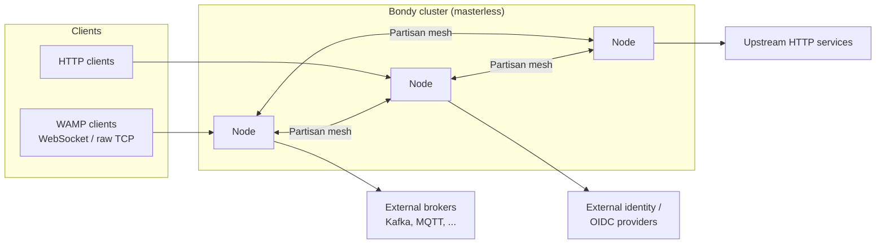

# Bondy Architecture

This is the architecture documentation for the Bondy router, organised by the
SEI *Views and Beyond* method: the system is described through several views,
each answering one kind of question, rather than one diagram that answers
none. This page is the documentation roadmap — what the views are, who each
one serves, and how they map onto one another. Every view page has the same
shape: a primary presentation (diagram), an element catalog stating each
element's responsibility, and the rationale for why the structure is the way
it is.

## System context

Bondy is a networking platform and router for distributed applications. It
implements WAMP — routed Remote Procedure Calls and Publish/Subscribe over a
single session — alongside an HTTP API gateway, and runs as a
masterless cluster: every node accepts clients, routes calls and events, and
replicates the state needed to route across nodes.

Any client may connect to any node. A call or event entering one node reaches
a callee or subscriber on any other; the cluster owes the client exactly one
behaviour regardless of which node it happens to reach. Everything in this
documentation exists to honour that sentence.

## The views

| View | Kind (V&B style) | Question it answers |
| --- | --- | --- |
| [Module decomposition](view_module_decomposition.md) | Module — decomposition, uses, layering | What are the parts, and what may depend on what? |
| [The routing plane](view_routing_plane.md) | Component-and-connector — pub/sub, client-server | How does a message travel from a client to its recipients, within and across nodes? |
| [The state plane](view_state_plane.md) | Component-and-connector — shared-data | How is routing and control state stored, materialised, and read on one node? |
| [Convergence and repair](view_convergence.md) | Component-and-connector — peer-to-peer | How do nodes agree on replicated state, detect divergence, and repair it? |
| [Deployment](view_deployment.md) | Allocation — deployment | What runs where: processes, sockets, disk, and the cluster mesh? |
| [Rationale: robustness](architecture_rationale.md) | Beyond views — rationale | Why is this trustworthy: fault design, overload design, and what is verified rather than asserted? |

## How to read this documentation

**Evaluating Bondy.** Read this page, then [the routing
plane](view_routing_plane.md), then [rationale:
robustness](architecture_rationale.md). That path answers "what does it do,
how does a message move, and why should I trust it under faults and load".

**Operating Bondy.** Read [deployment](view_deployment.md) and [convergence
and repair](view_convergence.md) — the two views whose elements appear in
your metrics and logs — then the configuration reference for the knobs each
view names.

**Contributing, or reasoning about the code (human or AI).** Read all six in
order. The [module decomposition](view_module_decomposition.md) tells you
where code may live and which dependencies are legal; the two
component-and-connector views tell you what the processes you are editing do
at runtime; the rationale tells you which properties are proven and must not
be casually weakened.

## Mapping between views

The views describe one system, so their elements correspond:

- The **applications** of the module view are the unit of layering; the
  **processes** of the routing and state planes are instances of modules
  from those applications. `bondy_router` supplies the routing plane;
  `bondy_db` and `bondy_oplog` supply the state plane; `bondy_mst` supplies
  the tree that the convergence view synchronises.
- The routing plane *reads* the state plane: the Routing Information Base
  consulted on every call and publish is a set of tables in the `registry`
  database of the state plane.
- The convergence view is the state plane viewed cluster-wide: what the
  state plane calls a shard's tree and frontier, the convergence view
  synchronises, certifies, and repairs.
- The deployment view allocates all of the above to OS processes, sockets,
  and directories on a machine.

## Deep dives

Several subjects earn their own explanation beyond what a view can carry.
These are the satellite documents this architecture references at the point
of need:

- [WAMP, the protocol Bondy routes](../introduction/wamp.md)
- [Registry routing (the RIB)](../router/registry_routing.md)
- [Progressive calls](../router/progressive_calls.md) and
  [progressive call results](../router/progressive_call_results.md)
- [Deletion and reclamation](../database/deletion_and_reclamation.md)
- [Per-origin prefix closure](../database/prefix_closure.md)
- [Load regulation and rate limiting](../configuration/load_regulation_and_rate_limiting.md)
