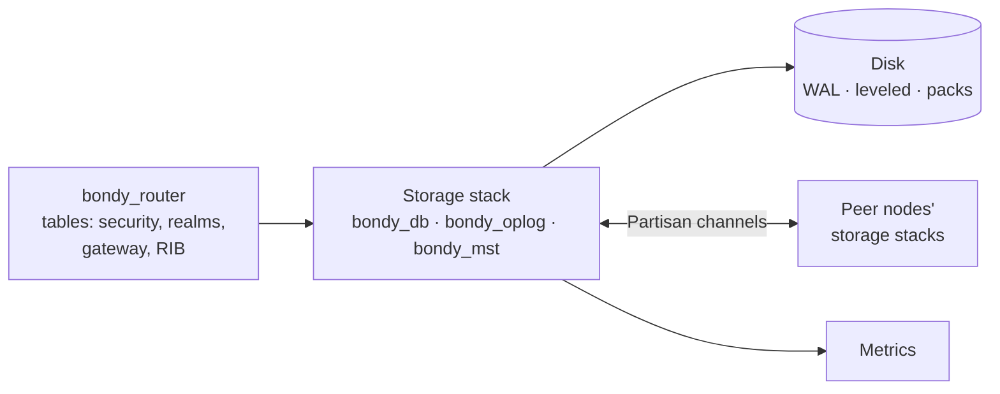

# Storage Architecture (bondy_db)

This is the architecture documentation for Bondy's storage stack — the
`bondy_db` facade, the `bondy_oplog` replication substrate, and the
`bondy_mst` Merkle Search Tree — organised by the SEI *Views and Beyond*
method. It zooms into what the [platform architecture](architecture.md)
covers in two pages, for readers who work on or operate this subsystem
directly.

## Context

The storage stack serves one consumer — the router's named tables — and
talks to three externals: the disk, the cluster mesh, and the operator's
metrics endpoint.

The contract at the top edge is small on purpose: name a table, a realm,
and a key; apply the operation the table's CRDT declares; read the current
value. Everything below that line — sharding, durability, replication,
convergence, repair, reclamation — is this subsystem's business and this
document's subject.

## The views

| View | Kind | Question it answers |
| --- | --- | --- |
| [Module decomposition](db_view_module.md) | Module | What are the parts of the three applications, and what may use what? |
| [The shard at runtime](db_view_shard_runtime.md) | Component-and-connector | What happens inside one shard on a write and on a read? |
| [Replication](db_view_replication.md) | Component-and-connector, peer-to-peer | How does a shard reconcile with its peers, page by page? |
| [The data lifecycle](db_view_lifecycle.md) | Component-and-connector | How history is bounded: stability, compaction, reclamation, repair |
| [Rationale: invariants and verification](db_rationale.md) | Beyond views | Which properties hold, why, and which are machine-checked |

Reading order for a first pass is top to bottom: parts, then one shard,
then many shards, then time, then why it holds.

## Vocabulary

The stack's terms are used identically on every page; each is defined once,
here.

- **Table** — a named key/value space with declared CRDT semantics,
  provisioned by the catalogue into one database.
- **Database** — a fixed set of shards sharing a topology: `main`
  (durable) or `registry` (ephemeral).
- **Shard instance** (or *instance*) — the unit of replication: one
  write-ahead log, one MST, one projection, one applier. Its replicas are
  the same-named instances on other nodes.
- **Event** — one operation as stored: key `{HLC, Origin, Seq}` plus the
  operation term. The *origin* is the instance's per-boot replica
  identity; *seq* is that origin's contiguous counter.
- **Projection** — the materialised current value per cell; what reads
  return.
- **Fold** — applying an event to the projection through the table's CRDT
  module; the only place operation semantics execute.
- **Applied frontier** — per instance, per origin: the highest
  contiguously folded seq.
- **Watermark** — per instance: the compaction bound; history at or below
  it may be truncated from the MST.
- **Catalogue** — the provisioning layer that turns table declarations
  into databases, topologies, and instances, and the source of the cell
  snapshots a rebootstrap installs.
