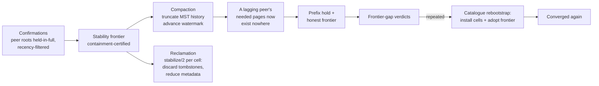
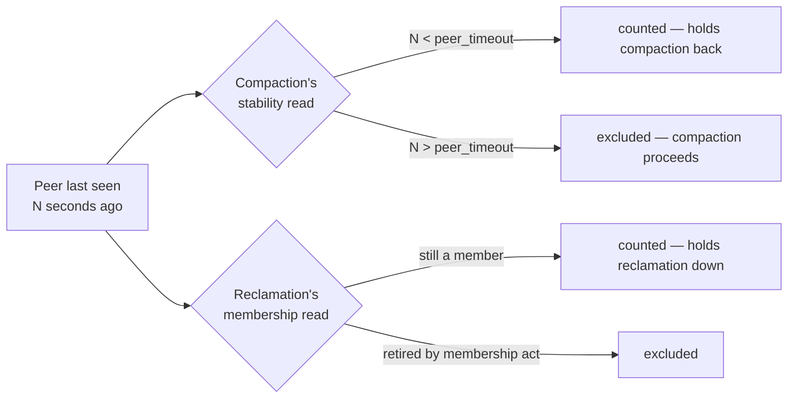

# Storage Runtime View: The Data Lifecycle

How history is bounded. An operation log grows with every write; this view
shows the machinery that certifies what may be forgotten, forgets it, and
repairs the one node that needed what everyone else forgot.

## Primary presentation

## Element catalog

| Element | Responsibility |
| --- | --- |
| Stability frontier | The license to forget. An instance certifies, by containment of its local keys in every confirmed peer's tree, a point at or below which every replica holds every event. In a cluster this requires confirmation from *every* member of the reclamation set; a solo node certifies unconditionally. |
| Compaction | Truncates MST history at or below the certified point and advances the watermark. History is redundant below the frontier by definition — every replica already folded it — so compaction reclaims index and page space without touching values. |
| Reclamation | The per-cell half: each table's CRDT answers, through `stabilize/2`, what remains of a cell once nothing older can arrive — discard a tombstone, reduce ordering metadata, or keep. The license's exact boundary (clock-governed reductions only; context-governed ones need more than this frontier certifies) is stated and mechanically checked — see [deletion and reclamation](../database/deletion_and_reclamation.md) and [rationale](db_rationale.md). |
| The liveness trade | Confirmations are recency-filtered: a peer silent past `db.compaction.peer_timeout` stops holding the frontier back, so one dead node cannot freeze reclamation cluster-wide. The deliberate consequence: a long-silent node's needed history can be compacted away everywhere. |
| Repair (rebootstrap) | The recovery half of that trade. The returning node's holds keep its frontier honest; the persistent deficit produces gap verdicts; repeated verdicts schedule a catalogue rebootstrap, which installs the peers' *materialised cells* — values survive compaction even though events do not — and adopts their frontier. The node's own events survive throughout in its local log. |
| Bootstrap | The same install path, used at first join: a fresh instance takes a catalogue snapshot rather than paging through history it never had. |

## An episode, end to end

A node goes silent under write load. Its peers confirm among themselves,
certify, compact past history the silent node never pulled, and keep
writing. The node returns:

1. Its first complete round integrates the survivors' trees; the fold
   holds each truncated origin's later events (`events_held` metric
   bursts) — no state ever skips operations.
2. Its frontier, refusing to count held events, stays behind; every round
   ends in a gap verdict.
3. The second verdict schedules rebootstrap per affected shard; cells and
   frontier install; held events at or below the adopted frontier become
   ordinary re-folds.
4. Frontiers equalise; metrics go quiet. Elapsed, in the validated record:
   about three minutes from restart, under full load.

## Variability guide

Every element above runs on a timer with a budget. The options set how often
a pass runs and how much one pass may do, with the values `bondy.conf` uses
when you set nothing.

### The sweeps

`db.reclaim.interval` spaces the reclamation passes and
`db.reclaim.batch_cells` caps how many cells one pass scans, so a sweep
cannot monopolise an instance. `db.origin_retirement.interval` spaces the
retirement of departed peers, recorded under
`db.origin_retirement.path`. Each has an on/off key.

Separately, every instance inspects its own heap every `db.gc_interval` and
fullsweep-hibernates when it has grown past `db.gc_heap_delta`, reclaiming
the transient apply and anti-entropy garbage a long-lived process would
otherwise hold until its next major collection.

### Liveness, read two ways

`db.compaction.peer_timeout` is the recency window named in the liveness
trade above. It governs the compaction scheduler only. Reclamation takes a
strict, membership-based reading with no recency filter, so a silent member
holds reclamation down until an explicit membership act retires it — no
timeout changes that. `db.gc_max_concurrency` caps concurrent compaction
cycles; despite the shared prefix it has nothing to do with the heap
monitor.

## Rationale

Forgetting is the only operation here that is irreversible, so it is the
only one gated on a cluster-wide proof; everything else — holding,
verdicts, rebootstrap — is reversible pressure toward convergence. The
recency filter is a chosen availability trade, and the design treats its
worst case not as a corner but as a first-class path with its own
enforcement, detection, repair, and validation. The alternative — letting
one silent node veto reclamation forever — fails operationally in exactly
the deployments (ephemeral registry state, high churn) this stack serves.
