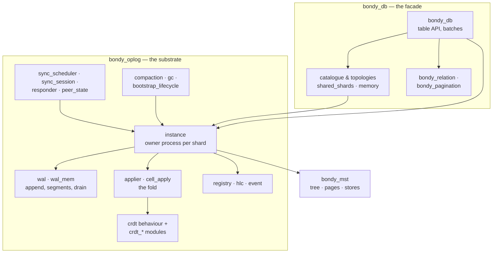

# Storage Module View: Decomposition

The static structure of the three storage applications: what each part is
responsible for, and the uses relation between them. Runtime behaviour is
in [the shard at runtime](db_view_shard_runtime.md).

## Primary presentation

## Element catalog

**bondy_db** — the facade the router sees.

| Part | Responsibility |
| --- | --- |
| `bondy_db` | The table API: `apply/4`, `apply_batch/2`, `read/3`, `delete/3`, folds. Resolves table → database → shard (by realm and key, honouring a table's aggregate-root declaration so related entities co-shard), and rejects malformed batches before any durability cost — a batch may carry at most one operation per target. |
| Catalogue & topologies | Provisioning: turns table declarations into running instances. Two topologies — `shared_shards` (durable shards over `leveled`, with an on-disk keying manifest that peers fingerprint-check before syncing) and `memory` (ephemeral ETS shards, no disk). |
| `bondy_relation`, `bondy_pagination` | Relational reads over tables: secondary-index-backed queries with shard-local or scatter-gather pagination. |

**bondy_oplog** — the substrate; knows nothing of table names or WAMP.

| Part | Responsibility |
| --- | --- |
| Instance | One process per shard: owns the MST and the overlay table, mints and signs event keys (one HLC tick per event, sequence ranges reserved atomically, ranges returned on rejection so sequences stay gap-free), installs drained batches into the tree, serves integration, and publishes its state (root, frontier, watermark) to the registry. Its lock-free append path lets an eligible caller mint and stage in its own process, bypassing the gen-server hop. |
| WAL | Durable (segmented, fsync-by-policy) and in-memory variants. A byte log positioned by a cursor: it appends already-minted events as all-or-nothing frames, rejecting a batch whose HLCs are not strictly increasing, and never depends on tree state. |
| Applier & cell_apply | The drain and the fold, in a process of their own. The applier reads the WAL, re-verifies signatures, folds through `cell_apply`, then hands the batch to the instance to install. `cell_apply` is the single materialisation path for every event source — local drain, live remote append, page-sync integration, re-derivation — and the point where per-origin prefix closure is enforced on the paths that can present a hole, and measured on the ones that cannot. |
| CRDT modules | The `bondy_oplog_crdt` behaviour and its implementations (registers, counters, sets, maps, flags, structs), each declaring its causal tier, fold, and reclamation callbacks. Semantics live here and nowhere else. |
| Sync machinery | The scheduler (tick, peer sampling, concurrency caps), the session (one shard, one peer, one round), the responder (serves roots, frontiers, pages), and peer-state (confirmed roots, recency). |
| Lifecycle | Compaction and garbage collection under the stability frontier; catalogue bootstrap and rebootstrap. |
| Registry, HLC, event | Node-local plumbing: the instance registry (lock-free lookup of roots, frontiers, handles), the per-instance hybrid logical clock, and the event/key codec. |

**bondy_mst** — the tree.

| Part | Responsibility |
| --- | --- |
| Tree | A content-addressed, page-oriented ordered map. Deterministic shape: the same key set produces the same pages and the same root hash on every node, which is what makes root equality mean history equality. |
| Stores | Page storage backends: in-memory for ephemeral shards; an incoming-plus-sealed pack store for durable ones, sealed in bounded passes so no seal freezes writes for long. |

## Uses discipline

Arrows are the only legal dependencies. Two prohibitions carry most of the
design: the substrate never calls up into `bondy_db` (semantics arrive as
CRDT callbacks, not as calls), and the tree never sees peers (the sync
machinery moves pages; the tree only stores and diffs them). Both keep the
hard proofs small — see [rationale](db_rationale.md).
