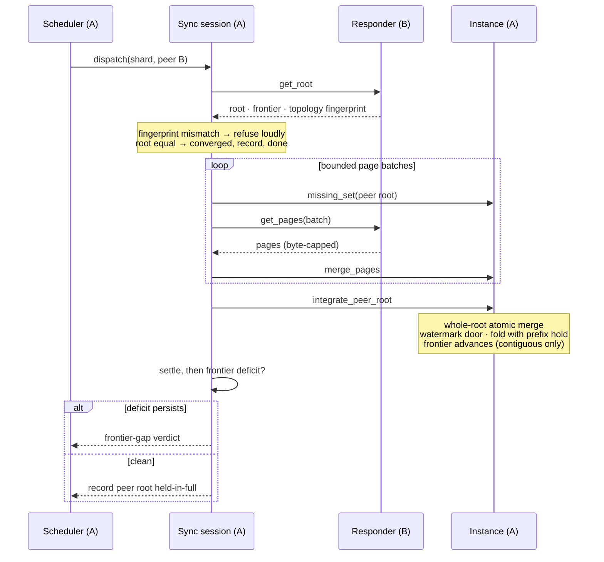

# Storage Runtime View: Replication

How one shard instance reconciles with its replicas: the sync round in
detail, from peer sampling to integration. The garbage-collection side of
the cluster relationship — stability, compaction, repair — is [the data
lifecycle](db_view_lifecycle.md).

## Primary presentation

## Element catalog

| Element | Responsibility |
| --- | --- |
| Scheduler | Ticks every `db.aae.interval`; samples `db.aae.fanout` peers; dispatches sessions under `db.aae.max_concurrency`. Adaptive live-sync backs converged shards off; shards backing the authentication fence are exempt. Escalates repeated gap verdicts and unservable-page reports into rebootstraps. |
| Sync session | One shard, one peer, one round, pull-only. Verifies that the peer's keying-topology fingerprint matches its own before pulling anything. Pins the peer root against its **own** node's page GC for the round's duration — during a multi-round pull the earlier rounds' pages are unreachable from the local root until the final integrate, and a concurrent compaction cycle would otherwise collect them and leave the merge treating the missing subtrees as empty. Pulls and merges missing pages in batches sized by the node-wide budget (`db.aae.max_pages_in_flight ÷ max_concurrency`), byte-capped to the mesh's frame limit, so peak memory is bounded however divergent the trees are; chases a refreshed root if the peer compacts mid-session. Delivers *nothing* unless it completes: only a round that held the peer's whole tree may integrate, record confirmation, or judge frontiers. |
| Responder | The serving side: answers roots, applied frontiers (behind an installed-consistency barrier, so a frontier never claims what the tree cannot ship), origins, and pages, and stamps each root and frontier reply with this node's keying-topology fingerprint so the initiator can refuse a mismatch rather than diverge silently. Its own refusal is narrower and about servability: if its root is dangling — a referenced page is missing, transiently normal under truncate-and-page-GC churn — it answers `undefined` so the peer pulls nothing unservable and this node heals by its own pull. |
| Peer state | The confirmation ledger: which peer roots this node holds in full, and how recently each peer confirmed. Recency-filtered reads of this ledger license compaction ([lifecycle](db_view_lifecycle.md)). |
| Integration | Whole-root atomic: merge the peer tree, pass the **watermark door** (an event at or below the local watermark that was never applied here is accepted, not discarded — "below the watermark" means *compacted history*, only provably so for events this replica folded), fold new events with the **prefix hold** (a remote origin's events beyond a contiguity gap are excluded from fold and frontier and re-presented until the gap fills or repair supplies them), and advance the frontier. |

## What a round guarantees — and refuses to claim

A completed round establishes: this node holds every page of the root it
completed against (recorded as confirmation, the input to compaction
licensing); every event in that tree is folded or deliberately held; and
the frontier comparison that follows is honest, because held events were
never counted. An incomplete round — budget exhausted, peer truncated
mid-session, pages unavailable — establishes nothing and records nothing.
The asymmetry is the design: every cluster-wide license in the
[lifecycle view](db_view_lifecycle.md) rests on confirmations, so
confirmations must be impossible to earn partially.

## Variability guide

Anti-entropy is background work subordinate to routing, and its options say
how subordinate. Each plate marks them on the geometry they govern, with the
values `bondy.conf` uses when you set nothing.

### The page budget, and what concurrency does to it

`db.aae.max_pages_in_flight` is the node-wide ceiling on reconciliation
pages held at any instant, and it is the option that bounds peak memory.
`db.aae.max_concurrency` divides that ceiling rather than adding to it: each
session fetches at most budget ÷ concurrency pages per round. Raising
concurrency therefore buys fairness — more shards make progress at once,
each more slowly — and never more memory. `1` serialises anti-entropy, which
is simplest but lets a busy node starve some shards indefinitely.

`db.aae.interval` spaces the ticks and `db.aae.fanout` sets how many peers
one tick reaches. When `db.aae.load_adaptive` is on, a run queue at or above
`db.aae.load_run_queue_threshold` per scheduler makes anti-entropy yield its
throttleable dispatches for that tick; the signal is smoothed, so a
momentary burst does not flap the yield.

### Cadence, and the fence that reads freshness

A converged instance widens its live-sync cadence from `db.aae.interval`
toward `db.aae.live_sync.max`, and returns to base when its root moves
again. `db.aae.live_sync` turns that backoff off.

`db.aae.fence.max_lag` bounds how stale this node's view of the security
tables may be before it refuses all new authentication, regardless of
method. The whole fence is a no-op when `db.aae` is off, because local
writes are then synchronous and no cross-node staleness window exists. The
freshness signal is produced here, on the anti-entropy side, honouring
`db.aae.fence.on_isolation`; authentication only reads it.

## Rationale

Pull-only rounds over a deterministic tree make the steady state one
root-hash exchange and catch-up proportional to the difference. The page
budget is node-wide so memory does not scale with shard count; the byte cap
matches the mesh's frame limit so no item can wedge a channel. The
watermark door and the prefix hold both follow one rule — *hold, never
drop, never fold out of order* — because each guards a case where a cheap
filter (key below watermark; seq beyond a gap) would otherwise silently
destroy exactly the events that matter most: the ones only one side has.
