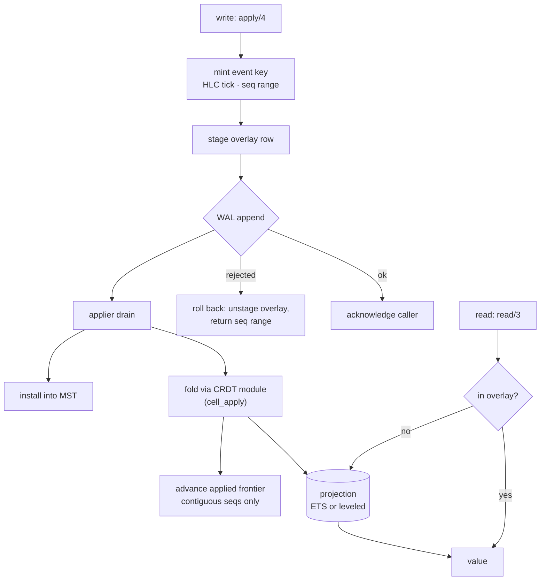

# Storage Runtime View: The Shard

One shard instance at runtime: the write path from `bondy_db:apply/4` to a
durable, readable, replicable event, and the read path back. Cross-node
behaviour is [replication](db_view_replication.md).

## Primary presentation

## The write path, step by step

1. **Mint.** The event key is created caller-side on the fast path: one
   hybrid-logical-clock tick (strictly monotone per instance, dominated by
   every timestamp ever received) and a sequence number from an atomically
   reserved contiguous range. Both fast (lock-free, stateless-validator)
   and gen-server paths share one minting core.
2. **Stage, then append.** The overlay row is staged *before* the WAL
   append, so the moment the event is durable a reader can see it — there
   is no window where a durable write is invisible. If the WAL rejects the
   append, the overlay row is unstaged and the reserved sequence range is
   returned to the counter when still topmost; a range overtaken by a
   concurrent reservation cannot be returned, so it is counted
   (`bondy_oplog_seqs_burned_total`) and backfilled with signed no-op
   `seq_fill` events (`bondy_oplog_seqs_filled_total`) that occupy the
   seqs — replicating and advancing frontiers like any event, folding to
   nothing — so the gap never becomes sync-unfillable.
3. **Acknowledge.** The caller's write is complete at durable append —
   before the fold. `db.wal.fsync_mode` governs what "durable" costs.
   `per_write`, the default, fsyncs every append: each write is durable
   before it returns, at the price of binding the writer to the device's
   fsync rate. `batched` defers the fsync to a size or time boundary
   (`db.wal.batched_fsync_bytes`, `db.wal.batched_fsync_interval`) and
   exposes durability through an explicit wait rather than through the
   append returning — roughly two orders of magnitude more throughput, in
   exchange for a bounded durability window. All three are global: they
   affect every durable instance node-wide. The ephemeral `registry`
   database's in-memory WAL never fsyncs and ignores them.
4. **Drain and fold.** The applier consumes the log in order and folds
   each event through the table's CRDT module into the projection. The
   fold is the only interpreter of operations; every event source passes
   through it, so a locally minted event and the same event arriving from
   a peer produce identical state.
5. **Frontier and install.** The applied frontier advances at the fold's
   commit point, per origin, across contiguous sequences only. The event
   is installed into the MST, becoming visible to
   [replication](db_view_replication.md). The overlay row is evicted once
   the projection covers it.

## The read path

`read/3` consults the overlay first (writes not yet drained), then the
projection — a lookup, never a fold, never the MST. Folds and relational
queries run over the projection and its secondary indexes, which
`cell_apply` maintains in the same commit as the values. Reads on the
writing node therefore observe writes immediately; reads elsewhere observe
them after replication.

## Ordering and concurrency contract

Within one instance: events fold in per-origin sequence order (holes are
held, not skipped — the prefix-closure enforcement lives at this fold);
concurrent writers to one instance interleave freely at mint time, and the
HLC gives every event a total order consistent with causality for
order-independent CRDTs. Across instances there is no ordering — a batch is
atomic only within one shard, which is why the facade co-shards entities
that must commit together (the aggregate-root declaration).

## Variability guide

Configuration does not change the structure above; it changes what each
element costs and how much of it may run at once. Each plate marks the
options on the geometry they govern, with the values `bondy.conf` uses when
you set nothing.

### Durability of the append

`db.wal.fsync_mode` decides whether `append/2` returns before or after the
platter has the frame, which is the difference between the head position
and the durable position. `per_write` collapses the two. `batched` opens a
window bounded by whichever of `db.wal.batched_fsync_bytes` or
`db.wal.batched_fsync_interval` fires first, and callers that need a
specific position on disk wait for it through `await_durable/3`.
`db.wal.max_segment_bytes` sets where the head segment rotates — a soft
target, since rotation is checked between appends so no batch spans a
boundary.

### Sealing the pack

`db.pack_seal_mode` decides whether the seal runs on the apply path.
`async`, the default, keeps it off that path; `sync` puts one long datasync
in front of the pipeline. `db.pack_auto_seal_bytes` sets how much
accumulates first, and is deliberately low so a seal rewrites the pack in
short passes.

### Detecting a stalled drain

`db.drain.stall_alarm` is how long the applier may process frames without
committing past the highest position it has ever committed before it raises
`{bondy_oplog_drain_stalled, InstanceId}`. Progress is measured against
that high-water mark, so re-reading ground already committed does not count.
`0` disables the detector.

### Sizing the projection

Twenty-two `db.leveled.*` options size the two paths a write takes into the
projection. The ledger path is bounded by `db.leveled.cache_size` and its
`db.leveled.cache_multiple` ceiling, past which every PUT pauses; the
journal path rolls on `db.leveled.max_journal_size` or
`db.leveled.max_journal_objects`. `db.leveled.sync_strategy` is `none` on
purpose: the write is already durable in the log before the fold reaches
leveled, and the projection rebuilds from it.

Compaction scores journal files and either compacts one alone or sweeps
several into a run, governed by
`db.leveled.singlefile_compaction_percentage`,
`db.leveled.maxrunlength_compaction_percentage` and
`db.leveled.max_run_length`. `db.leveled.compression_point` decides whether
the CPU goes on the write path or at compaction.

### Bounding an index rebuild

`db.primary_scan_limit` caps the primary-cell rescan behind an index
rebuild. A scan that fills the cap returns a potentially incomplete result
and logs a warning naming the key — the caller is not told. The correct
value follows from realm size and nothing else.

## Rationale

Acknowledging at the log rather than the fold makes write latency the price
of durability, not of interpretation, and lets the fold batch. Staging the
overlay before the append trades a rollback obligation on the failure path
for read-your-write with no coordination on the success path — the common
case pays nothing. One minting core and one fold path exist because both
were once two, and each pair drifted; the invariants each must uphold
(gap-free sequences; identical interpretation everywhere) are now stated in
one place each. See [rationale](db_rationale.md) for which of these are
machine-checked.
