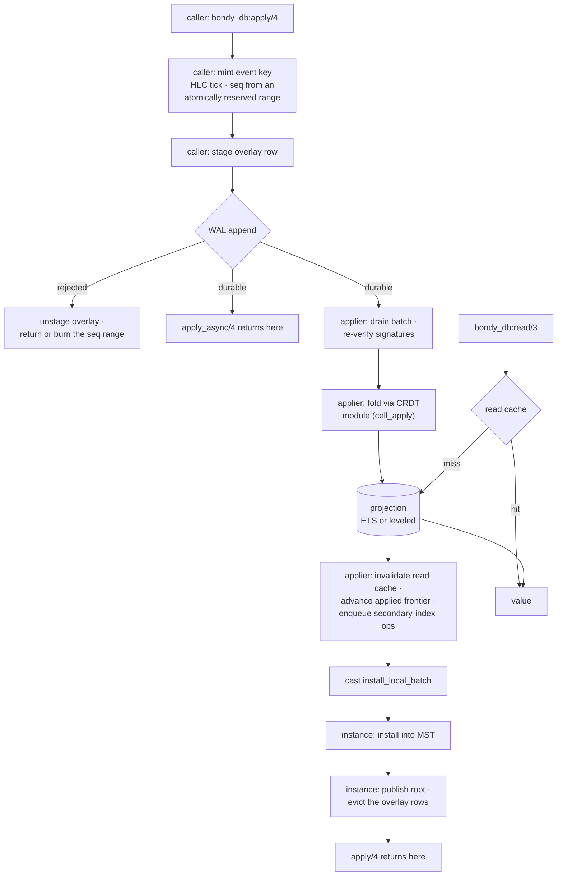

# Storage Runtime View: The Shard

One shard instance at runtime: the write path from `bondy_db:apply/4` to a
durable, readable, replicable event, and the read path back. Cross-node
behaviour is [replication](db_view_replication.md).

## Primary presentation

The write path is a chain, not a fan-out. Three processes run it — the
caller, the shard's applier, the shard's instance — and each stage begins
only when the one before it has committed.

The fold's input is the WAL batch and the cell's prior state; it reads that
prior state from the projection (or a write-through cache of it), never
from the MST. The MST install is strictly downstream of the fold and runs
in a different process. What overlaps is *batches*, not stages: while the
instance installs batch N, the applier is already reading, verifying and
folding batch N+1.

## The write path, step by step

1. **Mint.** The event key is created caller-side on the fast path: one
   hybrid-logical-clock tick (strictly monotone per instance, dominated by
   every timestamp ever received) and a sequence number from an atomically
   reserved contiguous range. The lock-free (stateless-validator) paths and
   the gen-server path mint identically — one tick per event, one atomic
   add per batch — and the event is signed in whichever process minted it.
   A `tier_2` table pays one extra round-trip before this step: the cell's
   current causal context is read from the instance and stamped into the
   event's metadata, so the read path can resolve concurrency later.
2. **Stage, then append.** The overlay row is staged *before* the WAL
   append, so the row exists the instant the log entry does. The applier
   reads the log the moment it commits; staging afterwards would let the
   install handler's eviction run before the row was there, leaving an
   orphan row that inflates the overlay size the drain barrier watches.
   If the WAL rejects the
   append, the overlay row is unstaged and the reserved sequence range is
   returned to the counter when still topmost; a range overtaken by a
   concurrent reservation cannot be returned, so it is counted
   (`bondy_oplog_seqs_burned_total`) and backfilled with signed no-op
   `seq_fill` events (`bondy_oplog_seqs_filled_total`) that occupy the
   seqs — replicating and advancing frontiers like any event, folding to
   nothing — so the gap never becomes sync-unfillable.
3. **Acknowledge.** Two acknowledgement points exist, and the facade
   exposes both. `apply_async/4` returns at durable append, before the
   fold: the caller pays for durability, not for interpretation.
   `apply/4` returns later — it blocks until the shard's overlay has
   drained, which is to say until the fold, the projection write and the
   MST install of its own event have all completed. That barrier is what
   makes a subsequent `read/3` observe the write, because the facade
   registers its tables with the read-path overlay merge *disabled*; the
   barrier, not an overlay lookup, is the read-your-write mechanism.
   `db.wal.fsync_mode` governs what "durable" costs.
   `per_write`, the default, fsyncs every append: each write is durable
   before it returns, at the price of binding the writer to the device's
   fsync rate. `batched` defers the fsync to a size or time boundary
   (`db.wal.batched_fsync_bytes`, `db.wal.batched_fsync_interval`) and
   exposes durability through an explicit wait rather than through the
   append returning — roughly two orders of magnitude more throughput, in
   exchange for a bounded durability window. All three are global: they
   affect every durable instance node-wide. The ephemeral `registry`
   database's in-memory WAL never fsyncs and ignores them.
4. **Drain and fold.** The applier consumes the log in order,
   re-verifies each event's stored signature, and folds the survivors
   through the table's CRDT module into the projection. The cell's prior
   state comes from an in-batch shadow, the applier's frame cache, or a
   projection read — in that order of precedence. The fold is the only
   interpreter of operations; every event source reaches it, so a locally
   minted event and the same event arriving from a peer produce identical
   state.
5. **Commit the projection.** Once the projection write returns, and only
   then, the applier invalidates the read cache for the touched cells,
   advances the applied frontier over the batch's `{origin, seq}` claims,
   and enqueues the secondary-index operations. Ordering the frontier
   after the durable write is what keeps it from ever leading the
   projection it is meant to certify.
6. **Install.** The applier casts the verified batch to the instance,
   which merges any casts queued behind it into one `put_batch` against
   the MST, publishes the new root — making the events visible to
   [replication](db_view_replication.md) — and then deletes the matching
   overlay rows. Publishing before evicting is deliberate — for a
   substrate consumer that does merge the overlay on read (see below), it
   closes the window in which an event is in neither place.

Peer-authored events reach the same fold from the opposite direction.
They are installed into the MST first, and the projection catches up by
diffing the tree against the last replayed root and folding the pairs the
diff yields — so on that path, and only on that path, the fold does read
the MST. [Replication](db_view_replication.md) covers it.

## The read path

`bondy_db:read/3` consults the per-shard value cache first and falls back
to the projection, decoding the stored cell and populating the cache. It
never touches the MST and never re-folds history. Folds and relational
queries run over the projection and its secondary indexes.

The substrate underneath can also merge an overlay of not-yet-drained
events into a read, interpreting them over the projection state. The
facade does not use it: it registers its tables with `overlay =>
disabled`, and gets read-your-writes from `apply/4`'s barrier instead.
Reads on the writing node therefore observe writes as soon as `apply/4`
returns; reads elsewhere observe them after replication.

**The secondary index is not part of the primary commit.** `cell_apply`
derives each index operation from the cell's old and new value, but
dispatches them only after the primary write is durable, and dispatches
them *asynchronously* to a shared index writer. That writer has a
bounded in-flight budget; a batch that would exceed it is dropped, the
index shard is marked for rebuild, and its freshness is reset so indexed
reads refuse to serve until the rebuild completes. The index is a
deterministic function of the primary, which is what makes discarding and
rebuilding it a legitimate response to saturation — but a query is
reading a projection that trails the values, not a co-committed one.

## Ordering and concurrency contract

Within one instance: the applier folds a batch's events in log order, and
concurrent writers interleave freely at mint time — the HLC gives every
event a total order consistent with causality for order-independent CRDTs.
Across instances there is no ordering at all: a batch is atomic only within
one shard, which is why the facade co-shards entities that must commit
together (the aggregate-root declaration).

Per-origin contiguity is treated differently on the two paths, and the
difference matters. Locally minted events are contiguous by construction —
one origin, one reserved range per batch, with a burned range backfilled by
`seq_fill` — so the local drain folds unconditionally and only *measures*
contiguity, reporting any gap it sees as telemetry. The prefix-closure
*enforcement* — hold an origin's events beyond a gap rather than fold them
— lives on the replication fold, where a page sync can genuinely present a
hole; see [replication](db_view_replication.md). The applied frontier is a
per-origin maximum over what was folded, so it reads as a contiguous
prefix exactly to the extent that the path feeding it holds.

## Variability guide

Configuration does not change the structure above; it changes what each
element costs and how much of it may run at once. Each plate marks the
options on the geometry they govern, with the values `bondy.conf` uses when
you set nothing.

### Durability of the append

`db.wal.fsync_mode` decides whether `append/2` returns before or after the
platter has the frame, which is the difference between the head position
and the durable position. `per_write` collapses the two. `batched` opens a
window bounded by whichever of `db.wal.batched_fsync_bytes` or
`db.wal.batched_fsync_interval` fires first, and callers that need a
specific position on disk wait for it through `await_durable/3`.
`db.wal.max_segment_bytes` sets where the head segment rotates — a soft
target, since rotation is checked between appends so no batch spans a
boundary.

### Sealing the pack

`db.pack_seal_mode` decides whether the seal runs on the apply path.
`async`, the default, keeps it off that path; `sync` puts one long datasync
in front of the pipeline. `db.pack_auto_seal_bytes` sets how much
accumulates first, and is deliberately low so a seal rewrites the pack in
short passes.

### Detecting a stalled drain

`db.drain.stall_alarm` is how long the applier may process frames without
committing past the highest position it has ever committed before it raises
`{bondy_oplog_drain_stalled, InstanceId}`. Progress is measured against
that high-water mark, so re-reading ground already committed does not count.
`0` disables the detector.

### Sizing the projection

Durable shards open every leveled Bookie in **`head_only` mode**
(`{head_only, with_lookup}`), and that one decision reshapes what the
twenty-two `db.leveled.*` options actually govern. In this mode the whole
cell — state and value — is stored as a ledger HEAD entry, written in
batches through `book_mput/2`. The same batch also goes to the journal, and
it goes there *whole*: the object specs carry the payload, serialised and
compressed, so the journal is a complete record of every version ever
written. Leveled's contract for that call is that those entries exist *only
for handling consistency on startup*. Nothing on the read path goes near
them: `book_get` becomes equivalent to `book_headonly`, so the fold's read
of the previous state is a ledger lookup with no journal seek.

The ledger path is therefore the whole of the live write path. It is
bounded by `db.leveled.cache_size` and its `db.leveled.cache_multiple`
ceiling, past which every PUT returns a pause — backpressure on the writer
rather than unbounded memory — then flushed through the penciller into the
LSM levels. The journal still rolls files on `db.leveled.max_journal_size`
or `db.leveled.max_journal_objects`. `db.leveled.sync_strategy` is `none`
on purpose: the write is already durable in the log before the fold reaches
leveled, and the projection rebuilds from it.

**Journal compaction does not run; a trim reclaims instead.** Leveled
accepts `compact_journal` only when `head_only` is `false`. Its head_only
counterpart is `trim`, which drops journal files older than the one holding
the penciller's persisted sequence number — precisely the history a clean
restart would no longer replay, so it cannot cost durability. Leveled never
schedules either on its own, so `db.journal_trim_interval` (hourly by
default) drives the trim from Bondy's side; without it the journal grows
with cumulative writes while the ledger holds only the live set. Reclaimed
disk returns a few seconds after each pass, because leveled defers the
unlink until no snapshot can still be reading the file.

Opening a store leaves waste of its own: the inker renames journal files
absent from its manifest, and the penciller renames SSTs it did not use to
rebuild the ledger, both to `.bak` — files leveled describes as removable
waste and leaves for an operator to collect. Bondy collects them itself,
on each Bookie start, which is the moment they appear.

Because compaction is the pass that never runs,
`db.leveled.singlefile_compaction_percentage`,
`db.leveled.maxrunlength_compaction_percentage`,
`db.leveled.max_run_length`, `db.leveled.journal_compaction_score_one_in`
and `db.leveled.waste_retention_period` have no effect.
`db.leveled.max_merge_below` is unaffected — it bounds a *ledger* merge, not
a journal one — as are the compression, snapshot and statistics options.
`db.leveled.compression_point` keeps only its `on_receipt` meaning;
`on_compact` would defer compression to a pass that never happens.

### Bounding an index rebuild

`db.primary_scan_limit` caps the primary-cell rescan behind an index
rebuild. A scan that fills the cap returns a potentially incomplete result
and logs a warning naming the key — the caller is not told. The correct
value follows from realm size and nothing else.

## Rationale

Splitting the acknowledgement in two is the central trade. Returning at the
log makes write latency the price of durability, not of interpretation, and
lets the fold batch; returning after the drain costs the caller the whole
in-flight backlog but leaves read-your-writes true without a read-side
merge. The facade defaults to the barrier and offers `apply_async/4` for
deltas whose consumers are eventually consistent by design.

Staging the overlay before the append is what makes both work: it
guarantees the row exists the instant the WAL entry does, so the drain's
eviction can never race ahead of it, and it gives the barrier something
exact to wait on. The cost is a rollback obligation on the failure path,
paid only when the WAL refuses.

Running the fold ahead of the MST install, rather than beside it, is a
correctness choice and not a performance one: the barrier is signalled by
the install handler, so a caller released by it must find the projection
already written. The pipeline recovers the lost overlap across batches.

One fold path exists because it was once two and they drifted; the
invariant it must uphold — identical interpretation of an event whatever
its source — is now stated in one place. See [rationale](db_rationale.md)
for which of these are machine-checked.
