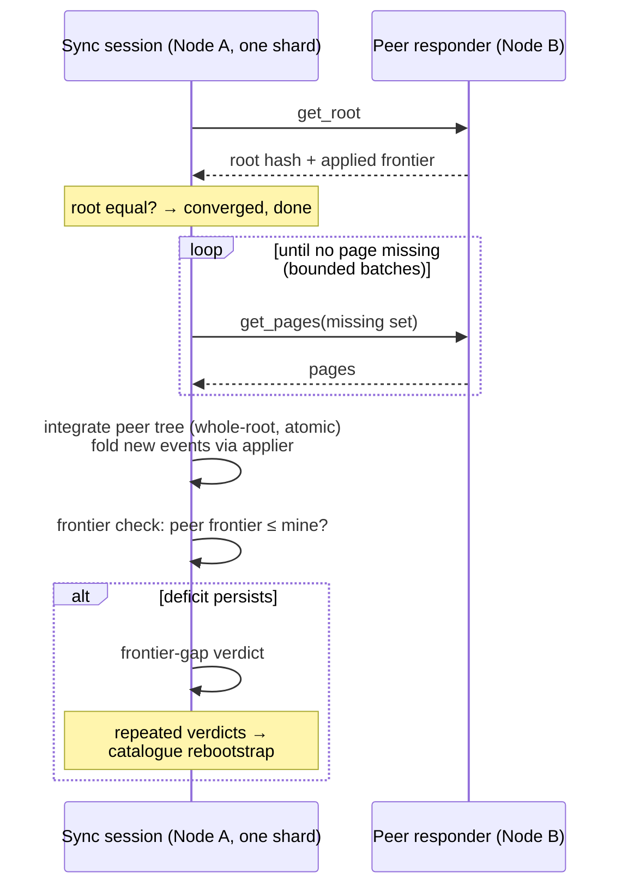
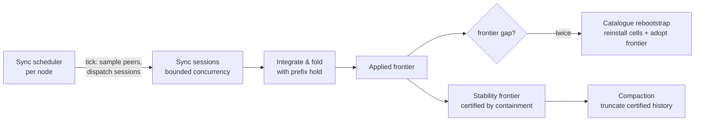

# Runtime View: Convergence and Repair

This view shows how shards on different nodes come to hold the same event
set — and what happens when they cannot. It answers "how does anti-entropy
work?", "how is divergence detected?", and "what repairs a node that fell
too far behind?". It is the cluster-wide continuation of [the state
plane](view_state_plane.md).

Bondy has no consensus round and no causal-broadcast middleware. Replication
is **pull-only anti-entropy**: each node periodically reconciles each shard
with sampled peers, and every mechanism below exists to make that simple
loop safe — including safe to garbage-collect under.

## Primary presentation

## Element catalog

| Element | Responsibility |
| --- | --- |
| Sync scheduler | Ticks every `db.aae.interval` (default 500 ms), samples `db.aae.fanout` peers from the membership, and dispatches per-shard sync sessions under a node-wide concurrency cap. Converged shards back off adaptively (`db.aae.live_sync`); shards backing the authentication fence never do. |
| Sync session | One shard, one peer, one round. Pulls the peer's root, then missing MST pages in bounded batches (memory is capped node-wide regardless of shard count), and integrates only when it holds the peer's *whole* tree — an incomplete round delivers nothing, by construction. |
| Integration & fold | Merges the peer's tree and folds the new events through the applier — the same fold local writes take. The fold enforces [per-origin prefix closure](../database/prefix_closure.md): an origin's events beyond a contiguity gap are held, re-presented until the gap fills or repair supplies them, and never counted by the frontier. |
| Applied frontier | Per shard, per origin: the highest *contiguously* folded sequence. Equal frontiers across nodes mean the same event set was applied — the convergence oracle the operator-visible metrics report. |
| Frontier-gap detection | After a complete round, a peer frontier still ahead of the local one (per origin, after a settle) is a verdict: the peer applied events this node can no longer obtain by page sync — they were compacted away everywhere. One verdict may be a transient; two schedule repair. |
| Catalogue rebootstrap | The repair: reinstall the peer's materialised cells and adopt its frontier, supplying in one act both the values and the bookkeeping that page sync can no longer deliver. The node's own events survive in its local log throughout. |
| Stability frontier & compaction | The garbage-collection license. A shard certifies, by containment proofs against every confirmed peer's tree, a point below which every replica holds every event; history below it may be truncated and tombstones reclaimed. The confirmation set is recency-filtered — a peer silent past `db.compaction.peer_timeout` stops holding compaction back, which is precisely why the frontier-gap/rebootstrap pair exists. |

## The failure that shapes this view

Truncation and lag can interleave: a node falls silent; its peers write,
confirm among themselves, and truncate; the peers keep writing. When the
silent node returns, the history between its position and the truncation
point exists nowhere as pages. Three mechanisms make this episode boring
instead of corrupting:

1. The **hold** keeps the returning node from folding the survivors'
   *later* events over the missing gap — no read ever sees a state that
   skips operations.
2. The **frontier**, unable to advance past the hold, keeps the deficit
   visible to the gap check on every round — detection is deterministic,
   not incidental.
3. The **rebootstrap** repairs from the peer's materialised cells — the
   values live on, even though the events that produced them do not.

The visible arc in the metrics: a burst of held events on the returning
node, frontier-gap verdicts, one scheduled rebootstrap per affected shard,
then quiet, with frontiers equal. This exact episode — two-minute node
outage under a 50,000-client load with compaction live — is part of the
validation record; see [rationale: robustness](architecture_rationale.md).

## Rationale

Pull-only reconciliation over Merkle trees was chosen over broadcast
because it makes the steady state cheap (a converged shard exchanges one
root hash), makes catch-up incremental (only missing pages move), and
leaves no delivery middleware whose failure modes need their own story.
The cost is that causal guarantees usually delegated to broadcast —
stability for garbage collection, per-origin ordering at the fold — must
be reconstructed from what anti-entropy can certify. The stability
frontier and the prefix hold are those reconstructions, and they are the
two properties of this view that are mechanically verified rather than
argued ([rationale](architecture_rationale.md)).

## Related views

- The shard being synchronised: [the state plane](view_state_plane.md).
- Timers, channels, and the metrics these elements emit: [deployment](view_deployment.md), and the cluster-sync dashboard.
- The reclamation license in depth: [deletion and reclamation](../database/deletion_and_reclamation.md).
