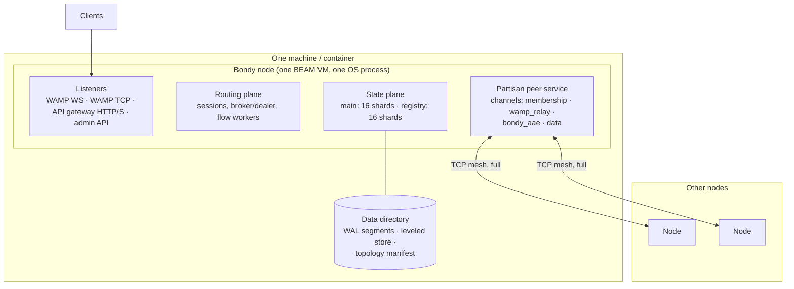

# Allocation View: Deployment

This view maps the runtime elements of the other views onto machines: the
OS process, its sockets, its disk, and the cluster mesh. It answers "what do
I run, what do I open, what do I back up, and what does the cluster look
like on the network?".

## Primary presentation

## Element catalog

| Element | Allocation facts |
| --- | --- |
| The node | One Erlang/OTP release, one OS process. Every node runs the same release with the same responsibilities — there are no roles to assign and no master to elect. Configuration is one file (`bondy.conf`), rendered at boot. |
| Listeners | Client-facing sockets: WAMP over WebSocket and over raw TCP (each with an optional TLS variant), the HTTP API gateway, and the admin API (health, metrics, cluster operations). Each listener's port, ACL, and TLS material is configuration. |
| Partisan mesh | Node-to-node connectivity: a full mesh of plain TCP connections managed by Partisan, *outside* Erlang distribution. Traffic is segregated by named channels with per-channel parallelism and compression, so no class can head-of-line-block another: `wamp_relay` carries the WAMP data plane (one connection per flow, pinned by partition key), `bondy_aae` carries anti-entropy sync, `partisan_membership` carries cluster control, and `data` carries the remainder. The first three and the default channel are tunable as `cluster.channels.{wamp_relay,control_plane,data,default}.*`; the anti-entropy channel is not operator-tunable. Peer discovery (static seeds, DNS) forms the mesh; membership changes propagate through it. |
| Data directory | Everything a durable node owns at rest: write-ahead log segments per `main` shard, the `leveled` store holding durable projections, and the keying-topology manifest that pins how keys map to shards. This directory is the unit of backup and the thing a re-keyed or re-provisioned node wipes. The `registry` database writes nothing here. |
| Metrics endpoint | Prometheus text format on the admin API. The convergence view's elements are directly observable: sync sessions, frontier-gap verdicts, rebootstraps, held events, compaction. |

## Placement and sizing

- **Shards × nodes**: every node hosts every shard of both databases; a
  shard's replicas are its instances on the other nodes. Adding a node
  adds capacity to the routing plane immediately and joins replication
  after its catalogue bootstrap.
- **Cluster size**: replication is full — each node holds the entire RIB
  and the entire `main` database — so the cluster scales for routing
  throughput and availability, not for data volume.
- **Resources**: the routing plane is CPU-bound (session establishment and
  message fan-out); the state plane's memory is bounded by explicit caps
  (anti-entropy page budgets are node-wide; overlay and working-set caps
  are per shard). File-descriptor limits deserve attention: durable
  storage and tens of thousands of client sockets both consume them.

## Failure allocation

What fails together, and what a failure costs:

| Failure | Blast radius | Recovery |
| --- | --- | --- |
| One connection/session process | That client | Client reconnects; RIB entries for the session are removed |
| One shard instance | One shard on one node, supervised restart | Durable: WAL replay reseeds state. Ephemeral: peers resupply via anti-entropy |
| One node | Its clients reconnect elsewhere; cluster routes on | On return: anti-entropy catch-up, or catalogue rebootstrap if history was compacted past it ([convergence](view_convergence.md)) |
| Network partition | Each side keeps routing locally; replication pauses across the cut | On heal: anti-entropy reconciles; authentication freshness is governed by the fence policy (`db.aae.fence.on_isolation`) |

## Rationale

Uniform nodes are the operational thesis: any node can be drained, killed,
replaced, or added without ceremony, because nothing unique lives on it —
durable state is everywhere, ephemeral state is regenerated, and identity
(the shard-keying manifest) is checked, not assumed, when peers meet.
Partisan instead of Erlang distribution keeps cluster traffic on
channels the operator can size and observe, and avoids the head-of-line
and mesh-scaling behaviour of the default distribution for this workload.

## Related views

- What the shards contain: [the state plane](view_state_plane.md).
- What the mesh carries: [the routing plane](view_routing_plane.md) (relay), [convergence](view_convergence.md) (sync).
- Every knob named here: the configuration reference.
