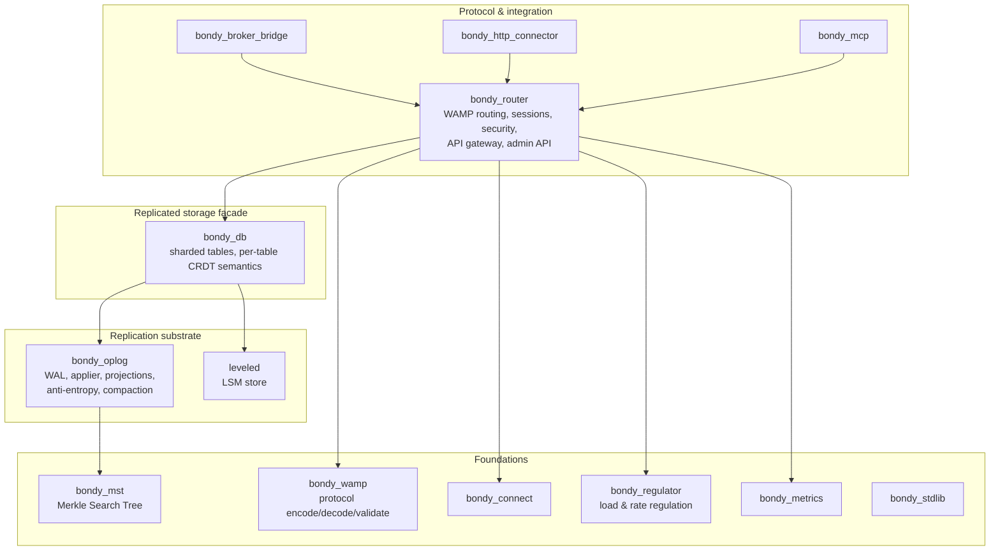

# Module View: Decomposition and Layering

This view shows Bondy's static structure: the OTP applications the system
decomposes into, and the *uses* relation between them. It answers "where does
a given responsibility live?" and "what is this application allowed to depend
on?". It says nothing about runtime — for that, see [the routing
plane](view_routing_plane.md) and [the state plane](view_state_plane.md).

## Primary presentation

An arrow means *uses*: the source may call the target's public interface.
The relation is acyclic by design, and the layering is strict — an
application uses only layers below it. `bondy_stdlib` and `bondy_metrics`
are usable from every layer and are drawn once for legibility.

## Element catalog

| Application | Responsibility |
| --- | --- |
| `bondy_router` | Everything protocol-facing: WAMP sessions, the broker and dealer roles, the Routing Information Base, security (realms, authentication, RBAC), the HTTP API gateway, the admin API, node-to-node relay. The largest application, and the only one that knows WAMP semantics. |
| `bondy_wamp` | The WAMP protocol as a library: message records, serialisation (JSON, MessagePack, BERT, CBOR), URI and option validation. No processes; pure functions over messages. |
| `bondy_db` | The storage facade the rest of the system writes and reads: named tables with per-table CRDT semantics over sharded, replicated instances. Owns table provisioning (the catalogue) and the two databases — durable `main`, ephemeral `registry`. |
| `bondy_oplog` | The replication substrate under every table: per-shard write-ahead log, the applier that folds operations into materialised projections, Merkle-tree indexing of history, anti-entropy synchronisation, compaction and reclamation. Knows nothing about what the operations mean. |
| `bondy_mst` | The Merkle Search Tree: a page-oriented, content-addressed ordered map whose root hash summarises its contents, enabling efficient set reconciliation between peers. |
| `leveled` | The LSM-tree store backing durable shards' projections at rest. Third-party, vendored. |
| `bondy_connect` | Client connection transport plumbing shared by listeners. |
| `bondy_regulator` | Admission control: system-load sampling (`bondy_regulator_load`) and token-bucket rate limiting, consulted at connection and session admission. |
| `bondy_metrics` | Metric primitives and a declaration registry; wait-free counters the hot paths can afford. |
| `bondy_stdlib` | Types and utilities shared by all layers (`optional/1`, keys, encoding helpers). |
| `bondy_broker_bridge`, `bondy_http_connector`, `bondy_mcp` | Integrations that consume the router's interfaces: bridging events to external brokers, invoking upstream HTTP services as callees, and the Model Context Protocol endpoint. |

## Interfaces between layers

Three seams carry almost all inter-layer traffic, and each is deliberately
narrow:

- **`bondy_router` → `bondy_db`**: named-table reads and writes
  (`read/3`, `apply/4`, `apply_batch/2`, folds). The router never sees
  shards, logs, or trees — it names a table, a realm, and a key.
- **`bondy_db` → `bondy_oplog`**: append operations to an instance's log;
  read the instance's projection. The CRDT modules that give operations
  meaning are supplied *by* this layer *to* the substrate as callbacks —
  the substrate stays semantics-free.
- **`bondy_oplog` → `bondy_mst`**: insert and look up history by key;
  diff two roots; serve and integrate pages. The tree neither knows it
  indexes an operation log nor that peers exist.

## Rationale

The layering exists so that each hard problem is solved exactly once, in a
place that cannot reach upward for help. The substrate cannot consult WAMP
semantics to decide convergence, so convergence holds for every table,
present and future. The router cannot reach around the facade to a shard,
so sharding strategy, replication, and repair can change without touching
routing code. The uses relation is enforced socially and by the dependency
graph: a cycle here is a defect.

Two consequences worth knowing when navigating the code: anything about
*what a message means* lives in `bondy_router` or `bondy_wamp`, never
below; anything about *how state converges* lives in `bondy_oplog` or
below, never above.

## Related views

- Runtime shape of `bondy_router`'s processes: [the routing plane](view_routing_plane.md).
- Runtime shape of `bondy_db`/`bondy_oplog`: [the state plane](view_state_plane.md).
