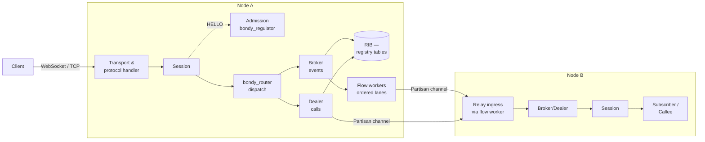
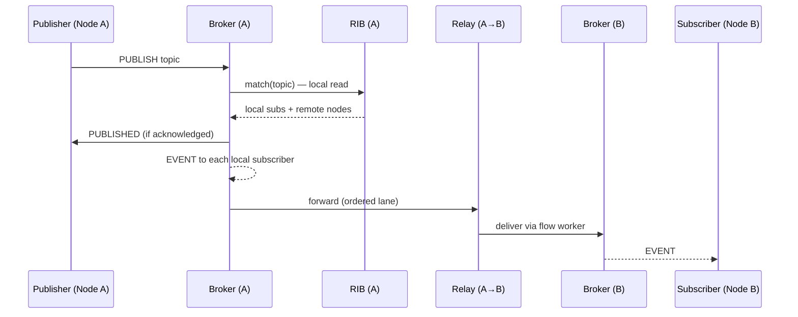

# Runtime View: The Routing Plane

This view shows the components and connectors that move a WAMP message from
a client to its recipients — the data plane. It answers "what happens when a
client publishes, subscribes, calls, or registers?", on one node and across
nodes. Storage internals are a single element here ("the RIB"); their own
structure is [the state plane](view_state_plane.md).

## Primary presentation

## Element catalog

| Element | Responsibility |
| --- | --- |
| Transport & protocol handler | One process per connection. Owns the socket, decodes frames via `bondy_wamp`, and writes replies. Idle connections hibernate; writes coalesce into single writev calls. |
| Session | The WAMP session state machine: establishment (HELLO/CHALLENGE/WELCOME), authentication against the realm's security tables, role negotiation, and teardown. Managed under `bondy_session_manager`. |
| Admission (`bondy_regulator`) | Consulted before session establishment commits resources. Under overload it refuses HELLO cheaply and explicitly (a busy ABORT the client can retry) rather than admitting work the node cannot finish — refusal is orders of magnitude cheaper than a half-served session. |
| `bondy_router` dispatch | Receives every in-session message and forwards it to the role that owns it. Ingress work runs through a regulated worker pool; the fallback executes inline in the calling process, so routing never silently drops under pool pressure. |
| Broker | The Publish/Subscribe role: matches a PUBLISH against subscriptions (exact, prefix, wildcard) in the RIB and emits an EVENT per local subscriber and one forward per remote node with matches. |
| Dealer | The routed-RPC role: matches a CALL against registrations in the RIB, applies the invocation policy (single, round-robin, ...), and threads CALL → INVOCATION → YIELD → RESULT, including progressive calls and progressive results. |
| RIB (registry tables) | The Routing Information Base: subscriptions and registrations as replicated tables in the `registry` database. Written on SUBSCRIBE/REGISTER, read on every PUBLISH/CALL. Each node holds the full RIB, so matching is always a local read — no network on the read path. See [Registry routing](../router/registry_routing.md). |
| Flow workers (`bondy_router_worker`) | A pool of ordered lanes. Work for the same origin/target pair lands on the same worker, preserving per-pair FIFO — WAMP's ordering guarantee — while unrelated pairs proceed in parallel. |
| Relay (`bondy_relay`) | Node-to-node WAMP forwarding over dedicated Partisan channels. Delivery on the receiving node resolves the destination flow worker directly (a registered-name lookup) — no intermediate singleton process to queue behind. |

## Connectors

- **Client ↔ node**: WebSocket or raw TCP, any negotiated WAMP serialiser.
- **Within a node**: process messages; ingress through the flow pool's
  ordered lanes, replies written directly by the owning transport process.
- **Between nodes**: Partisan channels — TCP connections outside Erlang's
  built-in distribution, with a dedicated channel and configurable
  parallelism for relay traffic (`cluster.channels.*`), so bulk data never
  queues behind cluster control messages.

## A publish, end to end

The publisher's acknowledgement never waits for remote delivery; ordering
between any publisher-subscriber pair is preserved by the lane discipline,
not by global serialisation.

## Rationale

Three decisions shape this plane. *Full RIB on every node* buys a local,
lock-free read on the hottest path (every call and publish) at the price of
replicating registrations and subscriptions — a price the state plane is
built to pay. *Ordered lanes instead of a serialising singleton* preserves
exactly the order WAMP promises (per pair) and nothing more, so throughput
scales with unrelated traffic. *Refusal at admission* keeps overload
behaviour honest: the node sheds sessions it cannot serve at the cheapest
possible point, protecting sessions already admitted — see [rationale:
robustness](architecture_rationale.md).

## Related views

- Where the RIB's tables live and how they replicate: [the state plane](view_state_plane.md), [convergence and repair](view_convergence.md).
- Sockets, channels, and their configuration: [deployment](view_deployment.md).
