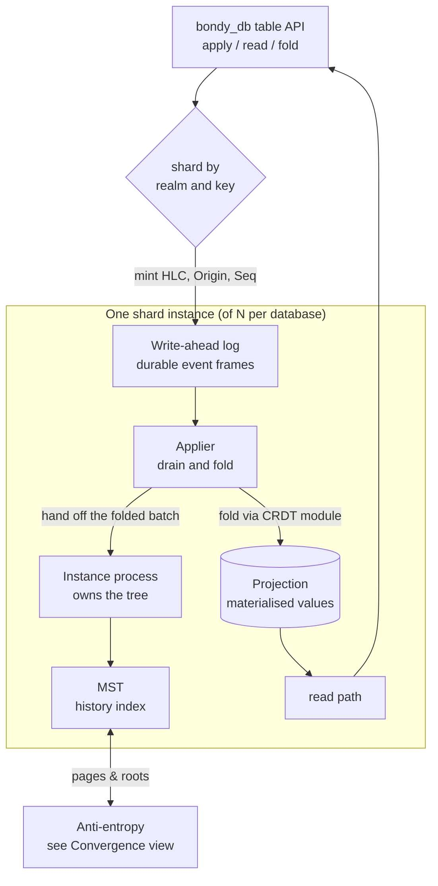

# Runtime View: The State Plane

This view shows how one node stores and serves replicated state: the path a
write takes from a table operation to a durable, readable value, and the
anatomy of a shard. It answers "what happens on `bondy_db:apply/4`?" and
"what am I looking at on disk and in memory?". Cross-node behaviour is [the
next view](view_convergence.md).

## Primary presentation

## Element catalog

| Element | Responsibility |
| --- | --- |
| Table API (`bondy_db`) | Names a table, realm, and key; resolves the shard; issues the operation the table's CRDT declares. Batches are atomic per shard. |
| Shard instance (`bondy_oplog_instance`) | The unit of replication and the owner process. Mints and signs event keys `{HLC, Origin, Seq}` — hybrid logical clock, this shard's replica identity, a contiguous sequence number — or lets an eligible caller mint them in its own process; owns the MST and installs drained batches into it. A database is a fixed set of shards (default 16), each replicating independently with its peers. |
| Write-ahead log | A byte log positioned by a cursor. Appends already-minted events as all-or-nothing frames and knows nothing of the tree. Durable shards fsync by policy; the ephemeral `registry` database's in-memory log never fsyncs. |
| Applier | A process of its own. Drains the log, re-verifies each event's signature, and *folds* it into the projection through the table's CRDT module — the one place operation semantics execute — then hands the batch to the instance to install. Remote events arriving via anti-entropy reach the same fold from the other side, so local and replicated writes cannot disagree about meaning. |
| Projection | The materialised current value per cell, the thing reads return. Ephemeral shards keep it in ETS; durable shards persist it in `leveled`. Reads never touch the MST or the log's history. |
| MST | The shard's history, indexed as a Merkle Search Tree ordered by event key. Its root hash summarises the shard's entire operation set; equality of roots is equality of history. Serves pages to syncing peers and integrates theirs. |
| CRDT modules | Per-table semantics: last-writer-wins and monotone registers, counters, add-wins sets and maps, flags, structs. Each declares how concurrent operations resolve and what metadata its cells carry; the substrate stays semantics-free. |

## The two databases

| | `main` | `registry` |
| --- | --- | --- |
| Contents | Security (realms, users, groups, grants), API gateway specs, tickets and tokens | Registrations and subscriptions — the RIB |
| Projection | Durable (`leveled`), survives restart | Ephemeral (ETS), rebuilt from peers on restart |
| Write profile | Low rate, correctness-critical | High rate, session-lifetime churn |
| Sharding | `db.main.shard_count`, placement by `db.main.partition_strategy` | `db.registry.shard_count` |

The split is deliberate: session-lifetime state has no business on disk
(a restarted node's old registrations are dead by definition — it re-learns
live ones from its peers), while security state has no business being lost.

## Write and read contracts

The facade offers two acknowledgement points. `apply/4` returns once the
shard has folded the write into its projection and installed it in the
tree, which is what makes a subsequent `read/3` observe it; `apply_async/4`
returns as soon as the log accepts the write — durably, on durable shards —
leaving the fold to happen behind the caller. If the log rejects a write,
its staged effects roll back completely, including returning the reserved
sequence range so the shard's sequence stays gap-free.

A reader on the writing node therefore observes the write when `apply/4`
returns; a reader on another node observes it after replication — Bondy is
eventually consistent across nodes, by design, with the freshness-sensitive
exception (authentication) fenced explicitly (see
[rationale](architecture_rationale.md)).

The applier maintains, per shard, an **applied frontier**: for each origin,
the highest sequence folded, advanced once the projection write is durable
so it can never claim more than the projection holds. It reads as a
contiguous prefix because of what feeds it — locally minted sequences are
contiguous by construction, and the replication fold holds a remote origin's
events behind any gap rather than folding past it ([per-origin prefix
closure](../database/prefix_closure.md)). The frontier is the shard's
truthful summary of what it has applied; the convergence view builds on it.

## Rationale

One log, one fold path, one projection per shard keeps the invariants small
enough to state: every replica folds the same events through the same CRDT
module, so replicas that hold the same event set hold the same values —
convergence reduces to *event-set* agreement, which is exactly what the
[convergence view](view_convergence.md) provides. Materialising a
projection, rather than folding on read, puts the fold's cost at write time
where it amortises, and makes the read path a lookup — which the routing
plane's per-message RIB reads demand.

## Related views

- How shards on different nodes reach the same event set: [convergence and repair](view_convergence.md).
- What the log, projection, and tree occupy on a machine: [deployment](view_deployment.md).
- How history is eventually discarded: [deletion and reclamation](../database/deletion_and_reclamation.md).
