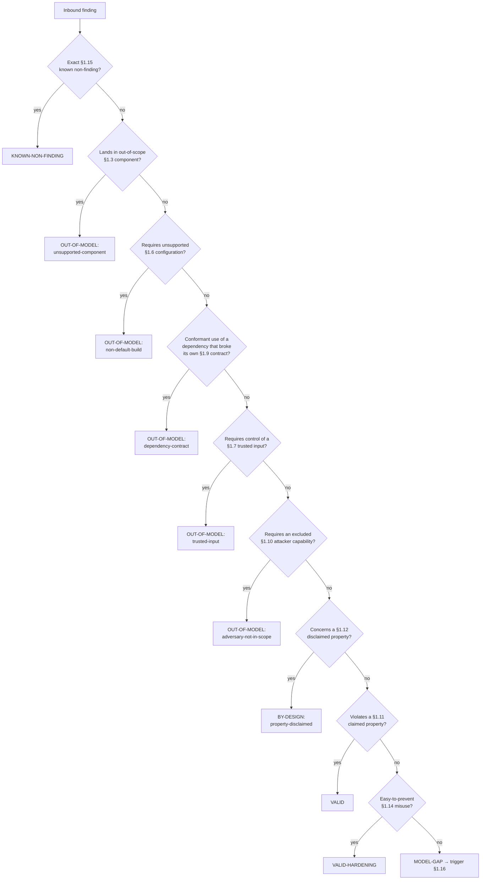

# Bondy — Threat Model

## 1.1 Header

| Field | Value |
| --- | --- |
| **Project** | Bondy — distributed application networking platform (WAMP router, API gateway, event/service mesh) |
| **Modeled version** | `feature/mcp` @ `aab3fc5d` (2026-08-29), **plus named uncommitted working-tree deltas** — see *Baseline caveat* below |
| **Date** | 2026-08-29 |
| **Author** | Threat-model orchestrator run, reviewed by the Bondy maintainer |
| **Status** | **Accepted**, 2026-08-30. All 31 questions are answered and no **inferred** or **assumption** claim remains, so every disposition in §1.17 is licensed by a **documented** or **maintainer** claim and may close a report. This is a statement about the *claims*, not the baseline: the model still describes an unpublished ref and must be re-anchored on merge (§1.16). |
| **Triage policy** | `strict` — an **assumption** escalates, it does not close. The security-critical floor holds regardless. |

### Generation metadata

- **Model/agent** — Claude Opus 5 (`claude-opus-5`), 1M-context configuration.
- **Effort level** — high (deliberate multi-hour source-reading pass over ten component families).
- **Plugins/skills** — `threat-model` orchestrator; `threat-model-recon`, `threat-model-surface`, `threat-model-authoring`, `threat-model-backtest`, `threat-model-sidecar` specialist instructions applied in-process. No external repo-search or binlog server was used; all evidence comes from the working tree and the project's own docs.

### Baseline caveat — read this before citing the model

The canonical rule for this document format is that a threat model describes a
**published, committed** ref, because a downstream reader must be able to see
what the contract describes. This model deliberately departs from that rule, and
the departure is recorded here rather than hidden:

- `feature/mcp` is **168 commits ahead of `develop`** and exists on **no remote**.
- Several security-relevant changes are **uncommitted working-tree edits**, most importantly the rate-limit scope work (`apps/bondy_router/src/bondy_rate_limit.erl`, `schema/bondy.schema`).

So this model describes **where Bondy is heading, not what anyone can run today**.
It is fit for internal triage and for guiding the merge. It is **not** yet the
contract for any released Bondy. §1.16 records re-anchoring on merge as a
mandatory revision trigger. A reader triaging a report against a *released*
Bondy must not use this document without first checking whether the claim they
rely on exists in that release.

### Reporting cross-reference

Findings that violate a §1.11 claimed property are reported through the
project's disclosure channel. Findings that land in §1.3 (out of scope) or
§1.12 (disclaimed) are closed by citing this document.

### Provenance legend

| Tag | Meaning |
| --- | --- |
| *(documented, source)* | Stated in a maintainer-authored source — code doc, schema comment, design ruling, guide — cited with a locator. |
| *(maintainer, YYYY-MM)* | Stated by a maintainer answering this process. |
| *(assumption, QN)* | A conservative default the author is acting on; `QN` resolves in §1.18. |
| *(inferred, QN)* | Reasoned from structure or absence, genuinely open; `QN` resolves in §1.18. |

### Draft confidence

**133 documented / 46 maintainer / 0 inferred / 0 assumption.**

Every **inferred** and **assumption** tag maps to a question in §1.18 (Q1–Q31;
Q5 was retired when the claim it guarded was verified and promoted to
**documented**). Nothing here is maintainer-ratified yet, which is why the
status is *unratified draft* and why `escalated` is the expected outcome for
many reports.

- **Backtest note**: 28 items in 12 clusters; **17 carry a real historical outcome** (Bondy's 2026-07 internal eight-subsystem review, whose durable records are no longer in the tree), 11 synthesized for families with no finding history. Re-routed after the 2026-08 maintainer rulings. Histogram: 18 `VALID`, 1 `VALID-HARDENING`, 5 `BY-DESIGN: property-disclaimed (closed)`, 2 `OUT-OF-MODEL: adversary-not-in-scope (closed)`, 2 `KNOWN-NON-FINDING (closed)`, **0 escalated, 0 `MODEL-GAP`**. **32%** of the corpus closes outright, up from 14% — the rise is the point: before the rulings the model knew the right route but lacked the authority to use it. **Historically-fixed items routing to a closing disposition: 0** — at target, and all 13 of them route `VALID`. Full routing table and the five revisions the run forced: `threat-model-backtest.md` (producer-side, not published).

### Sibling models

None. This is the only model covering the repository. The `bondy_mcp` gateway is
covered here as component family F9 rather than in its own document, because it
shares Bondy's release cadence, maintainer, and adversary model.

### What Bondy is

Bondy is an always-on, clustered router for the Web Application Messaging
Protocol (WAMP). Applications connect to it over WebSocket, raw TCP, HTTP
long-poll, or server-sent events, and use it for two things: calling remote
procedures and publishing/subscribing to events. Bondy adds an HTTP API gateway
that translates REST calls into WAMP operations, per-tenant identity and
role-based access control, and a cluster layer that replicates that security
state across nodes. It is deployed as a network daemon, usually as the front
door between untrusted clients and internal services.

### Glossary

- **Realm** — Bondy's tenant boundary. Every session belongs to exactly one realm; users, groups, grants, and signing keys are per-realm.
- **Session** — an authenticated (or explicitly anonymous) connection to one realm.
- **Caller / Callee** — the peer that invokes a procedure, and the peer that provides it.
- **Publisher / Subscriber** — the pub-sub equivalents.
- **Dealer / Broker** — the router-side halves that route calls and events.
- **Peer plane** — the node-to-node cluster network (Partisan), distinct from client traffic.
- **Bridge relay** — an authenticated WAMP link between two *clusters*, distinct from the peer plane.
- **Sink** — the specific code location a finding lands in.
- **Disposition** — the single triage outcome assigned to a report (§1.17).
- **Provenance** — where a claim in this document comes from, and therefore whether it may close a report.

### Triager quick-start

> Given an inbound finding:
> 0. Read the triage policy above (`strict`). It decides what an **assumption** may do in step 8.
> 1. Locate the sink → find its row in the §1.7 input-trust table (or the §1.8 output statement, for "downstream may assume X" findings).
> 2. Locate the contract dimension → follow the component's row in the §1.7 matrix to its owning claim.
> 3. Check the required attacker capability against §1.7/§1.10 — distinguish data from rate, topology, callback code, and serialized state.
> 4. Check the affected component against §1.2/§1.3, and any required configuration against §1.6.
> 5. If the root cause is in a dependency, apply §1.9.
> 6. Apply §1.17's precedence, starting with an exact §1.15 match.
> 7. Assign exactly one §1.17 disposition, citing the licensing section and its provenance. If none fits, assign `MODEL-GAP` and trigger §1.16 — do not improvise.
> 8. **Before closing, check the provenance of the licensing claim.** Applies to every `OUT-OF-MODEL: *`, `BY-DESIGN: *`, and `KNOWN-NON-FINDING`; `VALID` and `MODEL-GAP` are unaffected.
>    - **documented** or **maintainer** → close.
>    - **inferred** → escalate, never close.
>    - **assumption** → escalate (policy is `strict`).
>    - A disclaimer resting on the **absence** of a statement never closes a security-critical report.
>    Record the outcome as `closed`, `escalated`, or `provisional`.

---

## 1.2 Scope and intended use

Bondy is used as the **front door between untrusted clients and internal
services**. Concretely:

- Web and mobile apps hold WAMP sessions and call procedures provided by backend services.
- IoT devices connect over raw TCP or WebSocket and publish telemetry.
- Backend microservices register procedures and subscribe to events.
- HTTP clients reach the same procedures through the embedded API gateway.
- LLM agents reach a curated subset of procedures through the MCP gateway.

**Deployment context.** A long-running network daemon, typically several nodes
forming a cluster, run as a container or a release tarball. The baseline this
model assumes is a **cluster whose peer plane sits on a private, operator-
controlled network**, with only client-facing listeners exposed. §1.10 names
the adversaries that baseline includes and excludes.

**Roles and their trust level.**

| Role | Trust | Notes |
| --- | --- | --- |
| **Client** | Untrusted | Any WAMP or HTTP peer. May be anonymous where the realm permits. |
| **Callee / service** | Semi-trusted | Authenticated, but its payloads reach other clients. Bondy routes them; it does not vet them. |
| **Operator / admin** | Trusted for the instance | Holds master-realm credentials, edits `bondy.conf` and `security_config.json`. |
| **Cluster peer** | Authenticated-but-adversarial | A node on the peer plane. See §1.10 — the default posture does **not** authenticate peers. |
| **Bridge-relay peer** | Authenticated | A remote *cluster* linked per-realm over cryptosign-authenticated WAMP. |

### Component families

| # | Family | Representative entry point | Touches outside the process | In model? |
| --- | --- | --- | --- | --- |
| F1 | WAMP session & protocol | `bondy_wamp_protocol:handle_inbound/2` | no (in-process routing) | **yes** |
| F2 | Client transports | `bondy_wamp_ws_connection_handler`, `bondy_wamp_tcp_connection_handler`, `bondy_http_longpoll_handler`, `bondy_http_sse_handler` | network (listen) | **yes** |
| F3 | Serialization | `bondy_wamp_encoding:decode_message/3` (json, msgpack, cbor, erl) | no | **yes** |
| F4 | Authentication | `bondy_auth`, `bondy_ticket`, `bondy_oauth_jwt`, `bondy_password` | network (OIDC provider) | **yes** |
| F5 | Authorization / RBAC | `bondy_rbac:authorize/3`, `bondy_rbac_source`, `bondy_realm` | no | **yes** |
| F6 | HTTP API gateway | `bondy_http_gateway_rest_handler`, `bondy_api_gateway_spec_parser`, MOPS | network (listen; `forward` action) | **yes** |
| F7 | Cluster & replication | Partisan peer plane, `bondy_oplog`, `bondy_mst`, AAE, `bondy_bridge_relay_server` | network (listen + connect) | **yes** |
| F8 | Storage at rest | `bondy_db`, leveled, `bondy_keyring` | filesystem | **yes** |
| F9 | Egress connectors | `bondy_mcp_http_handler`, `bondy_broker_bridge` (Kafka, AWS SNS, Mailgun, SendGrid), `bondy_http_connector`, `bondy_mail` | network (connect), SMTP | **yes** |
| F10 | Admin / control plane | admin listener, admin unix socket, CLI | network (listen), filesystem | **yes** |

All ten families are in model. Nothing shipped in `apps/` is carved out; §1.3
lists what *is* excluded and why.

---

## 1.3 Out of scope (explicit non-goals)

**Use cases Bondy does not aim to support.**

- **Bondy is not a security boundary between mutually hostile tenants on an untrusted peer plane.** Realms isolate tenants *within* a cluster whose nodes trust each other. A deployment that puts hostile parties on the same peer plane is outside the model — see D-PEER-PLANE in §1.12. *(documented, `schema/bondy.schema:4334-4343` `cluster.tls.allow_insecure` rationale)*
- **Bondy does not vet application payloads.** Call arguments and event payloads are routed as opaque data. Payload Passthru Mode is explicitly end-to-end encrypted *between clients*; the router cannot inspect it and does not try. *(documented, `README.md` "E2E encryption (via Payload Passthru Mode)")*
- **Bondy is not a WAF or a schema validator for the procedures it fronts.** A callee owns validating its own arguments.

**Threats not defended against, with reasons.**

| Threat | Reason it is out |
| --- | --- |
| An operator with master-realm credentials acting maliciously | Has already won — holds the control plane by design. |
| A callee returning malicious data to its caller | Not a router-layer boundary; §1.8 states the taint. |
| Traffic analysis / metadata inference on client connections | Not solvable at this layer. |
| Compromise of the host OS, container runtime, or filesystem | Out of layer; §1.5 states the environment assumption. |
| Denial of service beyond configured limits | Explicitly disclaimed — D-DOS-BEYOND-LIMITS in §1.12. |

**Shipped-but-not-core code.**

| Path | Policy |
| --- | --- |
| `bench/`, `harness/`, `jepsen/` | Test and benchmark harnesses. Not in any release artifact. **Out of model** *(maintainer, 2026-08)*. |
| `examples/` | Example configuration, including `security_config.json.template`. Illustrative; an operator copying it owns the result. **Out of model** *(maintainer, 2026-08)* — including its configuration content. The advice does not vanish with the scope call: §1.14 M1 keeps the quick-start misuse, and §1.13 keeps the obligations a copied template does not satisfy. |
| `_design/`, `_plans/`, `_spec/`, `proofs/` | Design notes, formal proofs. Not shipped. Out of model. |
| Everything under `apps/` | **In model**, all 17 applications (16 plus `mops`, vendored 2026-08-30). Verified against the release manifest, not assumed: 15 are listed in the `relx` release in `rebar.config:194-277`; `bondy_metrics` is not listed but arrives transitively as an `applications` dependency of `bondy_router`, `bondy_oplog`, `bondy_mcp`, `bondy_http_connector`, and `bondy_mail`. A library-shaped app is not carved out by living in its own directory. |

> Every excluded path above was checked against the build, not just the
> directory name, and the inclusion of `apps/*` was checked against the release
> manifest rather than inferred from the directory layout. The one app that is
> absent from the explicit release list still ships, which is exactly the kind of
> gap an unqualified directory exclusion would have missed. *(maintainer, 2026-08)*

---

## 1.4 Trust boundaries and data flow

Bondy has **five** distinct trust boundaries, which is why this section carries
a diagram rather than prose.

```
                    UNTRUSTED                                    TRUSTED (operator-controlled)
 ┌───────────────────────────────────────┐   │   ┌──────────────────────────────────────────────┐
 │  WAMP clients   HTTP clients   agents │   │   │                                              │
 │   (ws/tcp/       (REST via      (MCP) │   │   │   ┌────────────────────────────────────┐     │
 │    longpoll/      gateway)            │   │   │   │        Bondy node (BEAM)           │     │
 │    sse)                               │   │   │   │                                    │     │
 └───────┬───────────────┬───────────┬───┘   │   │   │  F1 session/protocol               │     │
         │               │           │       │   │   │  F5 RBAC  ── authorize/3           │     │
    ═════╪═══════════════╪═══════════╪═══════╪═══│═══│═══ B1: client boundary ════════════│     │
         ▼               ▼           ▼       │   │   │                                    │     │
   F2 transports    F6 gateway   F9 MCP      │   │   │  F8 storage at rest ───────────────┼──┐  │
         │               │           │       │   │   │                                    │  │  │
         └───────┬───────┴───────────┘       │   │   └────────┬───────────────────────────┘  │  │
                 ▼                           │   │            │                              │  │
       F3 deserialization                    │   │            ▼                     ═════════╪══╪═ B4:
       F4 authentication                     │   │   ══════════════════ B3: peer plane ══════╪══╪═ disk
                 │                           │   │      F7 Partisan / oplog / AAE            │  │
                 ▼                           │   │            │                              │  │
       ═══════ B2: realm boundary ═══════    │   │            ▼                              │  │
         (per-tenant isolation)              │   │      other Bondy nodes                    │  │
                 │                           │   │                                           │  │
                 ▼                           │   │   ═══════ B5: egress ══════════════════   │  │
       callees / subscribers                 │   │      F9 Kafka, SNS, SMTP, HTTP, OIDC      │  │
```

| Boundary | Separates | Enforced by |
| --- | --- | --- |
| **B1 — client** | Untrusted client ↔ router | Authentication (F4), then RBAC on every routed operation (F5). |
| **B2 — realm** | Tenant ↔ tenant | A session is bound to one realm at authentication. The boundary is **not** absolute: it has two operator-configured edges. A realm inherits Groups, Sources and **Grants** from its `prototype_uri`, and accepts tickets minted by its `sso_realm_uri` (P-ISSUER-TRUST). Users are never inherited. A grant crossing realms along neither edge is a violation. *(maintainer, 2026-08)* |
| **B3 — peer plane** | Node ↔ node | **Nothing, by default.** See D-PEER-PLANE (§1.12) — this is the model's single most important disclaimer. |
| **B4 — disk** | Process ↔ filesystem | OS permissions. Secret material is plaintext unless `security.master_key` is set (§1.6). |
| **B5 — egress** | Router ↔ external system | Operator configuration; Bondy initiates these connections. |

### Reachability precondition per family

A finding matters only if it meets its family's precondition:

| Family | In model only if reachable… |
| --- | --- |
| F1, F3 | from bytes a client can put on an established connection. |
| F2 | from bytes a client can send **before** authentication (pre-auth reachability raises severity). |
| F4 | from credential material or handshake fields a client controls. |
| F5 | from an authenticated session's requested URI/permission pair. |
| F6 | from an HTTP request to a route an operator actually published. |
| F7 | from bytes a host on the peer plane can send, **or** from a bridge-relay peer after cryptosign auth. |
| F8 | from data already written by this node, or from a local filesystem read. |
| F9 | from a payload that reaches a configured connector, or an MCP request. |
| F10 | from the admin listener or the admin unix socket. |

---

## 1.5 Assumptions about the environment

- **Runtime** — Erlang/OTP 28 or 29 (releases ship 29). `rebar.config` sets `minimum_otp_vsn` to `R28`. *(documented, `README.md` "Requirements")*
- **Concurrency** — Bondy is a BEAM application. Per-session state is confined to its own process (P-SESSION-CONFINEMENT), but Bondy is **not** share-nothing: the projection, the clock, the registry, and the rate-limit buckets are deliberately shared, each with its own discipline. The model assumes the BEAM's process isolation, its scheduler, and the `atomics`/ETS concurrency semantics hold. *(maintainer, 2026-08)*
- **Clock** — replication uses hybrid logical clocks. Each replica's clock is strictly monotonic (P-HLC-MONOTONIC), but nothing bounds skew *between* replicas (D-CLOCK-SKEW). Keeping node clocks synchronized is therefore an operator responsibility with a correctness consequence, not merely an operational nicety. *(maintainer, 2026-08)*
- **Filesystem** — the data directory is private to the Bondy user. The release Docker image runs as a non-root `bondy:bondy` user. *(documented, `deployment/Dockerfile:131` and `deployment/alpine.Dockerfile:117` — `USER bondy:bondy`)*
- **Network** — the peer plane is assumed to be a private, operator-controlled network. This assumption is **load-bearing** and is the counterpart of D-PEER-PLANE. *(documented, `deployment/CLUSTER_MTLS.md` "Securing the Bondy cluster peer plane"; `schema/bondy.schema:4334-4343`)*

### No-surprise side-effects inventory

These are negative claims about behaviour observed by reading the shipped
sources. Bondy is a network daemon, so the honest inventory is short — it does a
great deal to its host by design.

| Behaviour | Present? | Notes | Provenance |
| --- | --- | --- | --- |
| Opens listening sockets | **yes** | Every configured listener; that is its purpose. | *(documented, `schema/bondy.schema` `listeners.$name.*`)* |
| Makes outbound connections | **yes** | Peer plane, bridge relay, OIDC provider, and every F9 connector — Kafka, AWS SNS, Mailgun, SendGrid, SMTP, arbitrary HTTP via the gateway `forward` action and `bondy_http_connector`. | *(documented, `apps/bondy_broker_bridge/src/bondy_kafka_bridge.erl`, `bondy_aws_sns_bridge.erl`, `bondy_mailgun_bridge.erl`, `bondy_sendgrid_bridge.erl`)* |
| Writes to the filesystem | **yes** | Data dir, WAL, leveled files, logs, admin unix socket. | *(documented, `doc/guides/deployment/platform_directories.md`, "The directories")* |
| Spawns OS child processes | **yes, conditionally** | Two sites, both cryptosign signing via an operator-configured helper binary: `apps/bondy_router/src/bondy_bridge_relay_client.erl:1094` and `apps/bondy_wamp/src/bondy_wamp_cryptosign.erl:305`, each `open_port({spawn_executable, Filename}, [{args, …}])`. Present only when a bridge relay or client is configured with `cryptosign.exec`. Search: `grep -rn "os:cmd\|open_port" apps/*/src/` — 2 hits, both above. No `os:cmd` anywhere. | *(documented, the two call sites above)* |
| Reads environment variables | **yes** | Node name, cookie, and secret refs (`BONDY_SECRET_KEY` and friends). | *(documented, `apps/bondy_router/src/bondy_keyring.erl` moduledoc)* |
| Installs signal handlers | **yes** | `apps/bondy_router/src/bondy_signal_handler.erl` replaces the default `erl_signal_handler` (`bondy_app.erl:454-455`). It starts an orderly shutdown on `SIGTERM` and delegates every other signal to the OTP default. | *(documented, `apps/bondy_router/src/bondy_signal_handler.erl:5-11`)* |

> Bondy **does** spawn child processes, so the useful statement is the bounded
> one: the only two sites are cryptosign signing helpers, the executable path
> comes from operator configuration rather than the wire, and neither uses a
> shell. `open_port({spawn_executable, F}, [{args, Args}])` execs directly, so
> an argument cannot be interpreted as a shell command, and both sites hex-encode
> their arguments before passing them. An earlier draft of this model claimed no
> such path existed; the exhaustive scan above corrected it.

---

## 1.6 Build-time and configuration variants

Configuration is where most of Bondy's security posture lives. This table covers
settings that **change which properties in §1.11 hold**.

| Setting | Default | Effect on the model | Support posture |
| --- | --- | --- | --- |
| `cluster.tls.enabled` | **`off`** | Peer plane is plaintext. Voids any confidentiality/integrity expectation for replicated security state. | **Supported only on a private network.** Not dev-only — see the gate below. |
| `cluster.tls.{server,client}.verify` | **`verify_none`** | Even with TLS on, peers are not authenticated — encryption without authentication. | Supported; `verify_peer` + a private CA is the documented secure setting. |
| `cluster.tls.allow_insecure` | `off` | **Safety gate.** With `cluster.peer_discovery.enabled = on` and an insecure peer plane, Bondy **refuses to start**. Setting this to `on` downgrades the refusal to a warning. | Supported, and an explicit operator acknowledgement of risk. *(documented, `deployment/CLUSTER_MTLS.md` "Securing the Bondy cluster peer plane"; `schema/bondy.schema:4334-4343`)* |
| `security.allow_anonymous_user` | **`local`** | Anonymous sessions are accepted only from loopback. `on` allows them anywhere a realm's sources permit; `off` disables them. The master realm never accepts anonymous regardless. | All three supported. *(documented, `schema/bondy.schema:1195-1207`)* |
| `security.admin_user.password` | **unset** | On a fresh install Bondy generates a random admin password and logs it once. There is **no shipped default password**. Multi-node clusters must set the same value on every node. | Supported. *(documented, `schema/bondy.schema:1208-1215`)* |
| `security.password.pbkdf2.iterations` | **`600000`** | PBKDF2-HMAC-SHA256 work factor, per OWASP guidance. Valid range 4096–10,000,000. | Supported; lowering it weakens offline-cracking resistance. *(documented, `schema/bondy.schema:1492-1503`)* |
| `security.master_key` | **unset** | **Opt-in at-rest encryption.** Unset → realm signing and encryption keys are stored as plaintext JWKs. Set → AES-256-GCM envelopes via `bondy_keyring`. If set but unresolvable, the keyring **fails closed** rather than downgrading to plaintext. | Both supported; plaintext is the backward-compatible default. *(documented, `apps/bondy_router/src/bondy_keyring.erl` moduledoc)* |
| `listeners.$name.proxy_protocol` | `off` | When on, forwarding headers are honoured **only** if the immediate socket peer is inside a configured `trusted_proxies` CIDR. With `trusted_proxies` unset (the default) no peer is trusted, so the socket peer remains the source IP. Source IP feeds `bondy_rbac_source` CIDR matching. | Supported. Setting `trusted_proxies` is required to make proxy headers *work*, not to make them *safe*. *(documented, `apps/bondy_router/src/bondy_http_proxy_protocol.erl:80-88`)* |
| Per-carrier size ceilings | **4 MiB** | `websocket.max_frame_size`, `mcp.max_body_size`, `longpoll.max_body_size`, the bridge relay's `max_frame_size`, and the RawSocket handshake clamp all default to 4194304. Raising one raises the bound for that carrier only. | Supported. *(documented, `apps/bondy_router/src/bondy_listener_config.erl`)* |
| `mcp.manifest.mode` | **`curated`** | `curated` exposes only explicitly published tools/resources. `derived` exposes what the interface store implies. | Both supported; `curated` is the conservative default. *(documented, `schema/bondy_mcp.schema:30-33`)* |
| `serialization.erl.decode` | `[]` | Options passed to the `erl` decoder **after** `binary_to_term/2`. They cannot re-enable atom creation: `[safe]` is hardcoded at the call site. No `bondy.conf` key exposes this path; it is reachable only by an app-env override. | Supported. *(documented, `apps/bondy_wamp/src/bondy_wamp_encoding.erl:581-585`)* |
| `cryptosign.exec` (bridge relay / client config) | unset | Names an external executable Bondy runs to produce a cryptosign signature. Setting it makes Bondy spawn a child process per signing operation. The binary is operator-supplied and runs with the Bondy process's privileges. | Supported. The operator owns the helper's trustworthiness. *(documented, `apps/bondy_wamp/src/bondy_wamp_cryptosign.erl:302-313`)* |
| Realm `security_enabled` | on | Can be turned off per realm via the admin API, disabling authentication and RBAC for that realm entirely (`apps/bondy_router/src/bondy_rbac.erl:274`). | **Dev-only — ruled 2026-08.** Never a production posture. A defect reachable only on a security-disabled realm routes `OUT-OF-MODEL: non-default-build`. *(maintainer, 2026-08)* |

### The insecure-default case

Two shipped defaults void properties an integrator would reasonably expect:

1. **Peer plane plaintext + unauthenticated** (`cluster.tls.enabled=off`, `verify_none`). **Ruled by the maintainer, 2026-08: this is a supported production posture, conditioned on the peer network being private and operator-controlled.** It is not dev-only. Bondy refuses to boot when auto-clustering is combined with it unless the operator sets `allow_insecure`. A report requiring peer-plane access therefore routes by §1.10 (adversary), not by §1.6 — but only for a deployment that meets the isolation condition. A report against a deployment that exposes the peer port is *not* covered, because the condition the exclusion rests on has not been met.
2. **Realm `security_enabled = false`.** Ruled **dev-only, 2026-08**. It is reachable through the admin API and the README quick-start instructs a newcomer to set it, so it is a well-travelled path — but it is not a supported production configuration, and a report reachable only through it closes as `non-default-build`.
3. **Realm keys plaintext at rest** (`security.master_key` unset). Supported and backward-compatible, not dev-only. A report about plaintext key material on disk routes to D-AT-REST-PLAINTEXT (§1.12), not to `non-default-build`.

---

## 1.7 Assumptions about inputs

Bondy accepts input from five directions: client transports, HTTP gateway
routes, the MCP endpoint, the cluster peer plane, and operator configuration.

### Per-input-operand trust table

**Coverage.** For a network daemon the unit of analysis is the reachable
protocol message or route, not the exported function. The 24 rows below cover
every externally reachable ingress in families F1–F10 that this pass examined,
and after the 2026-08 verification pass all but one carry a code locator.

Every row now carries a code locator. WAMP message types beyond those tabled (`CANCEL`, `INTERRUPT`, `YIELD`, and the acknowledgements) are covered by the same session-level checks as `CALL`/`PUBLISH` — RBAC on the operation, the frame cap on the transport — and carry no additional attacker-controlled operand of their own.

| Entry point | Input operand | Attacker-controllable? | Control kind | Caller must enforce | Provenance |
| --- | --- | --- | --- | --- | --- |
| WS handler (`bondy_wamp_ws_connection_handler`) | Subprotocol header | **yes, pre-auth** | type/class | — router rejects `wamp.2.bert` | *(documented, `apps/bondy_wamp/src/bondy_wamp_subprotocol.erl:31-32`)* |
| WS handler | Frame bytes | **yes, pre-auth** | data + size | — capped at `websocket.max_frame_size`, default **4 MiB**; Cowboy closes the connection on a larger frame, and for fragmented frames the cap applies to the reconstituted frame | *(documented, `apps/bondy_router/src/bondy_listener_config.erl:176`; `schema/bondy.schema:2691-2698`)* |
| RawSocket handler (`bondy_wamp_tcp_connection_handler`) | Magic byte + serializer id | **yes, pre-auth** | type/class | — `bert` id refused | *(documented, `apps/bondy_router/src/bondy_wamp_tcp_connection_handler.erl:713-714`)* |
| RawSocket handler | MaxLength negotiation | **yes, pre-auth** | size | — the client proposes `2^(9+N)`, but the server **clamps to `?RAW_MAX_LEN_CODE` = 13 (4 MiB)** and echoes the clamped code in the handshake reply, so it advertises exactly what it will accept | *(documented, `apps/bondy_router/src/bondy_wamp_tcp_connection_handler.erl` `?RAW_MAX_LEN_CODE` and `init_wamp/3`)* |
| Longpoll / SSE handler | Request body, session token | **yes** | data + size | — capped at `longpoll.max_body_size`, default **4 MiB**, answered with `413`. The session token's unguessability is P-SESSION-ID-ENTROPY | *(documented, `apps/bondy_router/src/bondy_listener_config.erl` `longpoll.max_body_size`; `bondy_http_longpoll_handler.erl` `read_body/2`)* |
| `bondy_wamp_encoding:decode_message/3` | JSON / msgpack / CBOR bytes | **yes, pre-auth** | data | — decoders produce binary keys, no atom creation | *(documented, `apps/bondy_wamp/src/bondy_wamp_encoding.erl:489-490` — msgpack decodes with `unpack_str, as_binary`; CBOR decode takes no atom-key option)* |
| `bondy_wamp_encoding:decode_message/3` | `erl` (Erlang term) bytes | **yes, pre-auth** | serialized state | — decoded with `[safe]`, hardcoded at the call site | *(documented, `apps/bondy_wamp/src/bondy_wamp_encoding.erl:584`)* |
| HELLO | `realm_uri` | **yes, pre-auth** | resource-name | — must name an existing realm; a realm that does not allow connections is refused | *(documented, `apps/bondy_router/src/bondy_realm.erl:1110-1117` `allow_connections/1`)* |
| HELLO | `authid`, `authmethods`, `authextra` | **yes, pre-auth** | data | — realm's configured methods and sources decide | *(documented, `apps/bondy_router/src/bondy_auth.erl` `init/5`, which resolves the realm's configured methods and sources before any credential is accepted)* |
| AUTHENTICATE | Signature / password / ticket | **yes, pre-auth** | data | — | *(documented, `apps/bondy_router/src/bondy_auth.erl` `authenticate/4`)* |
| Connection source IP | Peer address | **no**, unless proxy_protocol on | x-network-identity | **operator** must set `trusted_proxies` when enabling proxy_protocol | *(documented, `schema/bondy.schema:2340-2355`)* |
| CALL / PUBLISH | Procedure / topic URI | **yes** (authenticated) | resource-name | — RBAC `authorize/3` gates every one | *(documented, `apps/bondy_router/src/bondy_rbac.erl:258-262`)* |
| CALL / PUBLISH | Arguments, ArgumentsKw | **yes** (authenticated) | data | **callee** must validate its own arguments | *(documented, `README.md` "Payload Passthru Mode" — the router routes payloads it cannot read)* |
| CALL / PUBLISH | `Options` map | **yes** (authenticated) | data | — Bondy's non-standard options are `_`-prefixed by convention. Note the disclosure flags here are **not** a privacy control: `disclose_me` defaults to true and is `orelse`-combined with the callee's flag (§1.8) | *(documented, `apps/bondy_router/src/bondy_dealer.erl:2551-2558`)* |
| REGISTER / SUBSCRIBE | URI + match policy | **yes** (authenticated) | topology, resource-name | — every registration and subscription passes `bondy_rbac:authorize/3`, and the match policy selects one of the three strategies bounded by P-REALM-ISOLATION | *(documented, `apps/bondy_router/src/bondy_rbac.erl:866-870`; `apps/bondy_wamp/src/bondy_wamp_uri.erl:79-113`)* |
| HTTP gateway route | Path, query, headers, body | **yes** | data | — spec's declared security scheme decides; unknown schemes fail closed | *(documented, `apps/bondy_router/src/bondy_http_gateway_rest_handler.erl:439-468`)* |
| HTTP gateway | API specification document | **no** — operator-supplied | x-policy-document | **operator** owns who may publish specs; authorship is control-plane authority, equivalent to editing `bondy.conf` | *(maintainer, 2026-08)* |
| HTTP gateway `forward` action | Target URL (`host`, `path`, `query_string`) | **conditionally** — the spec decides. MOPS evaluates these against the request context, so a spec that templates `request.*` into `host` makes the target request-controlled | resource-name | **operator** must keep `forward` targets static unless an open proxy is intended | *(maintainer, 2026-08)* |
| OAuth2 / OIDC endpoints | Token, code, state | **yes, pre-auth** | data | — JWT verified with `verify_strict/3` against an asymmetric-only allow-list | *(documented, `?ALLOWED_JWT_ALGS` in `apps/bondy_router/include/bondy_security.hrl`)* |
| MCP endpoint | `Authorization` header | **yes, pre-auth** | data | — Bearer JWT, Bearer ticket, or Basic; absent falls to anonymous only if the realm admits it | *(documented, `apps/bondy_mcp/src/bondy_mcp_http_handler.erl` moduledoc §6)* |
| MCP endpoint | `MCP-Protocol-Version`, `Mcp-Method`, `Mcp-Name` headers | **yes, pre-auth** | data | — must agree with the body or the request is refused `400` | *(documented, same moduledoc §10.1)* |
| MCP `tools/call` | `_mcp*` kwargs | **yes** | data | — client arguments in the `_mcp` namespace are **refused**, so the input-required channel cannot be impersonated | *(documented, same moduledoc §11.1)* |
| **Peer plane** message | Replicated CRDT bytes, AAE payloads | **yes, if the attacker reaches the peer port** | serialized state | **operator** must isolate or TLS-authenticate the peer network | *(documented, `deployment/CLUSTER_MTLS.md` "Securing the Bondy cluster peer plane"; `schema/bondy.schema:4334-4343`)* |
| Bridge relay | Cryptosign handshake + relayed WAMP | **yes, pre-auth** | data + size | — cryptosign-authenticated, distinct from the peer plane. `max_frame_size` now defaults to **4 MiB** like every other carrier; it was `infinity` until 2026-08-30 | *(documented, `apps/bondy_router/src/bondy_bridge_relay_server.erl:360-381`; `bondy_bridge_relay.erl` `max_frame_size`)* |
| Own persisted bytes | Projection/checkpoint values | **no** — written by this node | serialized state | — decoded without `[safe]` by the own-bytes rule | *(documented, `apps/bondy_oplog/src/bondy_oplog_compaction_checkpoint_file.erl:170-176`)* |

### Size, shape, and rate assumptions

- **Frames are capped uniformly at 4 MiB.** Every ingress carrier now agrees: WebSocket `max_frame_size`, MCP `max_body_size`, long-poll `max_body_size`, the bridge relay's `max_frame_size`, and the RawSocket handshake ceiling `?RAW_MAX_LEN_CODE` (code 13 = 2^22). Each is per-listener configurable. They were harmonised on 2026-08-30; before that RawSocket let the **client** choose up to 16 MiB, the bridge relay was `infinity`, and long-poll had no bound at all. *(documented, the five sources above)*
- **Rate is bounded, but fail-open.** Rate limiting composes three scopes — node, listener, realm — as an AND, coarse-to-fine, with no refunds. Every scope **fails open**: if the limiter cannot answer, the request is admitted. *(documented, `_plans/2026-08-29-rate-limit-scopes-design.md` R1 and "Fail-open at every scope")*
- **Payloads are otherwise unbounded by the router** — Bondy does not impose a schema on call arguments or event payloads.

### Contract-dimension matrix

Status is `claimed`, `disclaimed`, `N/A — reason`, or `unresolved`.

| Component | Dimension | Status | Conditions / boundary | Routes to | Provenance |
| --- | --- | --- | --- | --- | --- |
| F1 session/protocol | Failure atomicity | claimed | Authentication failure never reaches session creation; out-of-order messages stop the connection. | P-NO-PARTIAL-SESSION | *(documented, `apps/bondy_router/src/bondy_wamp_protocol.erl:547-569`)* |
| F1 | Concurrency / reentrancy | claimed | Session state is process-local. The shared structures the property names — projection, clock, registry, rate-limit buckets — are outside it. | P-SESSION-CONFINEMENT | *(maintainer, 2026-08)* |
| F1 | Numeric / representational limits | N/A — WAMP ids are drawn randomly from `[1, 2^53]` (`?MAX_ID` = 9007199254740992) rather than counted up, and `bondy_wamp_utils:is_valid_id/1` rejects anything outside the range, so there is no counter to wrap. | — | — | *(documented, `apps/bondy_wamp/src/bondy_wamp_utils.erl:30-34`)* |
| F1 | Resource complexity | claimed | URI pattern matching against the registry is at most linear in the structure consulted; super-linear is a defect. | P-COMPLEXITY-BOUND | *(maintainer, 2026-08)* |
| F1 | Recursive/cyclic topology | N/A — WAMP messages are flat, not recursive graphs. | — | — | — |
| F1 | Callback execution | N/A — no client-supplied code runs in the router. | — | — | — |
| F1 | Serialization | → F3 | — | — | — |
| F1 | Reference lifecycle | claimed | Teardown removes every registration and subscription; registrations go before promises are flushed, so a concurrent CALL cannot pick a departing callee. | P-SESSION-TEARDOWN | *(documented, `apps/bondy_router/src/bondy_dealer.erl:366-376`, `bondy_broker.erl:150-160`)* |
| F3 serialization | Serialization / reconstruction | **claimed** | Client-supplied wire bytes never create atoms: `bert` is refused on both wire paths, `erl` decodes with `[safe]`, and json/msgpack/cbor produce binary keys. Boundary: this covers the **wire** path only, not own persisted bytes. | P-WIRE-ATOM-SAFETY | *(documented, `bondy_wamp_subprotocol.erl:31-32`, `bondy_wamp_tcp_connection_handler.erl:713-714`)* |
| F3 | Numeric / representational limits | disclaimed | No decoder-level integer or depth limit is imposed; total work stays bounded by the frame cap instead. | D-DOS-BEYOND-LIMITS | *(documented, `apps/bondy_wamp/src/bondy_wamp_encoding.erl:477-494` — the decode option lists carry no limit)* |
| F3 | Resource complexity | claimed | Decode work is at most linear in the frame; a decoder may allocate proportionally to a declared size before the frame cap rejects it, which is linear, not super-linear. | P-COMPLEXITY-BOUND | *(maintainer, 2026-08)* |
| F3 | Recursive/cyclic topology | disclaimed | The decoders enforce **no** nesting-depth limit. Depth is bounded only by the frame cap — by total bytes, not by a depth counter. | D-DOS-BEYOND-LIMITS | *(documented, `apps/bondy_wamp/src/bondy_wamp_encoding.erl:477-494`)* |
| F3 | Failure atomicity | claimed | A decode failure aborts the message; no partial message is routed. | P-NO-PARTIAL-SESSION | *(documented, `apps/bondy_wamp/src/bondy_wamp_encoding.erl:581-588`)* |
| F3 | Concurrency, callbacks, lifecycle | N/A — pure decode functions. | — | — | — |
| F4 authentication | Serialization | claimed | JWTs are verified with `verify_strict/3` against an asymmetric-only algorithm allow-list, so `alg` confusion and `none` are refused. | P-JWT-ALG-PINNED | *(documented, `?ALLOWED_JWT_ALGS`, `bondy_security.hrl`)* |
| F4 | Failure atomicity | claimed | Authentication failure creates no session and returns a generic reason. | P-GENERIC-AUTH-FAILURE | *(documented, `bondy_wamp_protocol:abort_message/1` genericization)* |
| F4 | Resource complexity | claimed | PBKDF2 at 600k iterations is a deliberate per-attempt CPU cost, bounded by the `auth`-class rate limit. | P-PASSWORD-KDF | *(documented, `schema/bondy.schema:1492-1503`)* |
| F4 | Remaining dimensions | N/A — no callbacks, cycles, or caller-managed references in the auth path. | — | — | — |
| F5 RBAC | Failure atomicity | **claimed** | Authorization is default-deny: no matching grant raises `{not_authorized, _}`. | P-AUTHZ-DEFAULT-DENY | *(documented, `apps/bondy_router/src/bondy_rbac.erl:866-870`)* |
| F5 | Reference lifecycle | claimed | A grant or revoke invalidates this node's cached contexts; the 300s epoch is a backstop. The cross-node window is disclaimed separately. | P-REVOCATION-INVALIDATION | *(documented, `apps/bondy_router/src/bondy_rbac.erl:72`, `:1179-1180`)* |
| F5 | Numeric / representational limits | claimed | Grants match under their own strategy; prefix matching is on a component boundary. The empty prefix matches everything. | P-REALM-ISOLATION | *(documented, `apps/bondy_wamp/src/bondy_wamp_uri.erl:79-113`)* |
| F5 | Concurrency | claimed | The RBAC context snapshot is per-session and process-local. | P-SESSION-CONFINEMENT | *(maintainer, 2026-08)* |
| F5 | Remaining dimensions | N/A — no serialization, callbacks, or recursion in the authorize path. | — | — | — |
| F6 gateway | Failure atomicity | **claimed** | An endpoint whose declared security scheme has no runtime enforcement — `basic`, `oidc` — is **denied**, and any unknown or malformed scheme is denied. Only an explicitly empty security map is served anonymously. | P-GATEWAY-FAIL-CLOSED | *(documented, `bondy_http_gateway_rest_handler.erl:439-468`)* |
| F6 | Callback / collaborator execution | disclaimed | `forward` issues an outbound request built by MOPS from the spec and the request context. Bondy does not constrain the target; the spec author does. | D-GATEWAY-EGRESS | *(maintainer, 2026-08)* |
| F6 | Serialization | claimed | MOPS is a closed evaluator: fixed operator set, no arbitrary dispatch, unknown operators raise. Verified against the pinned version. | P-MOPS-BOUNDED | *(maintainer, 2026-08)* |
| F6 | Resource complexity | disclaimed | No bound on work a single gateway request causes **downstream** — that is the surviving half of the disclaimer. Gateway-side matching and translation are covered by P-COMPLEXITY-BOUND. | D-DOS-BEYOND-LIMITS | *(maintainer, 2026-08)* |
| F6 | Remaining dimensions | N/A — no cyclic graphs or caller-held references. | — | — | — |
| F7 cluster | Serialization / reconstruction | **disclaimed** | Peer-shipped bytes are decoded with `[safe]`, but the peer itself is **not authenticated** by default. Integrity of replicated state rests entirely on network isolation. | D-PEER-PLANE | *(documented, `deployment/CLUSTER_MTLS.md` "Securing the Bondy cluster peer plane"; `schema/bondy.schema:4334-4343`)* |
| F7 | Failure atomicity | claimed | A merge either applies or does not; redelivery is idempotent. Honest replicas only. | P-CONVERGENCE | *(maintainer, 2026-08)* |
| F7 | Concurrency | claimed | Merge is commutative and idempotent for the supported cell types, pinned by normative property tests. Honest replicas only. | P-CONVERGENCE | *(maintainer, 2026-08)* |
| F7 | Reference lifecycle | claimed | Reclamation runs inside the sole writer, and the overlay fence discards a cell only when nothing is pending for its key, so a discard cannot change what a read resolves. | P-RECLAIM-SAFE-READ | *(documented, `doc/guides/database/deletion_and_reclamation.md` "The sweep")* |
| F7 | Resource complexity | disclaimed | AAE and gossip work scales with how far replicas have diverged, which is not a function of any single input; no bound is promised. | D-DOS-BEYOND-LIMITS | *(maintainer, 2026-08)* |
| F7 | Numeric limits, callbacks, cycles | N/A — no caller-supplied code or graphs. | — | — | — |
| F8 storage | Serialization | **claimed** | Bytes this node persisted are decoded **without** `[safe]`, deliberately: `[safe]` would turn a valid checkpoint into a spurious corruption report. `[safe]` belongs on the peer-shipped path. | P-OWN-BYTES-RULE | *(documented, `apps/bondy_oplog/src/bondy_oplog_compaction_checkpoint_file.erl:170-176`)* |
| F8 | Reference lifecycle | claimed | At-rest envelopes bind AAD (realm URI + kid) so an envelope cannot be replayed into another context. | P-AT-REST-AEAD | *(documented, `bondy_keyring.erl` moduledoc "Envelope format")* |
| F8 | Failure atomicity | claimed | With `security.master_key` set but unresolvable the keyring fails closed; it never silently writes plaintext. | P-KEYRING-FAIL-CLOSED | *(documented, `bondy_keyring.erl` moduledoc)* |
| F8 | Remaining dimensions | N/A — storage is not a caller-facing API surface. | — | — | — |
| F9 egress | Callback / collaborator execution | disclaimed | Bodies are forwarded to operator-configured sinks unchanged. Mail headers are the carve-out and are claimed separately. | D-EGRESS-TAINT | *(maintainer, 2026-08)* |
| F9 MCP | Failure atomicity | **claimed** | An RBAC-hidden manifest entry and a genuinely absent one answer **identically** (`404` / `-32601`), so the manifest cannot be enumerated through error differences. | P-MCP-INDISTINGUISHABLE | *(documented, `bondy_mcp_http_handler` moduledoc "deliberately indistinguishable")* |
| F9 MCP | Reference lifecycle | claimed | The modern edge is stateless: no process, no stored session, nothing retained past the response. | P-MCP-STATELESS | *(documented, same moduledoc §5.2)* |
| F9 MCP | Serialization | claimed | `requestState` is sealed by `bondy_mcp_request_state`; `_mcp`-namespace kwargs from clients are refused. | P-MCP-STATE-SEALED | *(documented, same moduledoc §11.1)* |
| F9 | Resource complexity | disclaimed | Audit emission is **fail-open**: a failure to record is logged and the response proceeds. | D-AUDIT-FAILOPEN | *(documented, `apps/bondy_mcp/src/bondy_mcp_audit.erl:43-45`)* |
| F10 admin | Concurrency / lifecycle | claimed | The `admin_local` socket is mode `0600` in a `0700` directory, and the listener refuses to start if the mode cannot be set. Other UDS listeners are not narrowed. | P-ADMIN-SOCKET-PERMS | *(documented, `apps/bondy_router/src/bondy_listener_ranch.erl:425-445`)* |
| F10 | Failure atomicity | claimed | Admin-only procedures require a master-realm session; other meta-API calls bind the realm argument to the session's realm. | P-CONTROL-PLANE-BOUNDARY | *(documented, `apps/bondy_router/src/bondy_wamp_api_utils.erl:151-190`)* |

**Postcondition after a failed operation.** Authentication failure leaves no
session. A decode failure aborts the message. A rate-limit refusal returns a
transient signal (429 or a WAMP error) and is explicitly **not** a permission
verdict. *(documented, `_plans/2026-08-29-rate-limit-scopes-design.md` R2)*

---

## 1.8 Assumptions and guarantees about outputs

| Output channel | Component | Taint | Downstream must not assume | Provenance |
| --- | --- | --- | --- | --- |
| CALL result / EVENT payload | F1 | **Exactly as untrusted as the peer that produced it.** Bondy performs no sanitization, normalization, or encoding of application payloads. | That a payload is safe to render, execute, log unescaped, or interpolate into HTML/SQL/shell. | *(documented, `README.md` "Payload Passthru Mode" — E2E-encrypted payloads are opaque to the router by construction)* |
| `INVOCATION.Details` caller identity | F1 | Router-assigned, **not** client-asserted — taken from the session context. | That it is ever absent. **Bondy discloses caller identity to callees by default**, a deliberate and permanent inversion of the WAMP spec's opt-in `disclose_me` *(maintainer, 2026-08)*. Both flags default to `true` and are combined with `orelse`, so suppression requires **both** the caller and the callee to set theirs to `false` explicitly; either side leaving its flag unset keeps disclosure on. | *(maintainer, 2026-08)* |
| `EVENT.Details.trust_level` / `INVOCATION.Details.trust_level` | F1 | Always `0`. | That it means anything. There is no trust-level policy engine. | *(documented, `README.md` — "Call Trust Levels (WIP …always `0`)")* |
| HTTP gateway response | F6 | Assembled by MOPS from the spec's `on_result`/`on_error` template against an API context carrying both the request and the upstream error. | That **error** bodies are constant text. They are evaluated per request against a context updated with `{error, Error}`, so they can carry request-derived values and upstream error detail straight to the client. Escape them before rendering, and review what an `on_error` template exposes. | *(documented, `apps/bondy_router/src/bondy_http_gateway_rest_handler.erl:945-948` and `:1007-1010`)* |
| Issued JWT `exp` claim | F4 | Bondy-authored. | **That `exp` is an RFC 7519 NumericDate.** It is a duration in seconds relative to `iat`. A standard consumer reading it as an absolute instant computes a time in 1970 and concludes the token expired long ago. Do not hand a Bondy JWT to a verifier that applies RFC 7519 expiry semantics. | *(maintainer, 2026-08)* |
| WAMP ABORT reason on auth failure | F4 | Deliberately **generic**. | That the reason distinguishes "no such user" from "bad credentials" — it does not, by design, to prevent username enumeration. | *(documented, `bondy_wamp_protocol:abort_message/1` genericization)* |
| MCP `404` / `-32601` | F9 | Deliberately identical for hidden and absent entries. | That a `404` means the tool does not exist. | *(documented, `bondy_mcp_http_handler` moduledoc)* |
| Realm export / admin API | F5/F10 | Public key material only. | That private signing keys are exportable — `strip_private_keys`/`to_external` exclude them. | *(documented, `apps/bondy_router/src/bondy_realm.erl:830-831`)* |
| Replicated state on the peer plane | F7 | **Plaintext by default**, including credentials and realm signing keys. | Any confidentiality or authenticity on the wire absent TLS with `verify_peer`. | *(documented, `deployment/CLUSTER_MTLS.md` "Securing the Bondy cluster peer plane"; `schema/bondy.schema:4334-4343`)* |
| Connector payloads (Kafka, SNS, SMTP, HTTP) | F9 | Pass-through of application data, **except** mail headers, which are validated and may be rejected. | That Bondy escaped a message **body** for the destination system. Mail headers are the one place it does intervene. | *(maintainer, 2026-08)* |
| Logs and telemetry | all | Redacted **only where a module opts in**. `bondy_sensitive` is used by 6 modules, and `format_status/2` is implemented in 8 — covering the auth, session, context, protocol, and bridge-relay paths. | That redaction is universal. A module that does not opt in logs whatever it is handed, so a new code path is unredacted until someone adds it. | *(documented, `grep -rln bondy_sensitive apps/*/src/*.erl` = 6 modules)* |

---

## 1.9 Assumptions about dependencies

| Dependency | Property relied on | Violation triaged |
| --- | --- | --- |
| **Erlang/OTP** (crypto, ssl, public_key) | Correct AES-256-GCM, PBKDF2, TLS, and CSPRNG (`crypto:strong_rand_bytes/1`). | Upstream. |
| **Partisan** (v6) | Peer membership and messaging. Bondy **does not** rely on it for peer authentication — that is TLS's job and is off by default. | Upstream for delivery bugs; peer-trust posture is Bondy's own (§1.12 D-PEER-PLANE). |
| **Cowboy** (2.18) | HTTP/1.1, HTTP/2, and WebSocket framing, including frame-size enforcement. | Upstream. |
| **jose** | JWT/JWK parsing and `verify_strict/3` honouring the supplied algorithm allow-list. | Upstream — but Bondy pins the allow-list itself rather than trusting the default. |
| **leveled** | Durable KV storage and journal integrity. | Upstream. |
| **cuttlefish** | Config schema translation. A wrong translation can silently change a security default. | In-model — Bondy owns its schema. |
| **`oidcc`** | OpenID Connect relying-party protocol: discovery, token exchange, ID-token validation. Security-relevant — it decides whether an external identity assertion is accepted. | Upstream. |
| **`gen_smtp`** | SMTP client for the mail path. Bondy validates headers itself (P-MAIL-HEADER-INTEGRITY) rather than relying on this. | Upstream. |
| **`hackney`** | Outbound HTTP for the gateway `forward` action and the HTTP connector. | Upstream. |
| **`ranch`** | Socket acceptor pool under every listener, including the Unix-domain admin socket. | Upstream. |
| **`gproc`** | Process registry on the session and registry paths. | Upstream. |
| **`bondy_mst`, `bondy_cbor`, `bondy_stdlib`, `mops`** | First-party, vendored into the umbrella. | **In model.** Not deferred upstream. `mops` was an external git dependency until 2026-08-30; see P-MOPS-BOUNDED. |
| **Kafka / AWS SNS / Mailgun / SendGrid / SMTP clients** | Transport correctness for egress. | Upstream, but see D-EGRESS-TAINT. |

**Routing rule.** A dependency that fails its own documented contract, where
Bondy's usage is conformant, routes to `OUT-OF-MODEL: dependency-contract` and
is forwarded upstream. Bondy *misusing* a dependency contract is in-model.

Bondy is **not** a zero-dependency project. The list above is the direct runtime
set that bears on security, taken from the `deps` block in `rebar.config` rather
than from recollection; the full direct set also includes build, telemetry, and
utility libraries that carry no security-relevant contract. *(documented, `rebar.config` `deps`)*

---

## 1.10 Adversary model

The actor list assumes the **baseline deployment** named in §1.2: client
listeners exposed, peer plane on a private operator-controlled network.

| Actor | In scope? | Capabilities held | Capabilities excluded | Goals | Provenance |
| --- | --- | --- | --- | --- | --- |
| **Anonymous network client** | **yes** | Reach a client listener; send arbitrary bytes pre-auth; open many connections. | No valid credentials; no peer-plane reach; no host access. | Crash the node, bypass auth, enumerate users or realms, exhaust resources. | *(documented, `deployment/CLUSTER_MTLS.md` — separates client listeners from the peer plane, which it says must "never [be] internet- or tenant-reachable")* |
| **Authenticated low-privilege client** | **yes** | A valid session in one realm; call and publish where granted. | Grants they were not given; other realms' data; control-plane operations. | Escalate within the realm, reach another realm, read others' traffic. | *(documented, `bondy_rbac.erl:866-870`)* |
| **Malicious callee / service** | **yes** | Register procedures; return arbitrary payloads; and **see the identity of every caller that reaches it** — this is by design, not a leak. | Router internals; other realms; RBAC grant tables. | Attack its callers through payloads, harvest caller identities. | *(documented, `apps/bondy_router/src/bondy_dealer.erl:2551-2558` — callee receives router-assigned caller identity)* |
| **LLM agent via MCP** | **yes** | Whatever a role-restricted ticket grants; the curated manifest. | Tools not published to it; the `_mcp` kwarg namespace; enumeration through error differences. | Reach procedures beyond its delegation. | *(documented, `bondy_mcp_http_handler` moduledoc)* |
| **Bridge-relay peer (remote cluster)** | **yes** | A cryptosign-authenticated, per-realm WAMP link. | The peer plane; other realms not bridged. | Inject or read events in a bridged realm. | *(documented, `bondy_bridge_relay_server.erl:360-381`)* |
| **On-path attacker on the peer plane** | **excluded from the baseline; in scope for any deployment that exposes the peer plane** | Read and modify replicated state including credentials and realm signing keys; join as a rogue peer. | Excluded only while the operator holds up their side: the peer network is private and operator-controlled. A deployment that exposes the peer port puts this actor back in scope. | Forge tokens, inject grants, resurrect revoked credentials. | *(maintainer, 2026-08)* |
| **Operator / master-realm admin** | **no** | Full control plane. | — | — | *(documented, `schema/bondy.schema:1208-1215` — the operator sets the master-realm admin password)* |
| **Host / container compromise** | **no** | Read the data directory and process memory. | — | — | *(documented, `apps/bondy_router/src/bondy_keyring.erl` moduledoc — at-rest protection assumes the host is not the adversary)* |

**The peer-plane row is the model's hinge.** Bondy is a distributed system, so
the authenticated-but-Byzantine participant deserves a threshold — and Bondy
does not offer one. There is **no honest-fraction assumption**: replication is
CRDT-based and eventually consistent, with no quorum, no voting, and no
Byzantine tolerance. A single rogue peer that reaches the peer plane can inject
security state. The defence is entirely **network isolation plus optional mTLS**,
which is why §1.5 records that assumption as load-bearing and §1.13 makes it an
operator obligation. *(documented, `deployment/CLUSTER_MTLS.md` "Securing the Bondy cluster peer plane"; `schema/bondy.schema:4334-4343`)*

---

## 1.11 Security properties the project provides

Each property states the guarantee and its conditions, the violation symptom,
the severity tier, its provenance, and **what voids it**.

### P-WIRE-ATOM-SAFETY — client wire bytes never create atoms

- **Property.** No serializer reachable from an untrusted connection can create Erlang atoms from attacker bytes. `bert` is refused at both wire entry points; the `erl` serializer decodes with `[safe]`; json, msgpack, and CBOR produce binary keys.
- **Conditions.** Covers the **wire** path only. It says nothing about bytes this node itself persisted — see P-OWN-BYTES-RULE.
- **Symptom if violated.** `crash` (atom-table exhaustion kills the node), reachable **pre-authentication**.
- **Tier.** security-critical.
- **Provenance.** *(documented, `apps/bondy_wamp/src/bondy_wamp_encoding.erl:573-585`; `apps/bondy_wamp/src/bondy_wamp_subprotocol.erl:31-32`; `apps/bondy_router/src/bondy_wamp_tcp_connection_handler.erl:713-714`)*
- **Voided by**: nothing on the wire path. Search: `grep -rn "binary_to_term" apps/bondy_wamp/src/ apps/bondy_router/src/bondy_wamp_ws_connection_handler.erl apps/bondy_router/src/bondy_wamp_tcp_connection_handler.erl | grep -v "\[safe\]"` — 1 hit, and it is a comment (`bondy_wamp_tcp_connection_handler.erl:714`), not a call. The `bert` codec survives as an internal library function and is documented "MUST NOT be re-exposed to untrusted input" (`bondy_wamp_encoding.erl:577-578`); re-listing it in `wamp_serializers` would void this property.

### P-AUTHZ-DEFAULT-DENY — authorization is default-deny

- **Property.** Every routed operation is checked against the session's grants. No matching grant raises `{not_authorized, _}`.
- **Conditions.** Holds for sessions in a realm with `security_enabled = true`.
- **Symptom if violated.** `integrity-bypass` — an operation proceeds without a grant.
- **Tier.** security-critical.
- **Provenance.** *(documented, `apps/bondy_router/src/bondy_rbac.erl:866-870`)*
- **Voided by**:
  - Disabling security on the realm — `apps/bondy_router/src/bondy_rbac.erl:274`, the `false -> ok` branch of `is_security_enabled/1`. This is the single most consequential off-switch in Bondy, and the README quick-start tells a new user to set it (§1.14).
  - The internal-caller bypass — `apps/bondy_router/src/bondy_rbac.erl:263-264`, `authorize(_, _, #{authid := '$internal'}) -> ok`. This is **not** wire-reachable, and the reason is compositional rather than a check: `'$internal'` is an Erlang *atom*, set only by `bondy_context:local_context/1` at `apps/bondy_router/src/bondy_context.erl:148`, whereas a client-supplied `authid` arrives as a binary. P-WIRE-ATOM-SAFETY is what makes that hold — no wire path can produce an atom at all. *(documented, the two sites above)*

### P-GATEWAY-FAIL-CLOSED — unenforced HTTP security schemes deny

- **Property.** An API-gateway endpoint is served anonymously **only** when its spec declares an explicitly empty security map. A declared scheme with no runtime enforcement (`basic`, `oidc`) is denied, and any unknown or malformed security value is denied.
- **Symptom if violated.** `integrity-bypass` — an endpoint the operator declared protected is served unauthenticated.
- **Tier.** security-critical.
- **Provenance.** *(documented, `apps/bondy_router/src/bondy_http_gateway_rest_handler.erl:439-468`)*
- **Voided by**: an operator publishing a spec with an empty security map, which is the documented way to declare an endpoint public.

### P-JWT-ALG-PINNED — JWT verification is algorithm-pinned

- **Property.** JWTs are verified with `jose_jwt:verify_strict/3` against a static asymmetric-only algorithm allow-list, so `alg: none` and RS→HS confusion are refused.
- **Symptom if violated.** `integrity-bypass` — token forgery.
- **Tier.** security-critical.
- **Provenance.** *(documented, `?ALLOWED_JWT_ALGS` in `apps/bondy_router/include/bondy_security.hrl`, applied in `bondy_oauth_jwt` and `bondy_ticket`)*
- **Voided by**: editing `?ALLOWED_JWT_ALGS` itself. The list is a compile-time macro holding only asymmetric algorithms — ES256/384/512, RS256/384/512, PS256/384/512, EdDSA — with no `HS*` and no `none`. Search: `grep -rn "ALLOWED_JWT_ALGS" apps/*/src/` — 2 hits, `bondy_oauth_jwt.erl:132` and `bondy_ticket.erl:384`, both passing it to `verify_strict/3`. No runtime configuration reads it. *(documented, `apps/bondy_router/include/bondy_security.hrl:118-133`)*

### P-PASSWORD-KDF — passwords use PBKDF2-HMAC-SHA256 at an OWASP-aligned work factor

- **Property.** Stored password verifiers use salted PBKDF2-HMAC-SHA256, defaulting to 600,000 iterations.
- **Symptom if violated.** `info-leak` — cheaper offline recovery of passwords from a stolen store.
- **Tier.** security-critical.
- **Provenance.** *(documented, `schema/bondy.schema:1492-1503`)*
- **Voided by**: `security.password.pbkdf2.iterations` set toward the 4096 floor the translation accepts (`schema/bondy.schema:1504-1516`).

### P-KEYRING-FAIL-CLOSED — configured at-rest encryption never downgrades

- **Property.** When `security.master_key` is configured but the key cannot be resolved or is malformed, the keyring fails closed. It never silently writes plaintext.
- **Symptom if violated.** `info-leak` — secret material written in the clear while the operator believes it is encrypted.
- **Tier.** security-critical.
- **Provenance.** *(documented, `apps/bondy_router/src/bondy_keyring.erl` moduledoc, "fails closed — it never silently downgrades to plaintext")*
- **Voided by**: leaving `security.master_key` unset, which is the default and selects plaintext storage outright (§1.6, and D-AT-REST-PLAINTEXT in §1.12).

### P-AT-REST-AEAD — at-rest envelopes are context-bound

- **Property.** When at-rest encryption is on, secret fields are sealed with AES-256-GCM and bind caller-supplied AAD (realm URI + kid), so an envelope cannot be lifted from one context into another.
- **Symptom if violated.** `integrity-bypass` — envelope substitution across realms or keys.
- **Tier.** security-critical.
- **Provenance.** *(documented, `apps/bondy_router/src/bondy_keyring.erl` moduledoc, "Envelope format")*
- **Voided by**: at-rest encryption being off by default. The single-arity `seal/1`/`open/1` variants exist and bind no AAD, but the realm key path does not use them: both call sites pass `key_aad(Uri, Kid, Field)` (`apps/bondy_router/src/bondy_realm.erl:2631` and `:2650`). A future caller reaching for the 1-arity form would not get this property. *(documented, the two call sites above)*

### P-OWN-BYTES-RULE — `[safe]` is applied on the peer-shipped path, not to own bytes

- **Property.** Bytes this node persisted are decoded with a plain `binary_to_term/1`; peer-shipped wire bytes are decoded with `[safe]`. This is deliberate: applying `[safe]` to a node's own checkpoint turns a valid file into a spurious corruption report.
- **Symptom if violated.** `crash` if the rule is inverted and untrusted bytes take the plain path.
- **Tier.** security-critical.
- **Provenance.** *(documented, `apps/bondy_oplog/src/bondy_oplog_compaction_checkpoint_file.erl:170-176`; applied at the CRDT decode seats, e.g. `apps/bondy_oplog/src/bondy_oplog_crdt_aw_map.erl:448-452`)*
- **Voided by**: an attacker who can write the data directory — excluded in §1.3 and §1.10 — or a future code path that routes peer bytes into an own-bytes decoder. This property is what discharges KNF-OWN-BYTES in §1.15.

### P-GENERIC-AUTH-FAILURE — authentication failures do not distinguish causes

- **Property.** WAMP `ABORT` on a failed authentication returns a single generic reason. "No such user", "user disabled", "missing signature", and "bad signature" are not distinguishable to the client.
- **Symptom if violated.** `info-leak` — username and realm enumeration.
- **Tier.** security-critical.
- **Provenance.** *(documented, `bondy_wamp_protocol:abort_message/1` genericization to `generic_authentication_failed/0`)*
- **Voided by**: nothing in the returned reason. This property is about the ABORT reason only and says nothing about timing; the timing channel is covered separately by P-CONSTANT-TIME-COMPARE, including its SCRAM gap. *(maintainer, 2026-08)*

### P-MCP-INDISTINGUISHABLE — hidden MCP entries answer like absent ones

- **Property.** A manifest entry hidden from a principal by RBAC and an entry that does not exist answer identically (`404` / `-32601`). The RBAC denial audit record is not visible on the wire.
- **Symptom if violated.** `info-leak` — an agent enumerates tools it cannot call.
- **Tier.** security-critical.
- **Provenance.** *(documented, `apps/bondy_mcp/src/bondy_mcp_http_handler.erl` moduledoc, "deliberately indistinguishable")*
- **Voided by**: nothing configurable. `schema/bondy_mcp.schema` exposes only `manifest.mode`, `manifest.cache_ttl`, `manifest.rebuild_debounce`, `request_state.ttl`, `request_state.max_size`, `metrics.label_by_name`, and the `upstreams.*` block. `manifest.mode = derived` changes *which* entries exist, not whether a hidden one is distinguishable from an absent one. *(documented, `schema/bondy_mcp.schema`)*

### P-MCP-STATE-SEALED — the MCP input-required channel cannot be impersonated

- **Property.** `requestState` is sealed by `bondy_mcp_request_state`, and client-supplied arguments in the `_mcp` namespace are refused, so a client cannot forge the reserved `_mcp_input_responses` / `_mcp_state` kwargs a callee sees.
- **Symptom if violated.** `integrity-bypass` — a client forges callee-facing control state.
- **Tier.** security-critical.
- **Provenance.** *(documented, `apps/bondy_mcp/src/bondy_mcp_http_handler.erl` moduledoc §11.1)*
- **Voided by**: nothing configurable. No key in `schema/bondy_mcp.schema` relaxes the `_mcp` namespace refusal or the request-state seal. *(documented, `schema/bondy_mcp.schema`)*

### P-MCP-STATELESS — the MCP request edge retains nothing

- **Property.** A modern MCP request is served without creating a process or a stored session. Nothing is retained past the response.
- **Conditions.** Covers the modern per-request edge. The older handshake era in the same handler is a separate path and is **not** covered by this property.
- **Symptom if violated.** `info-leak` — state from one principal's request observable in another's.
- **Tier.** security-critical.
- **Provenance.** *(documented, `apps/bondy_mcp/src/bondy_mcp_http_handler.erl` moduledoc §5.2)*
- **Voided by**: the handshake-era path in the same handler, which does keep session state and is outside this property. No configuration key relaxes the modern edge. *(documented, `apps/bondy_mcp/src/bondy_mcp_http_handler.erl` moduledoc, "The handshake era")*

### P-CLUSTER-INSECURE-REFUSAL — auto-clustering refuses an insecure peer plane

- **Property.** With `cluster.peer_discovery.enabled = on` and an insecure peer plane, Bondy **refuses to start** unless the operator sets `cluster.tls.allow_insecure = on`.
- **Conditions.** Only fires when auto-discovery is on. A statically configured cluster on an insecure peer plane starts normally.
- **Symptom if violated.** `bad-data-accepted` — a node auto-joins a cluster over an unauthenticated plane.
- **Tier.** security-critical.
- **Provenance.** *(documented, `deployment/CLUSTER_MTLS.md` "Securing the Bondy cluster peer plane"; `schema/bondy.schema:4334-4343`)*
- **Voided by**: `cluster.tls.allow_insecure = on`, which is exactly its purpose — an explicit, logged operator acknowledgement.

### P-IDENTITY-AUTHORITATIVE — caller and publisher identity are router-assigned

- **Property.** The identity a callee sees in `INVOCATION.Details` comes from the router's session context, not from anything the caller put in the message.
- **Symptom if violated.** `integrity-bypass` — identity spoofing between clients.
- **Tier.** security-critical.
- **Provenance.** *(documented, `apps/bondy_router/src/bondy_dealer.erl:2551-2558` — `bondy_context:caller_details(Ctxt, Acc)`)*
- **Voided by**: nothing that lets a caller override the identity itself. Note the distinct **privacy** default in §1.8: the identity is not only authentic, it is disclosed to callees by default, permanently *(maintainer, 2026-08)*. Authenticity and confidentiality are different questions here, and Bondy provides the first, not the second.

### P-SESSION-ID-ENTROPY — session identifiers are unguessable

- **Property.** A Bondy session id is `NodeHash.Base62(ExtId ++ Payload)`, where `Payload` is 104 bits from `crypto:strong_rand_bytes/1`. Guessing a live session id requires guessing that payload.
- **Conditions.** This is a claim about the **full session id only**. The 56-bit external id is drawn with `rand:uniform/1` because WAMP requires a uniform draw over `[0, 2^53]`; it is a public protocol identifier, **not** a secret. Nothing in this property says the external id is unpredictable, and any mechanism that treats the external id alone as a capability falls outside it.
- **Symptom if violated.** `integrity-bypass` — session hijack by identifier guessing.
- **Tier.** security-critical.
- **Provenance.** *(documented, `apps/bondy_router/src/bondy_session_id.erl:51-75`)*
- **Voided by**: nothing found. Search: `grep -rn "strong_rand_bytes\|rand:uniform" apps/bondy_router/src/bondy_session_id.erl` — 2 hits, `:54` (the public external id) and `:72` (the 104-bit secret payload). No configuration selects a different generator.

### P-PROXY-TRUST-BOUNDED — forwarding headers are honoured only from trusted proxies

- **Property.** When `proxy_protocol` is enabled, `Forwarded` / `X-Forwarded-For` / `X-Real-IP` move `source_ip` **only** if the immediate socket peer falls inside a configured `trusted_proxies` CIDR. Otherwise the socket peer is the source IP, and the ignored headers are logged.
- **Conditions.** With `trusted_proxies` unset — the default — no peer is trusted, so a spoofed header can never move `source_ip`. This matters because `source_ip` feeds `bondy_rbac_source` CIDR matching.
- **Symptom if violated.** `integrity-bypass` — a client picks its own apparent source address and satisfies an IP-scoped credential source.
- **Tier.** security-critical.
- **Provenance.** *(documented, `apps/bondy_router/src/bondy_http_proxy_protocol.erl:80-95` and `:266-272`)*
- **Voided by**: adding an over-broad CIDR to `trusted_proxies` — notably `0.0.0.0/0`, which trusts every peer and restores full header spoofing. That is operator configuration, not a code switch.

### P-AUTH-RATE-LIMITED — credential verification is rate limited per source

- **Property.** Credential-verification attempts are throttled by the `auth` rate-limit class before the credential is checked, so online guessing is bounded per source.
- **Conditions.** Covers the WAMP authentication path and the HTTP auth surfaces that call the same limiter. This is a claim that the limiter **is consulted**; it is not a claim that it always answers — see D-RATE-LIMIT-FAILOPEN for the fail-open behaviour when it cannot.
- **Symptom if violated.** `integrity-bypass` — unbounded credential stuffing against an authentication path that consults no limiter at all.
- **Tier.** security-critical.
- **Provenance.** *(documented, `apps/bondy_router/src/bondy_wamp_protocol.erl:467-472`; classes at `apps/bondy_router/src/bondy_rate_limit.erl:35,57`)*
- **Voided by**: a rate-limit configuration that sets no `auth` budget, and the fail-open path itself. The distinction that matters for triage: *"this path never consults the limiter"* violates this property and routes `VALID`; *"the limiter admitted my request because it failed open"* is D-RATE-LIMIT-FAILOPEN and closes.

### P-SAFE-DEFAULTS — a fresh install grants no privilege to an unauthenticated principal

- **Property.** Out of the box, Bondy ships no default admin password, grants the anonymous role no privileges on the master realm, and accepts anonymous sessions only from loopback. A fresh install is not remotely administrable with shipped credentials.
- **Conditions.** Covers the **default** configuration of a fresh install. It says nothing about a deployment the operator has since opened up — `security.allow_anonymous_user = on`, a hand-written anonymous grant, or a realm with security disabled are all operator choices outside this property.
- **Symptom if violated.** `integrity-bypass` — an unauthenticated network client performs privileged operations on a default install.
- **Tier.** security-critical.
- **Provenance.** *(documented, `schema/bondy.schema:1195-1215`; master-realm construction in `apps/bondy_router/src/bondy_realm.erl`)*
- **Voided by**: `security.allow_anonymous_user = on` (`schema/bondy.schema:1202-1207`), which permits anonymous sessions wherever a realm's own sources allow; and disabling security on a realm (`apps/bondy_router/src/bondy_rbac.erl:274`). Both are operator settings, and both are recorded in §1.6.

### P-REALM-ISOLATION — grants match on URI components, never on raw bytes

- **Property.** A grant authorises a URI only under its own strategy. `exact` matches an identical URI and nothing else. `prefix` matches only on a **component boundary** — either the pattern already ends with `.`, or the next byte of the URI is `.`. `wildcard` matches component-wise and requires the same component count.
- **Conditions.** One boundary matters and is easy to miss: the **empty prefix** `<<"">>` matches every URI, deliberately. A grant written that way is a grant on everything.
- **Symptom if violated.** `integrity-bypass` — a grant reaches a sibling namespace it does not name, e.g. `com.app.order` authorising `com.app.orders_admin.x`.
- **Tier.** security-critical.
- **Provenance.** *(documented, `apps/bondy_wamp/src/bondy_wamp_uri.erl:79-113`, whose `Z-1` comment states the component-boundary rule; pinned by `apps/bondy_wamp/test/bondy_wamp_uri_SUITE.erl:237-273` and `apps/bondy_router/test/bondy_rbac_SUITE.erl:893-898`)*
- **Voided by**: granting the empty prefix `<<"">>` (`bondy_wamp_uri.erl:85-87`, the `match(_, <<>>, ?PREFIX_MATCH) -> true` clause), which matches every URI by design.

### P-ISSUER-TRUST — a ticket is only accepted from a realm that issued for it

- **Property.** A ticket's `authrealm` claim is accepted only when it equals the target realm, or equals that realm's **configured** SSO realm.
- **Conditions.** Covers ticket verification. The SSO relationship must be configured on the target realm — a realm cannot nominate itself as an issuer for another.
- **Symptom if violated.** `integrity-bypass` — cross-realm authentication using a ticket minted elsewhere, escalated by a username collision.
- **Tier.** security-critical.
- **Provenance.** *(documented, `apps/bondy_router/src/bondy_realm.erl:1085-1091` — `AuthRealmUri =:= RealmUri orelse AuthRealmUri =:= sso_realm_uri(RealmUri)`)*
- **Voided by**: configuring a shared SSO realm across trust domains, which is exactly what the second disjunct permits. Prototype-realm inheritance is a separate, also-supported edge across the realm boundary, carrying Groups, Sources and Grants rather than authentication — see §1.4 B2 and §1.14 M6.

### P-CONTROL-PLANE-BOUNDARY — cluster operations require a master-realm session

- **Property.** Two rules, both enforced in one place. An **admin-only** procedure proceeds only when the caller's session is on the master realm. Any other meta-API call naming a realm URI proceeds only when that URI matches the caller's own session realm — unless the session is on the master realm, which may act across realms.
- **Conditions.** Covers procedures routed through `bondy_wamp_api_utils`. Per-realm administration by a delegated realm admin is intentionally *not* gated by this; it is gated by RBAC.
- **Symptom if violated.** `integrity-bypass` — a session in one realm performs control-plane operations, or operations against another realm.
- **Tier.** security-critical.
- **Provenance.** *(documented, `apps/bondy_router/src/bondy_wamp_api_utils.erl:151-190` — the `?MASTER_REALM_URI` clauses of `do_validate_call_args/6`, falling through to `error(unauthorized(…))`)*
- **Voided by**: a handler that calls `validate_call_args` instead of `validate_admin_call_args`, which sets `AdminOnly = false` and drops the master-realm requirement. That is a per-procedure authoring decision, not a runtime switch.

### P-ADMIN-SOCKET-PERMS — the admin unix socket is owner-only, or the node refuses to serve

- **Property.** The `admin_local` listener's socket file is set to mode `0600` and its parent directory to `0700`. If the mode cannot be set, the listener **fails to start** rather than serving an unprotected control socket.
- **Conditions.** Applies to the `admin_local` listener specifically. Other Unix-domain listeners hit the catch-all clause and are **not** narrowed — a UDS listener an operator configures themselves does not inherit this.
- **Symptom if violated.** `integrity-bypass` — the Admin API reachable by every local uid. The socket mode is the only access control a Unix-domain listener has: there is no peer address to filter and nothing is exchanged before the handler runs.
- **Tier.** security-critical.
- **Provenance.** *(documented, `apps/bondy_router/src/bondy_listener_ranch.erl:425-445`, whose comment states "a silently unprotected control socket is worse than a node that refuses to start")*
- **Voided by**: nothing configurable — `admin_local` "is injected rather than configured, and has no key an operator could use to widen or narrow it" (same source). Configuring a *separate* UDS listener does not get this treatment.

### P-REVOCATION-INVALIDATION — a grant change invalidates cached authorization contexts

- **Property.** Authorization decisions read a per-session context snapshot. Every grant and revoke path invalidates this node's cached contexts for the realm, and a session re-resolves on its next authorization. A 300-second context epoch is a backstop on top of that, not the primary mechanism.
- **Conditions.** The invalidation is **node-local**. A grant written on one node reaches other nodes through replication, so the cross-node bound is replication convergence plus the epoch backstop, not the local invalidation. Authorization changes take effect without tearing sessions down; authentication changes do close them.
- **Symptom if violated.** `integrity-bypass` — a revoked permission still honoured on a live session.
- **Tier.** security-critical.
- **Provenance.** *(documented, `apps/bondy_router/src/bondy_rbac.erl:18-22` and `:72` moduledoc; `invalidate_sessions_on/2` at `:1179-1180` calling `bondy_session_manager:invalidate_rbac_all/1`)*
- **Voided by**: nothing on the local path. The cross-node delay is bounded by `?CTXT_REFRESH_SECS` = 300 seconds (`apps/bondy_router/src/bondy_rbac.erl:151`), whose value is compared in seconds against a seconds-valued diff at `:309-315`. Under the test profile the same macro is 1 second (`:142`).

### P-COMPLEXITY-BOUND — super-linear work on a hot path is a defect

- **Property.** Routing, registry, and decode paths do work that is at most linear in the size of their input and of the structure they consult. Algorithmic blowup — work that grows super-linearly in message size, subscription count, registry size, or session count — is treated as a bug, not as capacity.
- **Conditions and threshold.** The threshold is the point of this property, so state it plainly: **super-linear is a bug; a constant factor is not.** "Bondy is slow at 50k sessions" is a capacity question and not a violation. "Each subscribe costs work proportional to the subscriptions already held" is a violation. The property covers the hot paths named above; it does not cover anti-entropy work under divergence, absolute traffic volume, or work Bondy causes in a downstream system, all of which remain disclaimed under D-DOS-BEYOND-LIMITS.
- **Symptom if violated.** `hang` or `unbounded-allocation` — a modest input drives disproportionate CPU or memory.
- **Tier.** security-critical.
- **Provenance.** *(maintainer, 2026-08)*, consistent with the project's own treatment of these paths: `apps/bondy_router/src/bondy_registry_store.erl:59` and `:679` describe removing work "quadratic over a session's subscribe burst", and `apps/bondy_router/src/bondy_registry.erl:759` and `apps/bondy_mail/src/bondy_mail_worker.erl:409` record the same reasoning elsewhere.
- **Voided by**: nothing configurable. The rate-limit classes bound *arrival*, not the cost of a single admitted operation, and they fail open (D-RATE-LIMIT-FAILOPEN), so they are not a substitute for this property.

### P-MAIL-HEADER-INTEGRITY — caller-supplied mail headers cannot inject or spoof

- **Property.** Two guarantees on the outbound mail path. A header name or value containing CR, LF, or NUL is **rejected** — never stripped, folded, or otherwise repaired — so a caller cannot end a header early and append recipients or a body that no authorization check saw. Separately, headers that decide where a message goes, who it appears to come from, or whether it is authentic are set from the request and the relay's configuration; a caller-supplied copy is refused rather than allowed to override or duplicate them.
- **Conditions.** Covers header **names and values** on the mail path. It does **not** cover the message **body**, and it does not extend to the other connectors. `X-` headers, `List-Unsubscribe`, and everything outside the spoofing set pass through unchanged. Rejection rather than repair is deliberate: silently fixing a value would send a message differing from the one the caller described, without telling them.
- **Symptom if violated.** `bad-data-accepted` — an injected header adds a recipient, or a spoofed one changes apparent origin or authenticity.
- **Tier.** security-critical.
- **Provenance.** *(maintainer, 2026-08)*, implemented and documented at `apps/bondy_mail/src/bondy_mail_header.erl:8-28` and `:163-167`, and held by a property-based test in that app's suite.
- **Voided by**: nothing configurable. Injection is checked **before** shape validation (`bondy_mail_header.erl:160-167`), deliberately, so a value carrying a newline is always reported as injection rather than as some other validation failure that happened to contain one.

### P-TOKEN-LIFETIME — issued credentials expire on a stated, bounded schedule

- **Property.** A Bondy-issued JWT is rejected once `iat + exp + 120` seconds have passed. A ticket is rejected once `expires_at` is within 120 seconds of now. Both are bounded and neither can be extended by anything the presenter controls.
- **Conditions, and they are unusual enough to state plainly.** On the JWT path `exp` is a **duration in seconds added to `iat`**, not the absolute NumericDate that RFC 7519 §4.1.4 defines. The two paths also apply their 120-second leeway in opposite directions: on the JWT path it **extends** validity (`bondy_oauth_jwt.erl:18`, `Ts + Secs + ?LEEWAY_SECS`), on the ticket path it **shortens** it (`bondy_ticket.erl:1248`, `Exp =< Now + ?LEEWAY_SECS`). Neither issues or checks an `nbf` claim. This property covers Bondy-issued credentials only.
- **Symptom if violated.** `bad-data-accepted` — a credential honoured past its lifetime.
- **Tier.** security-critical.
- **Provenance.** *(maintainer, 2026-08)*, implemented at `apps/bondy_router/src/bondy_oauth_jwt.erl:18` and `:156-162`, and `apps/bondy_router/src/bondy_ticket.erl:159` and `:1247-1248`.
- **Voided by**: nothing a presenter controls. The duration convention is not reachable by a foreign token: both callers verify against the **realm's own signing key** (`bondy_auth_oauth2.erl:77`, `bondy_http_verify_handler.erl:270`), so a third-party token fails signature verification before expiry is ever evaluated. A token accepted despite failing that signature check is a violation, not this convention.

### P-CONSTANT-TIME-COMPARE — credential comparison does not leak by timing

- **Property.** Every credential comparison goes through a constant-time helper whose running time does not depend on where the first differing byte falls. The strategies that verify a secret against a computed value — CRA and SCRAM — call `compare/2`; the rest delegate to a primitive that is constant-time by construction (`crypto:hash_equals/2` for stored passwords, Ed25519 verification for cryptosign, `jose_jwt:verify_strict/3` for tickets and OAuth2 tokens).
- **Conditions.** The helper answers `false` on operands of different lengths rather than raising. That is deliberate and is not a leak: `crypto:hash_equals/2` raises `badarg` on unequal sizes, so without the length check it cannot be used on a wire-supplied value at all, and a length difference is already known to whoever sent it. What the constant-time path protects is *where* two same-length values first differ.
- **Symptom if violated.** `info-leak` — a timing oracle recovers credential material byte by byte.
- **Tier.** security-critical.
- **Provenance.** *(maintainer, 2026-08)*, implemented at `apps/bondy_wamp/src/bondy_wamp_cra.erl` `compare/2`, `apps/bondy_router/src/bondy_password_scram.erl` `compare/2`, and their call sites in `bondy_auth_wamp_cra.erl` `authenticate/4` and `bondy_auth_wamp_scram.erl` `do_authenticate/3`.
- **Voided by**: nothing configurable. Search: `grep -rn "hash_equals" apps/*/src/*.erl` — the helpers and the stored-password paths; `grep -rn "=:=" apps/*/src/*scram*.erl` — no comparison of key material remains.

> **History worth keeping.** An earlier draft of this model claimed this property held for CRA and named SCRAM as the only gap. That was wrong in both directions. The CRA *strategy* compared the client signature by **pattern-matching it in the function head** (`authenticate(Signature, _, _, #{signature := Signature} = State)`), bypassing the `compare/2` helper that already existed in `bondy_wamp_cra` and had **zero callers**. SCRAM's live path pattern-matched the stored key in a `case`. The lines the draft cited — `bondy_password_scram.erl:231,:236` — were in `check_proof/4`, which nothing calls. Both strategies were fixed 2026-08-30, along with a separate crash: `recovered_client_key/2` is `crypto:exor/2`, so a proof of the wrong length aborted the connection with `badarg` instead of an authentication failure, pre-auth. Pinned by `short_proof_is_rejected_not_crash` and `long_proof_is_rejected_not_crash` in `bondy_auth_wamp_scram_SUITE`, both of which fail if the length guard is removed.


### P-CONVERGENCE — honest replicas converge on the same state

- **Property.** For the supported cell types, replica merge is **commutative** (delivery order does not change the result), **idempotent** (redelivering an event changes nothing), and **convergent** (replicas that have exchanged the same events agree). Convergence is op-based: replicas converge by interpreting the same events, not by folding state.
- **Conditions.** Holds **given honest replicas**. A participant that fabricates or withholds events is outside it — that actor is excluded by §1.10 and D-BYZANTINE-TOLERANCE, and there is no honest-fraction threshold to fall back on. The property covers the supported cell types. The interaction between reclamation and a concurrent read is a separate, also-claimed property — P-RECLAIM-SAFE-READ.
- **Symptom if violated.** `integrity-bypass`. That is why the tier is what it is: grants, users, tickets, and realm signing keys all replicate through these cells, so a permanent divergence in the grant cell is indistinguishable from a revocation that was ignored.
- **Tier.** security-critical.
- **Provenance.** *(maintainer, 2026-08)*, who identifies the property-based suites as **normative**: `prop_full_sync_converges`, `prop_permutation_invariant`, `prop_idempotent_redelivery`, and `prop_per_replica_eager_equals_group` in `apps/bondy_oplog/test/bondy_oplog_crdt_aw_map_proper_test.erl` and its `aw_set` counterpart.
- **Voided by**: nothing configurable. The honest-replica condition is the boundary, and it is not a switch — it is a property of the deployment, which is why §1.13 obligation 1 is load-bearing for this property as well as for D-PEER-PLANE.

### P-SESSION-TEARDOWN — a closing session leaves no routable state behind

- **Property.** When a session goes away, every registration and every subscription it held is removed. Registrations are removed **before** in-flight promises are flushed, so a concurrent CALL cannot select the departing peer as a callee once teardown has begun.
- **Conditions.** Covers registrations (`bondy_dealer:flush/2`) and subscriptions (`bondy_broker:flush/2`), keyed by the ref's session id. Removal deliberately suppresses cluster broadcast to avoid an avalanche across nodes, so other nodes learn through ordinary replication rather than a teardown storm.
- **Symptom if violated.** `integrity-bypass` — calls routed to a peer that is gone, or events delivered to a subscription whose session ended.
- **Tier.** security-critical.
- **Provenance.** *(documented, `apps/bondy_router/src/bondy_dealer.erl:366-376` and `apps/bondy_router/src/bondy_broker.erl:150-160`)*
- **Voided by**: nothing configurable. Both sites carry a `TODO` that `on_delete/1` is not invoked on deletion, which affects notification hooks rather than the removal itself.

### P-HLC-MONOTONIC — a replica's logical clock never goes backwards

- **Property.** Each replica's hybrid logical clock produces a strictly increasing 64-bit value — 48 bits of milliseconds since the epoch, 16 bits logical — that never regresses. It holds across a backwards jump of the system clock, across repeated calls inside one millisecond, and across receipt of events from a peer whose physical clock is ahead. Logical overflow clamps at the maximum and advances the physical component rather than wrapping, so the next value is still strictly larger.
- **Conditions.** This is a **per-replica** guarantee. It says nothing about agreement between replicas' clocks — see D-CLOCK-SKEW.
- **Symptom if violated.** `wrong-output` — a regressed clock breaks the ordering that last-writer-wins resolution depends on.
- **Tier.** correctness-only. A regression corrupts ordering rather than granting access directly; the access-relevant case is skew, which is disclaimed separately.
- **Provenance.** *(maintainer, 2026-08)*, implemented at `apps/bondy_oplog/src/bondy_oplog_hlc.erl` — see its moduledoc "Encoding" and "Concurrency" sections, and the overflow handling at `:198`.
- **Voided by**: nothing configurable. The clock is held in an `atomics` array updated with `compare_exchange/4`, wait-free uncontended and lock-free under contention, so there is no mode in which monotonicity is traded away.

### P-NO-PARTIAL-SESSION — a failed handshake creates nothing

- **Property.** A session is created only on the success branch of authentication. `maybe_open_session/1` dispatches `{ok, AuthExtra, St}` to `open_session/2`, which is the sole caller of `bondy_session_manager:open/3`; the `{error, Reason, St}` clause never reaches it. A message arriving out of order — a second `HELLO` on a connection that already has a session, say — is answered with a protocol violation and stops the connection rather than mutating state.
- **Conditions.** Covers WAMP session establishment and message decode. The MCP handler states the same property for its own request edge: authentication failure returns `401` and "NOTHING has been started".
- **Symptom if violated.** `integrity-bypass` — a session usable without completed authentication.
- **Tier.** security-critical.
- **Provenance.** *(documented, `apps/bondy_router/src/bondy_wamp_protocol.erl:547-569` and `:617`; out-of-order guards at `:454` and `:462`)*
- **Voided by**: nothing configurable. The error and success branches are distinct function clauses, so no path partially initialises a session and then fails.

### P-MOPS-BOUNDED — the gateway expression language cannot reach arbitrary code

- **Property.** MOPS, the language API-gateway specs are evaluated in, is a **closed** evaluator. It exposes a fixed operator set, has no path to arbitrary module or function dispatch, and raises `{invalid_expression, _}` on an unrecognised operator rather than falling through. Request data enters as *context*, not as template source, so a request cannot introduce a new operator.
- **Conditions.** MOPS is now the umbrella app `apps/mops`, vendored 2026-08-30. It was previously an external git dependency tracked on `{branch, "master"}`, so only `rebar.lock` pinned it and this property rested on a ref that could move without any change to `rebar.config`. Vendoring makes the evaluator ordinary in-tree source that review and CI cover. Verified: 34 `apply_op/3` clauses; no `erlang:apply`, `list_to_atom`, or `binary_to_atom`; one `binary_to_existing_atom` used for map-key lookup, which cannot mint atoms; unknown operators raise `{invalid_expression, _}`.
- **Symptom if violated.** `integrity-bypass` — a crafted spec expression reaching code outside the operator set.
- **Tier.** security-critical.
- **Provenance.** *(maintainer, 2026-08)*, verified against `apps/mops/src/mops.erl`. A MOPS escape is triaged **here** and routes `VALID` — it is in-tree code, not a dependency, so `OUT-OF-MODEL: dependency-contract` does not apply to it at all.
- **Voided by**: nothing in Bondy's configuration. Adding an operator that dispatches dynamically would void it, which is now an ordinary source change under review rather than a dependency bump.

### P-RECLAIM-SAFE-READ — reclamation cannot change what a read observes

- **Property.** Physically removing a cell never changes the value a read resolves. Two mechanisms hold this. Reclamation runs **inside the applier**, which is the sole writer to the projection, so a discard cannot interleave with a concurrent apply to the same cell. And the **overlay fence** discards a cell only when nothing at all is pending for its key — which matters because a read of an absent cell replays pending events from the beginning of time, so discarding a cell with pending events would widen its replay window.
- **Conditions.** A second guard, the **strict boundary**, keeps a tombstone whose HLC equals the stability point, because at equal HLC a dot with a higher origin may still be unconfirmed and the register's tie-break needs the tombstone materialised. The visible consequence: a tombstone that is the newest event on its shard stays until a later write lands there, so on an idle shard one cell persists — retained because the proof requires it, not because the sweep missed it.
- **Symptom if violated.** `wrong-output` — a read resolving a value that reclamation should not have been able to affect.
- **Tier.** correctness-only. It is a convergence-correctness property; the security-relevant replication guarantee is P-CONVERGENCE.
- **Provenance.** *(documented, `doc/guides/database/deletion_and_reclamation.md`, "The sweep" — the overlay fence and strict boundary)*
- **Voided by**: nothing configurable. `reclaim_batch_cells` sets the batch size so concurrent writes interleave between batches rather than waiting out a whole-shard scan; it changes the sweep's granularity, not the guards.

### P-SESSION-CONFINEMENT — one session's state is not reachable from another

- **Property.** Per-session state — the context, the RBAC snapshot, protocol state — lives in that session's own process. No other session can read or mutate it. The same confinement covers per-connection state on the transports, per-request state in the HTTP gateway, and authentication state during a handshake.
- **Conditions — Bondy is not share-nothing, and the model says so.** Several structures are shared **on purpose**, each with its own concurrency discipline, and this property does not extend to them:

  | Shared structure | Discipline |
  | --- | --- |
  | Projection / cell state | A single writer, the applier, so a delete cannot interleave with an apply to the same cell. |
  | Hybrid logical clock | An `atomics` array updated with `compare_exchange/4`; wait-free uncontended, lock-free under contention. |
  | Registry | ETS. |
  | Rate-limit buckets | ETS, consulted per message, and fail-open (D-RATE-LIMIT-FAILOPEN). |

- **Symptom if violated.** `data-race` leading to `info-leak` — one session observing or corrupting another's state.
- **Tier.** security-critical.
- **Provenance.** *(maintainer, 2026-08)*, with the disciplines documented at `doc/guides/database/deletion_and_reclamation.md` ("The sweep") and `apps/bondy_oplog/src/bondy_oplog_hlc.erl` ("Concurrency").
- **Voided by**: nothing configurable. The boundary is the table above: a race **inside** one of those shared structures is not excluded by this property and is a real finding. Saying "no shared mutable state" would have excluded it by assertion, which is why this property names them instead.

### Candidate properties — not published guarantees

These matrix rows read `claimed` but rest on **inferred** provenance. Under the
`strict` policy they may **escalate** a report and may never close one, and per
the tier rule they carry **no** `security-critical` tier until ratified. Each is
an explicit choice in §1.18.

| Candidate | What it would say | Question |
| --- | --- | --- |

### Worked routing examples

_Exported from the phase-3.6 backtest; de-identified._

| Reported | Sink | Attacker needs | Symptom | Routes to | Licensed by |
| --- | --- | --- | --- | --- | --- |
| Pre-auth frame selecting a serializer whose decoder creates atoms, crashing the node | `bondy_wamp_encoding:decode_message/3` | a socket, no credentials | crash | `VALID` | P-WIRE-ATOM-SAFETY |
| Endpoint declaring an HTTP auth scheme is served without credentials | `bondy_http_gateway_rest_handler:is_authorized/3` | an HTTP request | integrity-bypass | `VALID` | P-GATEWAY-FAIL-CLOSED |
| `binary_to_term/1` without `[safe]` flagged by a scanner in the oplog CRDT decoders | `bondy_oplog_crdt_*:decode_state/1` | n/a — bytes are node-authored | crash | `KNOWN-NON-FINDING` **(closed)** | KNF-OWN-BYTES |
| Replicated credentials readable on the wire between nodes | Partisan peer plane | on-path position on the peer network | info-leak | `OUT-OF-MODEL: adversary-not-in-scope` **(closed)** | §1.10 peer-plane row + D-PEER-PLANE |
| Session id generated with a non-cryptographic PRNG | `bondy_session` id generation | observation of issued ids | info-leak | `KNOWN-NON-FINDING` **(closed)** | KNF-SESSION-ID |

The third and fourth rows show the precedence doing real work: an exact §1.15
match fires ahead of everything (rule 1), while the peer-plane report has no
§1.15 entry and falls through to the adversary check (rule 6).

---

## 1.12 Security properties the project does *not* provide

| ID | The project does not provide | Conditions / boundary | Tier | False friend? | Provenance |
| --- | --- | --- | --- | --- | --- |
| **D-PEER-PLANE** | Confidentiality, integrity, or peer authentication on the cluster peer plane. | Applies to Partisan node-to-node traffic **only** — not to client listeners and not to the cryptosign-authenticated bridge relay. Replicated credentials and realm signing keys transit in the clear by default. Rests on a **stated** limit, not on silence. Ruled a supported production posture **conditioned on network isolation**; a deployment that exposes the peer port is outside the condition and this disclaimer does not cover it. | security-critical | — | *(maintainer, 2026-08)* |
| **D-AT-REST-PLAINTEXT** | Encryption of secret material at rest **by default**. | Covers exactly one claim: that the shipped default stores realm signing and encryption keys as plaintext JWKs. It does **not** cover a report that key material is plaintext *despite* `security.master_key` being configured, nor a report that no protection mechanism exists — both route `VALID` via P-KEYRING-FAIL-CLOSED. Public keys are never encrypted. Does not cover the WAL body, a separate not-yet-wired path. Rests on a **stated** limit. | security-critical | — | *(documented, `apps/bondy_router/src/bondy_keyring.erl` moduledoc)* |
| **D-RATE-LIMIT-FAILOPEN** | A guaranteed request ceiling. Rate limiting **fails open** at every scope — if the limiter cannot answer, the request is admitted. | Covers the node, listener, and realm scopes of `bondy_rate_limit`. Does not cover the frame-size caps, which are hard limits. | security-critical | **yes** — a configured rate limit looks like an availability guarantee; it is a best-effort capacity control. | *(documented, `_plans/2026-08-29-rate-limit-scopes-design.md`, "Fail-open at every scope")* |
| **D-RATE-LIMIT-NOT-AUTHZ** | Authorization via rate limiting. A refusal is a transient signal, never a permission verdict. | Covers all rate-limit classes. | correctness-only | **yes** — a 429 is not a "denied" decision. | *(documented, same design doc, R2)* |
| **D-REALM-QUOTA-PER-NODE** | A cluster-wide realm quota. The realm `total` budget bounds **each node** separately. | Covers the realm `total` kind in v1. A 3-node cluster with a 1000/s realm total admits up to 3000/s cluster-wide. | correctness-only | **yes** — "total" reads as cluster-wide and is not. | *(documented, same design doc, R4)* |
| **D-AUDIT-FAILOPEN** | Guaranteed audit capture. MCP audit emission is fail-open: a construction failure is logged and the response proceeds. | Covers `bondy_mcp_audit:record/2`. | correctness-only | **yes** — an audit trail with gaps is not a compliance control. | *(documented, `apps/bondy_mcp/src/bondy_mcp_audit.erl:43-45`)* |
| **D-TRUST-LEVELS** | Meaningful WAMP trust levels. `trust_level` is always `0` and no policy engine consumes it. | Covers `INVOCATION.Details` and `EVENT.Details`. | correctness-only | **yes** — the field exists and is spec-named, so it reads as enforced. | *(documented, `README.md`, "Call Trust Levels (WIP …always `0`)")* |
| **D-GATEWAY-EGRESS** | Restriction of API-gateway `forward` targets. Bondy issues whatever outbound request the spec describes. | Covers the `forward` action. Its `host`, `path`, `query_string`, `headers`, and `body` are all MOPS-evaluated against the request context, so a spec **can** build the target from request data — and one that does is the author choosing to run an open proxy. Writing a spec is control-plane authority: the same author already picks each endpoint's auth scheme. The disclaimer stops at authorship. Bondy reaching a host the spec did **not** describe is a routing defect and is **not** covered — that routes `VALID`. Rests on a **stated** limit. | security-critical | — | *(maintainer, 2026-08)* |
| **D-EGRESS-TAINT** | Sanitization of payload **bodies** for downstream connectors. | Narrowed by the Q18 ruling. Covers message bodies and the Kafka, AWS SNS, Mailgun, SendGrid, and HTTP payloads, which are forwarded unchanged. It does **not** cover mail **headers** — those are claimed under P-MAIL-HEADER-INTEGRITY, and a header-injection or header-spoofing report routes `VALID`. Bondy cannot escape a body for a destination grammar it does not know: the same bytes are inert in Kafka and dangerous in an HTML mail body. Rests on a **stated** limit. | security-critical | — | *(maintainer, 2026-08)* |
| **D-DOS-BEYOND-LIMITS** | Absorption of unbounded traffic volume, anti-entropy work under divergence, and work Bondy causes in a downstream system. | Narrowed by the Q12 ruling. It no longer covers algorithmic complexity on routing, registry, or decode paths — that is claimed as P-COMPLEXITY-BOUND, and a super-linear path there routes `VALID`. What remains disclaimed is absolute volume, AAE cost when replicas diverge, and downstream fan-out. Does not cover the frame caps or the KDF cost, which are stated limits. | security-critical | — | *(maintainer, 2026-08)* |
| **D-PAYLOAD-INSPECTION** | Any inspection, validation, or schema enforcement of application payloads. | Covers all routed call arguments and event payloads, including Payload Passthru Mode, which the router cannot read by construction. | correctness-only | **yes** — a router in the data path looks like a policy enforcement point for content; it is not. | *(documented, `README.md` "E2E encryption (via Payload Passthru Mode)")* |
| **D-REVOCATION-IMMEDIACY** | *Cluster-wide instantaneous* effect of a grant revocation. | Narrow, and the narrowing matters. On the node taking the write, invalidation is immediate and is a claimed property — P-REVOCATION-INVALIDATION. What is disclaimed is only the **cross-node** window: another node honours the old grant until replication reaches it, bounded by the 300-second context epoch. A revocation not honoured on the *writing* node, or still honoured after the epoch elapses, is **not** disclaimed and routes `VALID`. | security-critical | — | *(documented, `apps/bondy_router/src/bondy_rbac.erl:72` and `:151`)* |
| **D-CLIENT-MTLS-REQUEST-ONLY** | Client authentication from `tls.verify = verify_peer` alone. On a client listener that setting only **requests** a certificate — a client presenting none still connects. | Covers `listeners.$name.tls.verify`. Requiring a certificate needs `fail_if_no_peer_cert = on` as well. Distinct from the cluster peer plane, which has its own verify settings and its own disclaimer. Rests on a **stated** limit. | security-critical | **yes** — `verify_peer` reads as "mutual TLS is enforced", and on its own it is not. | *(documented, `schema/bondy.schema:3024-3040`)* |
| **D-CLOCK-SKEW** | Any bound on skew *between* replicas, or rejection of a peer timestamp far in the future. | The HLC absorbs a peer stamp that is ahead of ours and never regresses afterwards, so one badly-set or hostile clock advances every replica permanently. The consequence worth stating plainly: a far-future stamp wins last-writer-wins **indefinitely**, so on a security cell it is a grant or credential that a later honest write cannot overwrite. Reaching that requires peer-plane access, which §1.10 already excludes — this sharpens D-BYZANTINE-TOLERANCE rather than opening a new hole. Per-replica monotonicity is claimed separately as P-HLC-MONOTONIC. Rests on a **stated** limit. | security-critical | — | *(maintainer, 2026-08)* |
| **D-TOKEN-NBF** | Any not-before (`nbf`) validation. Bondy neither issues nor checks the claim. | Covers issued JWTs and tickets. A token is usable from the moment it is signed; there is no post-dating and no clock-skew window on the not-before side. Rests on a **stated** limit. | correctness-only | — | *(maintainer, 2026-08)* |
| **D-DELIVERY-DURABILITY** | Durable sessions, event history, or guaranteed delivery across a disconnect. An event reaches the subscribers attached when it is published. | Covers pub/sub delivery. Event **Retention** (a retained last value per topic) exists and is a different feature; Event History and Testament are not implemented. | correctness-only | **yes** — "Event Retention" reads as durability, and a subscriber that was offline does not receive what it missed. | *(documented, `README.md` Advanced Pub/Sub feature list — Event Retention checked, Event History unchecked; "Testament" unchecked)* |
| **D-BYZANTINE-TOLERANCE** | Any Byzantine fault tolerance or honest-fraction threshold. Replication is CRDT-based with no quorum or voting. | Covers F7. A single rogue peer with peer-plane access can inject security state — there is no honest-fraction threshold to fall back on, which is precisely why the isolation precondition is load-bearing rather than defence-in-depth. | security-critical | — | *(maintainer, 2026-08)* |

**Well-known attack classes left to the caller.**

- **Injection into downstream sinks** (SQL, shell, HTML, log forging) — Bondy routes payloads verbatim; the consumer escapes for its own sink. See D-PAYLOAD-INSPECTION and §1.8.
- **Amplification via pub/sub fan-out** — a single publish can be delivered to every subscriber of a topic. Bondy bounds this only by the rate-limit classes, which fail open. See D-RATE-LIMIT-FAILOPEN.
- **Decompression/parse bombs in application payloads** — not inspected. See D-PAYLOAD-INSPECTION.
- **Replay of captured peer-plane traffic** — no peer authentication by default. See D-PEER-PLANE.

---

## 1.13 Downstream responsibilities

What the **operator** must do for the assumptions in §1.5–§1.10 to hold.

**Non-negotiable for any production deployment.**

1. **Isolate the peer plane, or authenticate it.** Bind the Partisan peer port to a private interface. If the network is not trustworthy, set `cluster.tls.enabled = on` **and** `cluster.tls.{server,client}.verify = verify_peer` with a private cluster CA. Enabling TLS without `verify_peer` gives encryption without authentication and does not discharge this obligation. The project ships a step-by-step guide and a CA bootstrap helper: `deployment/CLUSTER_MTLS.md` and `deployment/cluster-ca-bootstrap.sh`. *(D-PEER-PLANE)*
2. **Run NTP, or equivalent, on every node.** Nothing in Bondy bounds skew between replicas: a node with a far-future clock advances every other replica's HLC permanently and wins last-writer-wins on replicated security state until a later timestamp arrives. *(D-CLOCK-SKEW)*
3. **Set `security.admin_user.password` before first boot**, and set the **same** value on every node of a cluster. Otherwise each node generates its own random admin password and logs it once.
4. **Keep `security.allow_anonymous_user` at `local`** unless you intend anonymous access from the network. Setting `on` exposes anonymous sessions wherever the realm's sources permit.
5. **Never run a production realm with `security_enabled = false`.** It disables authentication and RBAC for that realm (`bondy_rbac.erl:274`). Ruled dev-only *(maintainer, 2026-08)*. The README quick-start turns it off for local exploration — see §1.14 M1.
6. **If you enable `proxy_protocol`, set `trusted_proxies` to your balancer's CIDRs.** Not for safety — Bondy already ignores forwarding headers from untrusted peers — but because without it every request is attributed to the balancer's own IP, which silently collapses per-source rate limiting and IP-scoped credential sources onto one address.

**Strongly recommended.**

6. **If you rely on client mTLS, set `fail_if_no_peer_cert = on`.** `tls.verify = verify_peer` on its own only asks for a certificate; a client that presents none still connects. *(D-CLIENT-MTLS-REQUEST-ONLY)*
7. **Do not treat pub/sub as a durable queue.** A subscriber that was disconnected does not receive what it missed. Use a broker bridge or an application-level store if you need durability. *(D-DELIVERY-DURABILITY)*
8. **Configure `security.master_key`** if realm signing keys must be encrypted at rest. Without it they are plaintext JWKs. *(D-AT-REST-PLAINTEXT)*
9. **Do not rely on rate limiting for availability.** It fails open. Put a hard limiter in front of Bondy if you need a real ceiling. *(D-RATE-LIMIT-FAILOPEN)*
10. **Size realm `total` quotas per node, not per cluster.** Multiply by node count to get the cluster-wide ceiling. *(D-REALM-QUOTA-PER-NODE)*
11. **Escape connector payload bodies for their destination.** Bondy validates outbound mail *headers* and rejects an injected one, but forwards every body and every Kafka, SNS, and HTTP payload unchanged. *(D-EGRESS-TAINT)*
12. **Validate call arguments in your callees.** Bondy does not inspect payloads. *(D-PAYLOAD-INSPECTION)*
13. **Escape routed payloads for your own sink** before rendering, logging, or querying with them. *(§1.8 taint row)*
14. **Do not treat MCP audit records as a complete trail.** Emission is fail-open. *(D-AUDIT-FAILOPEN)*
15. **Treat API-spec authorship as control-plane authority.** A spec author picks each endpoint's security scheme and can build a `forward` target out of request data. Grant it to the same people who may edit `bondy.conf`, and keep `forward` targets static unless you intend a proxy. *(D-GATEWAY-EGRESS)*
16. **Assume every callee learns who called it.** Disclosure is on by default and permanent, unlike the WAMP spec's opt-in, and suppressing it needs *both* parties to opt out explicitly. Treat caller identity as visible to any service a client can reach, and place services accordingly. *(§1.8)*

---

## 1.14 Known misuse patterns

**M1 — Following the README quick-start into production.**
*What it looks like:* the quick-start creates a realm and then issues
`DELETE /realms/com.myrealm/security_enabled` so a newcomer can experiment
without credentials.
*Why unsafe:* that flag short-circuits `bondy_rbac:authorize/3` entirely
(`bondy_rbac.erl:274`, the `false -> ok` branch). Every P-AUTHZ-DEFAULT-DENY
guarantee is void for that realm.
*Instead:* create users, groups, and grants, and leave security on. Treat the
quick-start realm as disposable. The flag is ruled **dev-only** *(maintainer, 2026-08)*, so a realm carrying real traffic with security off is outside the supported envelope entirely.

**M2 — Exposing the peer plane to reach a cluster across networks.**
*What it looks like:* binding the Partisan peer port to `0.0.0.0`, or routing it
over a shared or public network, to join nodes in different locations.
*Why unsafe:* the peer plane is unauthenticated and plaintext by default. It
carries replicated credentials and realm signing keys, and a rogue peer can
inject security state — there is no quorum to outvote it (D-BYZANTINE-TOLERANCE).
*Instead:* use a **bridge relay** for cross-cluster links. It is
cryptosign-authenticated and per-realm, which is exactly the intended shape for
joining separate trust domains. Reserve the peer plane for nodes on one private
network.

**M3 — Enabling `proxy_protocol` without `trusted_proxies`.**
*What it looks like:* turning on proxy-protocol so client IPs appear correctly
behind a load balancer, and leaving the trusted-proxy list empty.
*Why it bites:* not a spoofing hole — Bondy ignores forwarding headers from any
peer outside `trusted_proxies`, and with the list empty that is every peer
(P-PROXY-TRUST-BOUNDED). The failure is quieter: **every** request is now
attributed to the balancer's address. Per-source rate limiting collapses onto a
single bucket, and an IP-scoped `bondy_rbac_source` matches on the balancer's IP
rather than the client's.
*Instead:* set `trusted_proxies` to the balancer's CIDRs. Use `mode = strict` if
a request arriving without proxy information should be dropped rather than
attributed to the socket peer.

**M4 — Reading a realm `total` rate limit as a cluster-wide quota.**
*What it looks like:* setting a 1000/s realm total to cap a tenant, on a 3-node
cluster.
*Why unsafe:* buckets are node-local, so the real ceiling is 3000/s
(D-REALM-QUOTA-PER-NODE). Combined with fail-open behaviour, the effective
ceiling under limiter failure is unbounded.
*Instead:* divide the intended cluster ceiling by node count, and enforce hard
ceilings upstream.

**M5 — Treating a 429 as an authorization decision.**
*What it looks like:* a client or an operator's dashboard treats rate-limit
refusals as "permission denied" and alerts or branches on them.
*Why unsafe:* rate limiting is capacity policy, explicitly not authorization
(D-RATE-LIMIT-NOT-AUTHZ). A refusal says "later", not "no".
*Instead:* branch on the WAMP `not_authorized` error for permission, and treat
429 as transient backpressure.

**M6 — Adding a grant to a prototype realm without checking who inherits it.**
*What it looks like:* granting a permission on a prototype to fix one realm's
access problem, or adding a realm to an existing prototype for its group
definitions.
*Why unsafe:* prototype inheritance is intentional and supported — that is the
point of it — but it is **fan-out**, and it works in both directions in time. A
grant added to a prototype lands in every realm that inherits it, including
realms added later that nobody re-reviewed. Grants to `all` are merged between a
realm and its prototype rather than overridden, so a broad prototype grant
cannot be narrowed from the inheriting realm. Users are never inherited, so the
blast radius is grants and group membership, not identities.
*Instead:* treat a prototype's grant set as a shared, security-relevant surface.
Keep tenant-specific grants on the tenant's own realm, and review the inheriting
set before widening anything on the prototype. *(maintainer, 2026-08)*


**M7 — Publishing an API-gateway spec that templates request data into a `forward` target.**
*What it looks like:* a spec whose `forward` action builds its target URL from
request-supplied values.
*Why unsafe:* MOPS evaluates `host`, `path`, and `query_string` against the
request context, so this turns the endpoint into an open proxy — a client picks
where Bondy connects, reaching internal services and link-local metadata
endpoints the client cannot reach itself. Bondy does not constrain the target
(D-GATEWAY-EGRESS).
*Instead:* keep `forward` targets static in the spec. If dynamic routing is
genuinely needed, bound it in the spec to a fixed set rather than interpolating
request data, and enforce egress policy in the network. *(maintainer, 2026-08)*

---

## 1.15 Known non-findings (recurring false positives)

| ID | Components | Symptom / attack class | What gets reported | Conditions for an exact match | Discharged by | Provenance |
| --- | --- | --- | --- | --- | --- | --- |
| **KNF-OWN-BYTES** | `bondy_oplog_crdt_*` (`aw_map`, `aw_set`, `rw_set`, `lww_register`, `mv_register`, `dw_flag`, `ew_flag`, `struct`), `bondy_oplog_compaction_checkpoint_file` | Unsafe deserialization → atom-table exhaustion / `crash` | A scanner or reviewer flags `binary_to_term/1` called **without** `[safe]` and reports remote atom exhaustion or arbitrary-term deserialization. | All of: (a) the sink is a `decode_state/1` or checkpoint `decode/1` in the modules listed; (b) the bytes decoded are ones **this node wrote** (projection state, checkpoint file); (c) the report does **not** demonstrate a path by which peer-shipped or client-shipped bytes reach that call. If (c) fails, it is a real finding and routes `VALID`. | **P-OWN-BYTES-RULE** (§1.11) | *(documented, `apps/bondy_oplog/src/bondy_oplog_compaction_checkpoint_file.erl:170-176`)* |
| **KNF-SESSION-ID** | `bondy_session_id` | Weak PRNG / predictable identifier → `integrity-bypass` (session guessing) | A scanner flags `rand:uniform/1` at `bondy_session_id.erl:54` as a non-cryptographic PRNG used to generate a session identifier. | All of: (a) the sink is `bondy_session_id:new/0` at `:54`; (b) the claim is that the **full session id** is guessable; (c) the report does **not** identify a mechanism that treats the 56-bit external id *alone* as a secret or capability. If (c) fails, it is a real finding — the external id is public by construction. | **P-SESSION-ID-ENTROPY** (§1.11) | *(documented, `apps/bondy_router/src/bondy_session_id.erl:51-75`)* |

Only these two entries qualify. Several other recurring reports — plaintext peer
traffic, plaintext keys at rest, no cluster-wide quota — are **not** listed here
on purpose. They are real behaviours closed by an adversary-scope or disclaimed-
property route further down the §1.17 precedence, and promoting them to
`KNOWN-NON-FINDING` would lift them above the scope and configuration checks
that should decide them.

---

## 1.16 Conditions that would change this model

- **The branch merges.** This model is anchored to an unpublished branch plus uncommitted edits (§1.1). When `feature/mcp` merges and a release is cut, the model must be **re-anchored to that release tag** and every claim re-verified against it. This is the highest-priority revision trigger.
- **A change to `apps/mops`.** P-MOPS-BOUNDED rests on that evaluator being closed. It is now an umbrella app rather than a git dependency, so the trigger is an ordinary source diff that code review already sees — which is why it was vendored.
- A change to any §1.6 default, especially `cluster.tls.*`, `security.allow_anonymous_user`, `security.master_key`, or the rate-limit defaults.
- Rate limiting changing from fail-open to fail-closed, or the realm `total` becoming a cluster-wide quota — both would retire disclaimers in §1.12.
- A new client transport, serializer, or listener type.
- A new egress connector, or a change to what the API-gateway `forward` action may target.
- Peer authentication becoming the default, which would retire D-PEER-PLANE and rewrite §1.10.
- A new deployment context being advertised — multi-tenant hosting across trust domains, or an untrusted peer plane — which today is out of scope per §1.3.
- Promotion of any candidate property in §1.11 to a ratified guarantee, or any §1.18 answer that overturns an assumption.
- **A report that cannot be routed cleanly to a §1.17 disposition.** Revise the model; do not make an ad-hoc call.

---

## 1.17 Triage dispositions

| Disposition | Meaning | Licensed by |
| --- | --- | --- |
| `VALID` | Violates a claimed property, via in-scope adversary and input. | §1.11, §1.7, §1.10 |
| `VALID-HARDENING` | No §1.11 property violated, but a §1.14 misuse is easy enough to harden against. | §1.14 |
| `OUT-OF-MODEL: trusted-input` | Requires attacker control of an input marked trusted. | §1.7 |
| `OUT-OF-MODEL: adversary-not-in-scope` | Requires an excluded attacker capability. | §1.10 |
| `OUT-OF-MODEL: unsupported-component` | Lands in out-of-scope code. | §1.3 |
| `OUT-OF-MODEL: non-default-build` | Requires a configuration §1.6 marks dev-only or unsupported. Non-default alone is not enough. | §1.6 |
| `OUT-OF-MODEL: dependency-contract` | Root cause is a dependency failing its own contract; Bondy's use is conformant. | §1.9 |
| `BY-DESIGN: property-disclaimed` | Concerns a property explicitly not provided. | §1.12 |
| `KNOWN-NON-FINDING` | Matches a documented recurring false positive. | §1.15 |
| `MODEL-GAP` | Fits none of the above. | triggers §1.16 |

**Precedence — first matching rule wins.**

1. Exact §1.15 match → `KNOWN-NON-FINDING`.
2. Out-of-scope component → `unsupported-component`.
3. Unsupported configuration → `non-default-build`.
4. Conformant use of a dependency that broke its own contract → `dependency-contract`.
5. Requires control of a trusted input → `trusted-input`.
6. Requires an excluded attacker capability → `adversary-not-in-scope`.
7. Disclaimed property → `BY-DESIGN: property-disclaimed`.
8. Violated claimed property → `VALID`; otherwise an easy-to-prevent §1.14 misuse may be `VALID-HARDENING`.
9. No unique supported conclusion → `MODEL-GAP`.



**Closure constraint.** Any disposition that closes a report against its
reporter must be licensed by a **documented** or **maintainer** claim.

- An **inferred** licensing claim may only **escalate**.
- The triage policy is `strict`, so an **assumption** also only escalates.
- An **assumption** never licenses `KNOWN-NON-FINDING`, a security-critical `property-disclaimed`, or `dependency-contract`.
- A §1.12 disclaimer resting on the **absence** of a statement never closes a security-critical report. Every security-critical disclaimer in §1.12 records its basis in its Conditions cell. After the 2026-08 rulings, every security-critical disclaimer rests on a **stated** limit and may close: D-PEER-PLANE, D-BYZANTINE-TOLERANCE, D-AT-REST-PLAINTEXT, D-RATE-LIMIT-FAILOPEN, D-CLIENT-MTLS-REQUEST-ONLY, D-REVOCATION-IMMEDIACY, D-EGRESS-TAINT, and D-DOS-BEYOND-LIMITS. As of the 2026-08 rulings there is no longer any security-critical disclaimer that rests on an unratified claim, so §1.12 can answer a report rather than only escalate it.

`VALID` and `MODEL-GAP` are fail-safe under every policy. With the model accepted there are no unratified claims left, so `escalated` should not arise; if it does, a claim has been added without provenance.

**Every closing disposition carries a status.**

| Status | Meaning |
| --- | --- |
| `closed` | Licensed by a **documented** or **maintainer** claim. The report is answered. |
| `provisional` | Not reachable under `strict`. Reserved for a future `relaxed` policy. |
| `escalated` | The route is right, but its licensing claim cannot close under the rules above. Hand to the maintainer with the intended disposition and the blocking `QN`. |

Report both, as `DISPOSITION (status)`. An escalated finding keeps its
disposition; it is **not** a `MODEL-GAP`.

---

## 1.18 Open questions for the maintainers

Not applicable — every question has been answered and no **inferred** or **assumption** claim remains.

Thirty-one questions were opened by the drafting pass. Seventeen were settled by
maintainer ruling on 2026-08-29/30 and fourteen by reading the code; four of the
code answers **contradicted the draft** and corrected it (child processes, signal
handlers, revocation immediacy, and proxy-header trust). Four more were closed by
changing the code rather than the document: the constant-time comparison gap, the
`mops` dependency pin, the transport size ceilings, and the long-poll body bound.
The history is kept in `threat-model-backtest.md` and in the §1.11 note under
P-CONSTANT-TIME-COMPARE, because a model that silently acquires certainty is
harder to trust than one that shows where its certainty came from.

## 1.19 Machine-readable companions

Two companions sit beside this document:

- `threat-model.yaml` — the triage sidecar (near-lossless).
- `threat-model.json` — a flat export for external consumers (lossy by design).

**Authority order: prose > yaml > json.** This document is canonical; when the
artifacts disagree, the derived one is wrong. Both are regenerated whenever this
prose changes.

The JSON export carries no triage policy, no disposition precedence, no
disclaimer tiers, and no binding to the prose beyond `commit` and `date`. It can
say what the contract is; it cannot say how to route a report against it. Triage
reads the prose and the YAML.

---

## Appendix — prior security-policy back-map

Bondy had no `SECURITY.md` or published threat-model content, so there is no
prior *policy* to supersede. It did have an internal eight-subsystem security
review whose durable records (`SEC_ACTION_PLAN.md`, `SEC_IMPLEMENTATION_PLAN.md`)
are no longer in the tree. Its **rulings** — as opposed to its findings — are
now carried here, and the table records where each landed. Findings themselves
are deliberately absent: a threat model is not a defect list.

| Prior ruling | Destination in this model |
| --- | --- |
| `bert` must never be exposed to untrusted input; the codec survives for internal use | §1.11 P-WIRE-ATOM-SAFETY, and its "voided by" |
| `[safe]` belongs on the peer-shipped path, not on a node's own persisted bytes | §1.11 P-OWN-BYTES-RULE; §1.15 KNF-OWN-BYTES |
| The peer plane is insecure by default and that is acceptable only on an isolated network | §1.6, §1.10 peer-plane row, §1.12 D-PEER-PLANE, §1.13 obligation 1 |
| Auto-clustering must refuse to boot on an insecure peer plane unless acknowledged | §1.11 P-CLUSTER-INSECURE-REFUSAL |
| Anonymous access is loopback-only by default; the master realm never accepts anonymous | §1.6 |
| No shipped default admin password; generate and log once | §1.6, §1.13 obligation 2 |
| PBKDF2 work factor follows OWASP | §1.11 P-PASSWORD-KDF |
| At-rest encryption is opt-in but must fail closed once configured | §1.11 P-KEYRING-FAIL-CLOSED, §1.12 D-AT-REST-PLAINTEXT |
| Unenforced HTTP security schemes must fail closed | §1.11 P-GATEWAY-FAIL-CLOSED |
| Auth failures must not distinguish causes | §1.11 P-GENERIC-AUTH-FAILURE |
| JWT verification must be algorithm-pinned to asymmetric algorithms | §1.11 P-JWT-ALG-PINNED |
| Proxy-protocol source IP requires a trusted-proxy allowlist | §1.6, §1.13 obligation 5, §1.14 M3 |
| Capability RBAC is coherent; the control-plane boundary is the master-realm session, not a separate admin role | §1.11 P-CONTROL-PLANE-BOUNDARY (candidate, Q20) |
| Rate limiting is capacity policy, not authorization, and fails open | §1.12 D-RATE-LIMIT-FAILOPEN, D-RATE-LIMIT-NOT-AUTHZ; §1.14 M5 |
| The realm `total` quota is per-node in v1 | §1.12 D-REALM-QUOTA-PER-NODE; §1.14 M4 |
